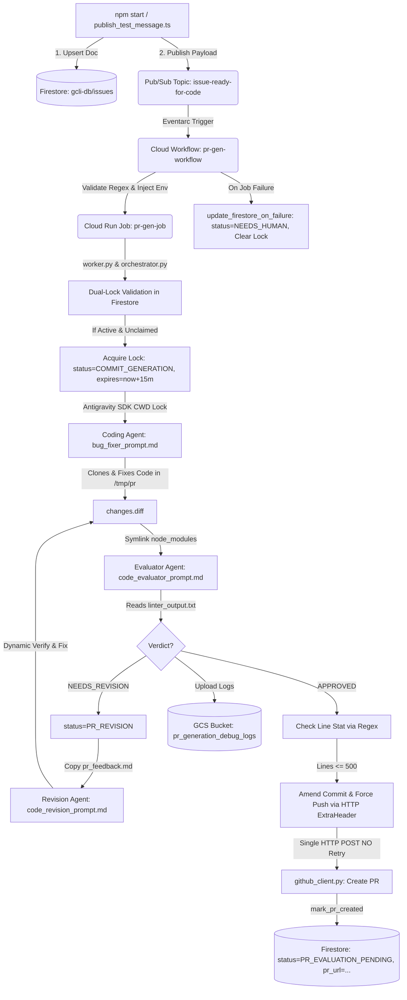

# Project Context & Developer Reference Manual

This document serves as the complete, authoritative reference guide for the **Gemini CLI Issue-to-PR Code Generation Pipeline** (`gcli-intern-project-2026`). It contains all architectural details, operational workflows, Firestore database integration specifications, GCS debug logging specs, evaluation framework commands, full file breakdowns, database enums, AI agent prompt rules, test suite mechanics, and golden issue dataset schemas required for an agent or developer working in this repository.

---

## 🚨 Critical Rules & Assertions for AI Agents

1. **STRICT WORKSPACE BOUNDARY**:
   * **NEVER edit files outside of the `cloudrun/code_generator/` directory.**
   * All orchestrator logic, prompt templates, evaluation scripts, build configurations, deployment scripts, and unit tests reside within `cloudrun/code_generator/`.
2. **GCLOUD CLI PROJECT SCOPE**:
   * The local development terminal defaults to `cloudtop-prod-us-east` if `--project` is omitted.
   * **Always append `--project=gcli-intern-project-2026` to all `gcloud` commands.**
3. **DO NOT MODIFY PERMISSION ROLES ON 403 ERRORS**:
   * If a `403 Permission Denied` error occurs (e.g. `aiplatform.endpoints.predict`, `storage.objects.get`, `datastore.databases.get`, or `workflows.invoker`), **DO NOT attempt to elevate roles (e.g. DO NOT upgrade `objectViewer` to `Admin`)**.
   * Run `./setup_permissions.sh gcli-intern-project-2026` to restore stripped IAM roles.

---

## 💀 The 403 Errors & The Reaper

### What is the Reaper?
The GCP project `gcli-intern-project-2026` runs in an intern sandbox environment governed by an automated background **Reaper process**. The Reaper enforces a periodic security compliance sweep that automatically strips custom or newly granted IAM role bindings from service accounts during idle times or long-running test cycles.

### The Solution
When a 403 error happens, **do not change code or alter role definitions**. Simply re-run the permissions provisioning script to restore all IAM role bindings:
```bash
cd cloudrun/code_generator
./setup_permissions.sh gcli-intern-project-2026
```

---

## 🏗️ High-Level System Architecture & State Machine

The project implements an autonomous, event-driven AI agent pipeline that receives triaged GitHub issue specifications, synchronizes them to Firestore (`gcli-db/issues`), enforces transactional concurrency locks, generates code patches using headless Gemini agents in a sandbox, evaluates changes against linters/tests, iteratively revises code upon rejection, uploads trajectory logs to GCS (`gs://pr_generation_debug_logs`), and creates Pull Requests on GitHub.

### End-to-End Workflow Diagram


### Key Architectural & Operational Behaviors
1. **Deterministic Preflight Regression Tests are Bypassed in Production**:
   * While the orchestrator defines `_run_regression_checks()`, in production code ([orchestrator.py:L620-L623](file:///usr/local/google/home/joneba/ssr-prototype/gcli-intern-project/cloudrun/code_generator/workflow/orchestrator.py#L620-L623)), deterministic regression test suites (`npm run build`, `npm run typecheck`, `npm run test:ci`) are commented out and bypassed by default:
     ```python
     logging.info("Deterministic preflight regression checks bypassed.")
     return True
     ```
2. **Performance Optimization via `node_modules` Symlinking**:
   * In `_run_evaluation()`, before falling back to `npm ci`, the orchestrator checks if `/tmp/pr/<repo_name>/node_modules` exists and symlinks it to `/tmp/eval/<repo_name>/node_modules` (`os.symlink`), avoiding redundant package installations during iterative evaluation loops.
3. **Headless Sandbox Tool Allowlist & Policy Hook**:
   * [agent_runner.py](file:///usr/local/google/home/joneba/ssr-prototype/gcli-intern-project/cloudrun/code_generator/workflow/agent_runner.py) enforces a strict 7-tool allowlist (`ALLOWED_SANDBOX_TOOLS`): `view_file`, `read_file`, `replace_file_content`, `multi_replace_file_content`, `write_file`, `write_to_file`, and `run_command`. It registers an Antigravity SDK policy hook (`@hooks.pre_tool_call_decide` via `auto_approve_all_tools`) that automatically returns `"PROCEED"` for allowlisted tools and `"REJECT"` for any other tool calls.
4. **Git Push Authentication via In-Memory Environment ExtraHeader**:
   * In `_submit_pull_request()`, rather than modifying global git credential stores, push authentication is achieved by injecting in-memory HTTP extra headers into the subprocess environment:
     ```python
     auth_bytes = f"x-access-token:{self.config.git_token}".encode("utf-8")
     auth_b64 = base64.b64encode(auth_bytes).decode("utf-8")
     git_env["GIT_CONFIG_COUNT"] = "1"
     git_env["GIT_CONFIG_KEY_0"] = "http.extraHeader"
     git_env["GIT_CONFIG_VALUE_0"] = f"AUTHORIZATION: basic {auth_b64}"
     ```
5. **Commit Amending & Force-Pushing during PR Creation**:
   * If the Evaluator Agent creates `pr_details.md`, the orchestrator extracts the recommended commit message using regex (`r"##\s*Commit\s*Message\r?\n\s*(.+?)(?=\r?\n##|$)"`) and amends the staged commit with `git commit --amend -m <msg> --no-verify`. When pushing to remote origin, it executes a force push (`git push -f origin HEAD:refs/heads/<branch_name>`) to override any prior retries.
6. **Absence of Network Retry Loops in GitHub Client**:
   * Contrary to general assumptions, [github_client.py](file:///usr/local/google/home/joneba/ssr-prototype/gcli-intern-project/cloudrun/code_generator/workflow/github_client.py) contains **zero network retry logic or retry loops**. It performs a single synchronous HTTP POST via `urllib.request.urlopen` (with a 60-second timeout) and immediately raises `GitHubClientError` upon failure.

---

### 3.5 Complete Environment Variables Reference

The table below documents every environment variable used across production execution (`workflow/`) and local evaluation (`eval/`):

| Environment Variable | Category | Required / Optional | Default Value | Description & Purpose |
| :--- | :--- | :--- | :--- | :--- |
| **`GOOGLE_CLOUD_PROJECT`** | GCP / Auth | Required (Prod) | Auto-resolved from ADC / GCP | Target Google Cloud Project ID for Vertex AI models and Firestore database (`gcli-intern-project-2026`). |
| **`GOOGLE_CLOUD_LOCATION`** | GCP / Auth | Optional | `"global"` | Google Cloud region/location for Vertex AI model endpoints (e.g. `global` or `us-central1`). |
| **`MODEL_NAME`** | Model / Agent | Optional | `"gemini-3.5-flash"` | Gemini model used by `AgentRunner` for agent execution across state machine turns. |
| **`MAX_ATTEMPTS`** | Workflow / State | Optional | `"5"` | Maximum repair loop iterations for patch generation before setting status to `NEEDS_HUMAN` (enforces `max(int(...), 1)`). |
| **`GIT_TOKEN`** | Auth / Secrets | Required (Prod PR creation) | `None` | GitHub Personal Access Token used for authenticated git operations and Pull Request creation. Popped from `os.environ` on `Config` init. |
| **`REPO_URL`** | Workflow / Git | Optional | `"https://github.com/google-gemini/gemini-cli.git"` | Target GitHub repository URL to clone into isolated workspaces. |
| **`FIRESTORE_DATABASE`** | Database | Optional | `"gcli-db"` | Specific Firestore database instance name. |
| **`FIRESTORE_COLLECTION`** | Database | Optional | `"issues"` | Target Firestore collection name storing issue specifications and transactional locks. |
| **`FIRESTORE_DOC`** | State / Ingestion | Required (Cloud Run) | `None` | Raw JSON string representing the complete Firestore issue specification document. |
| **`FIRESTORE_ID`** / **`firestore_id`** | Database / Lock | Required (Cloud Run) | `None` | Firestore document ID used for transactional concurrency locks and status tracking. |
| **`EXECUTION_ID`** | Observability | Optional | `"local-eval-execution"` (Eval) | Unique Cloud Run Job or Cloud Workflow execution identifier. |
| **`PR_GEN_DEBUG_LOGS_BUCKET`** | Storage / Logs | Optional | `"pr_generation_debug_logs"` | GCS bucket name for uploading production trajectory debug logs and artifacts. |
| **`PR_GEN_EVAL_RESULTS_BUCKET`** | Storage / Eval | Optional | `"pr-generation-eval-results"` | GCS bucket name for storing evaluation run outputs when `--gcs` is enabled. |
| **`DISABLE_GCS_LOGGING`** | Storage / Eval | Optional | `"false"` | Toggles GCS log uploads. Set to `"true"` or `"1"` in local evaluation mode to bypass remote GCS calls unless `--gcs` is explicitly passed. |
| **`EVAL_GCS_RUN_NAME`** | Eval Harness | Auto-set in `--gcs` eval | `None` | Evaluation run identifier set by `eval_suite.py` when `--gcs` is passed to direct GCS blobs to `runs/<run_name>_<timestamp>/`. |
| **`EVAL_GCS_RUN_TIMESTAMP`** | Eval Harness | Auto-set in `--gcs` eval | `None` | UTC timestamp string set by `eval_suite.py` when `--gcs` is passed. |
| **`LOCAL_TRACE_DIR`** | Eval Harness | Auto-set in eval | `eval/run_outputs/<run_name>/json` | Directory path where local agent trajectory JSON logs are saved per turn. |
| **`GEMINI_CLI_WORKSPACE_TRUSTED`** | System / CLI | Auto-set by Config | `"true"` | Set automatically by `Config` initialization to bypass workspace trust prompts when running `gemini-cli` commands. |
| **`USE_ADC`** | GCP / Auth | Optional | `"true"` | Directs Vertex AI / Google Auth SDK to use Application Default Credentials. |

---

## 4. Complete File Breakdown & Directory Map

### 4.1 Root Infrastructure, Configuration & Deployment Scripts
| File | Description & Key Parameters |
| :--- | :--- |
| **[.env](file:///usr/local/google/home/joneba/ssr-prototype/gcli-intern-project/cloudrun/code_generator/.env)** | Stores root environment variable `GOOGLE_CLOUD_PROJECT=gcli-intern-project-2026`. |
| **[.gitignore](file:///usr/local/google/home/joneba/ssr-prototype/gcli-intern-project/cloudrun/code_generator/.gitignore)** | Configures Git to ignore `pr_gen_evals/` (local evaluation output directory). |
| **[Dockerfile](file:///usr/local/google/home/joneba/ssr-prototype/gcli-intern-project/cloudrun/code_generator/Dockerfile)** | Built from `python:3.11-slim`. Copies Node.js 20 from `node:20-slim`, creates unprivileged user `appuser` (UID 1000) with `WORKDIR /app`, installs `requirements.txt`, copies `workflow/` and `agent_prompts/`, and sets `ENTRYPOINT ["python", "/app/workflow/worker.py"]`. |
| **[job.yaml](file:///usr/local/google/home/joneba/ssr-prototype/gcli-intern-project/cloudrun/code_generator/job.yaml)** | Cloud Run Job specification (`pr-gen-job`) in `us-central1`. Uses execution environment `gen2`, 2 CPU, 8Gi memory, `timeoutSeconds: '3600'`, `maxRetries: 2`, and service account `code-gen-job-execution-sa@...`. Sets env vars (`FIRESTORE_DATABASE=gcli-db`, `FIRESTORE_COLLECTION=issues`, `PR_GEN_DEBUG_LOGS_BUCKET=pr_generation_debug_logs`) and mounts secret `GIT_TOKEN` from `PR_GEN_GITHUB_PUSH_KEY`. |
| **[workflow.yaml](file:///usr/local/google/home/joneba/ssr-prototype/gcli-intern-project/cloudrun/code_generator/workflow.yaml)** | Cloud Workflow definition (`pr-gen-workflow`). Enforces regex `^[a-zA-Z0-9_.-]+$` on `doc_id` in `validate_doc_id`. Invokes `pr-gen-job` with a 7200s connector timeout. If the job fails, step `update_firestore_on_failure` traps the error, sets status to `NEEDS_HUMAN`, records the exception, and clears transactional locks to `NULL_VALUE`. |
| **[package.json](file:///usr/local/google/home/joneba/ssr-prototype/gcli-intern-project/cloudrun/code_generator/package.json)** & **[package-lock.json](file:///usr/local/google/home/joneba/ssr-prototype/gcli-intern-project/cloudrun/code_generator/package-lock.json)** | Node.js project manifest (`gcli-intern-project`). Defines script `"start": "node -r dotenv/config -r ts-node/register publish_test_message.ts"`. Dependencies: `@google-cloud/firestore` (^8.6.0), `@google-cloud/pubsub` (^4.7.0), `dotenv` (^17.4.2). |
| **[tsconfig.json](file:///usr/local/google/home/joneba/ssr-prototype/gcli-intern-project/cloudrun/code_generator/tsconfig.json)** | TypeScript configuration targeting `es2022` with `commonjs` module generation, strict type-checking, `esModuleInterop: true`, and `skipLibCheck: true`. |
| **[requirements.txt](file:///usr/local/google/home/joneba/ssr-prototype/gcli-intern-project/cloudrun/code_generator/requirements.txt)** | Python dependencies: `google-antigravity>=0.1.0`, `protobuf>=7.35.0`, `pydantic`, `google-cloud-firestore>=2.15.0, <3.0.0`, `google-cloud-storage>=2.14.0`, and `google-genai>=2.0.0`. |
| **[pytest.ini](file:///usr/local/google/home/joneba/ssr-prototype/gcli-intern-project/cloudrun/code_generator/pytest.ini)** | Pytest configuration requiring `minversion = 8.0`, `testpaths = tests`, `asyncio_mode = auto`, and line coverage reporting for both `workflow` AND `eval` modules (`--cov=workflow --cov=eval`). |
| **[setup_permissions.sh](file:///usr/local/google/home/joneba/ssr-prototype/gcli-intern-project/cloudrun/code_generator/setup_permissions.sh)** | Provisions IAM roles for three service accounts: Workflow SA (`triaged-issue-ingestion@...`), Execution SA (`code-gen-job-execution-sa@...` with `aiplatform.user`, `storage.objectAdmin`, `datastore.user`, and `secretAccessor`), and Compute SA (`${PROJECT_NUMBER}-compute@...` with `artifactregistry.writer`). Grants Workflow SA `iam.serviceAccountUser` on Execution SA. Noticeably grants NO Pub/Sub roles. |
| **[update_deployment.sh](file:///usr/local/google/home/joneba/ssr-prototype/gcli-intern-project/cloudrun/code_generator/update_deployment.sh)** | Automated deployment script performing three sequential steps: (1) builds `jetski-worker:latest` via Cloud Build, (2) deploys Cloud Run Job `pr-gen-job` (`--memory=8Gi --cpu=2 --task-timeout=3600`), and (3) deploys Cloud Workflow `pr-gen-workflow` from `workflow.yaml`. |
| **[publish_test_message.ts](file:///usr/local/google/home/joneba/ssr-prototype/gcli-intern-project/cloudrun/code_generator/publish_test_message.ts)** | TypeScript synchronizer and publisher (`npm start`). Reads issue JSONs from `inputPath`, resolves document ID (`github_<owner>_<repo>_<issue_number>`), converts ISO date strings to Firestore `Timestamp` objects, upserts docs to `gcli-db/issues`, and publishes payload to Pub/Sub topic `issue-ready-for-code`. |
| **[example_firestore.json](file:///usr/local/google/home/joneba/ssr-prototype/gcli-intern-project/cloudrun/code_generator/example_firestore.json)** | Sample JSON document adhering to current triaged ingestion schema (`status: "TRIAGED"`, `triage_attempts: 0`, `generation_attempts: 0`, `lock`, timestamps, `workable_spec`, `github_metadata`, `error: ""`). |
| **[example_firestore_old.json](file:///usr/local/google/home/joneba/ssr-prototype/gcli-intern-project/cloudrun/code_generator/example_firestore_old.json)** | Sample JSON document illustrating deprecated legacy schema (`expected` block, `input.body`, and deprecated `pr_url`/`target_version` positioning). |
| **[example_spec.json](file:///usr/local/google/home/joneba/ssr-prototype/gcli-intern-project/cloudrun/code_generator/example_spec.json)** | Sample standalone `workable_spec` JSON without Firestore document wrapper metadata. |

---

### 4.2 AI Agent System Prompts (`agent_prompts/`)
| File | Agent Role & Strict Execution Rules |
| :--- | :--- |
| **[bug_fixer_prompt.md](file:///usr/local/google/home/joneba/ssr-prototype/gcli-intern-project/cloudrun/code_generator/agent_prompts/bug_fixer_prompt.md)** | **Coding Agent**: Ingests `firestore_doc.json`. Enforces mandatory file edits using allowlisted tools on files in `files_to_modify` and `test_file`. **Strictly forbidden from running `npm run preflight` or full package test suites**, `git commit`, or `git push`. Must execute targeted tests via `run_command` with `WaitMsBeforeAsync: 10000` (e.g., `npx vitest run <test_file>`) and avoid non-tool waiting text. |
| **[code_evaluator_prompt.md](file:///usr/local/google/home/joneba/ssr-prototype/gcli-intern-project/cloudrun/code_generator/agent_prompts/code_evaluator_prompt.md)** | **Evaluator Agent**: Quality and security gatekeeper. Ingests `changes.diff`. Evaluates Correctness, Security (avoiding ReDoS and raw shell execution), and Readability. **MUST NOT run linter or test commands itself**; must inspect pre-generated `linter_output.txt` via `view_file`, restricting linting evaluation and feedback strictly to files edited in `changes.diff` without encouraging unrelated revisions. If `NEEDS_REVISION`, creates `pr_feedback.md` grouped by category with line numbers and writes `verdict.json`. If `APPROVED`, creates `pr_details.md` with commit message ($\le 10$ words) and PR description (must include `fixes #<issue_number>`, professional third-person tone, and restrict subsections to Level 3 or lower headers to ensure strict compatibility with the orchestrator's section regex). |
| **[code_revision_prompt.md](file:///usr/local/google/home/joneba/ssr-prototype/gcli-intern-project/cloudrun/code_generator/agent_prompts/code_revision_prompt.md)** | **Revision Agent**: Invoked during `PR_REVISION` state upon evaluation rejection or when previous session produced no modifications. Ingests `pr_feedback.md`. Operates within a strict **maximum 3-turn budget**. Executes targeted test commands via `run_command` with `WaitMsBeforeAsync: 10000` (`npx vitest run <test_file>`), avoiding full package test suites and non-tool waiting text. Prohibits exploratory git commands (`git status`, `git log`). |

---

### 4.3 Workflow Core Modules (`workflow/`)
| File | Description & Implemented Classes/Functions |
| :--- | :--- |
| **[workflow/__init__.py](file:///usr/local/google/home/joneba/ssr-prototype/gcli-intern-project/cloudrun/code_generator/workflow/__init__.py)** | Package initializer for the orchestrator namespace. |
| **[workflow/config.py](file:///usr/local/google/home/joneba/ssr-prototype/gcli-intern-project/cloudrun/code_generator/workflow/config.py)** | Defines `ConfigurationError` and `Config`. Reads env vars (`REPO_URL`, `GIT_TOKEN`, `FIRESTORE_DOC`, `FIRESTORE_ID` / lowercase `firestore_id`, `EXECUTION_ID`, `GOOGLE_CLOUD_PROJECT`, `GOOGLE_CLOUD_LOCATION` defaulting to `"global"`, `MODEL_NAME`, `MAX_ATTEMPTS` defaulting to 5). Sets `os.environ["GEMINI_CLI_WORKSPACE_TRUSTED"] = "true"` and removes secret `GIT_TOKEN` from environment via `os.environ.pop("GIT_TOKEN", None)`. Enforces lower bound `max(int(...), 1)` on `MAX_ATTEMPTS` (defaulting to a max_attempts turn limit of 5). Implements `load_and_validate_firestore_doc()`. |
| **[workflow/worker.py](file:///usr/local/google/home/joneba/ssr-prototype/gcli-intern-project/cloudrun/code_generator/workflow/worker.py)** | Container entrypoint. Configures process-wide root logger to `WARNING` to drop SDK transport chatter (`RAW WS MSG`) and sets up dedicated `Orchestrator` logger at `INFO` level with `StreamHandler(sys.stdout)`. Sets up dual-tier crash handlers around `asyncio.run(main())`, mapping exceptions to exit codes (`exit 1` for `OrchestrationError`, `exit 4` for unexpected runtime errors). |
| **[workflow/worker_old.py](file:///usr/local/google/home/joneba/ssr-prototype/gcli-intern-project/cloudrun/code_generator/workflow/worker_old.py)** | Preserved 56-line legacy container entrypoint identical to `worker.py`. |
| **[workflow/orchestrator.py](file:///usr/local/google/home/joneba/ssr-prototype/gcli-intern-project/cloudrun/code_generator/workflow/orchestrator.py)** | Main state machine (`Orchestrator` and `OrchestrationError`). Uses `logger = logging.getLogger("Orchestrator")`. Initializes dynamic `self.base_ref` (defaulting to `"origin/main"`, overridden in evaluation to target commit SHA). Coordinates git sync, `_run_code_generation()`, `_run_evaluation()`, `_run_regression_checks()`, ESLint static checks (`_run_eslint_static_check` on modified TS/JS files via `git diff {self.base_ref} --name-only`), symlink optimization, commit amending, force pushing, `<500` line regex calculation, writing feedback to `pr_feedback.md` when no workspace modifications are staged, and GCS debug logging under role folders (`"coding_agent"`, `"eval_agent"`). |
| **[workflow/orchestrator_old.py](file:///usr/local/google/home/joneba/ssr-prototype/gcli-intern-project/cloudrun/code_generator/workflow/orchestrator_old.py)** | Preserved 685-line legacy orchestrator operating without GCS debug logging integration. |
| **[workflow/command_executor.py](file:///usr/local/google/home/joneba/ssr-prototype/gcli-intern-project/cloudrun/code_generator/workflow/command_executor.py)** | Subprocess utility (`CommandExecutor` and `CommandExecutionError`). Uses `logger = logging.getLogger("Orchestrator")`. Implements `sanitize_relative_path` (blocking traversal `..` and null bytes) and `sanitize_identifier` (stripping injection symbols `[^a-zA-Z0-9._-]`). Parses inline env prefixes (`KEY=VAL`), tokenizes commands via `shlex.split`, and runs with a default `3600.0s` timeout. |
| **[workflow/github_client.py](file:///usr/local/google/home/joneba/ssr-prototype/gcli-intern-project/cloudrun/code_generator/workflow/github_client.py)** | GitHub REST API v3 client (`GitHubClient` and `GitHubClientError`) built purely with standard library `urllib`. Uses `logger = logging.getLogger("Orchestrator")`. Submits PRs to `https://api.github.com/repos/{owner}/{repo}/pulls` targeting base branch `"main"` with a 60s timeout. Contains NO network retry logic or loops. |
| **[workflow/preflight_filter.py](file:///usr/local/google/home/joneba/ssr-prototype/gcli-intern-project/cloudrun/code_generator/workflow/preflight_filter.py)** | Strips ANSI escape sequences (`strip_ansi`) and evaluates test failures (`PreflightFilter` and `is_preflight_failure_allowed`). Enforces allowlist `ALLOWED_SANDBOX_FAILURES` containing 4 exact exception strings: `"src/utils/sessionCleanup.test.ts"`, `"src/config/extension-manager-permissions.test.ts"`, `"root-privilege-check"`, and `"container-permission-test"`. Returns `True` only if all failing lines match an allowed exception. |
| **[workflow/agent_runner.py](file:///usr/local/google/home/joneba/ssr-prototype/gcli-intern-project/cloudrun/code_generator/workflow/agent_runner.py)** | Headless Antigravity SDK runner (`AgentRunner` and `AgentRunnerError`). Uses `logger = logging.getLogger("Orchestrator")` to log `[Thought]`, `[Tool Call]`, and `[Response]` entries cleanly into `.log` files. Implements process-wide CWD async lock (`_cwd_lock`), 7-tool sandbox allowlist, automatic policy hook (`auto_approve_all_tools`), and path traversal prevention in `_load_prompt_file()`. Returns `(full_output_text, resolved_chunks)`. |
| **[workflow/gcs_logger.py](file:///usr/local/google/home/joneba/ssr-prototype/gcli-intern-project/cloudrun/code_generator/workflow/gcs_logger.py)** | GCS storage logger (`PR_GEN_DEBUG_LOGS_BUCKET`). Uses `logger = logging.getLogger("Orchestrator")`. Implements streaming delta consolidation in `serialize_chunks()` (merging consecutive `Text` deltas per step into single `Text` objects). Implements `_get_gcs_blob_prefix()` to route GCS uploads to `pr-generation-eval-results/runs/<run_name>_<timestamp>/` when in evaluation mode (`EVAL_GCS_RUN_NAME`), falling back to `<owner>_<repo>/` in production mode. In local mode (`LOCAL_TRACE_DIR`), saves structured arrays with unique timestamps to `json/coding_agent/issue_<num>_<timestamp>_traces.json` and `json/eval_agent/issue_<num>_<timestamp>_traces.json`. Fails silently without throwing exceptions if GCS is unavailable. |
| **[workflow/db/__init__.py](file:///usr/local/google/home/joneba/ssr-prototype/gcli-intern-project/cloudrun/code_generator/workflow/db/__init__.py)** | Database package initializer cleanly re-exporting 13 core symbols from `.db_interface`. |
| **[workflow/db/db_interface.py](file:///usr/local/google/home/joneba/ssr-prototype/gcli-intern-project/cloudrun/code_generator/workflow/db/db_interface.py)** | Firestore database access layer. Defines enums `IssueStatus`, `ClaimAction`, and `ReleaseAction`. Resolves doc IDs via `get_firestore_id()`. Implements transactional locking in `acquire_lock()` (900s duration, permitting jobs to start from `TRIAGED`, `COMMIT_GENERATION`, or defensively `PR_REVISION` in `allowed_start_states`, and automatically escalating to `NEEDS_HUMAN` when `generation_attempts >= 2`) and `release_lock()` (which defensively resets `generation_attempts` to 0 when `success=True` for future multi-stage PR revision runs). |

---

### 4.4 Local Evaluation Framework (`eval/`)
| File | Description & Implemented Classes/Functions |
| :--- | :--- |
| **[eval/__init__.py](file:///usr/local/google/home/joneba/ssr-prototype/gcli-intern-project/cloudrun/code_generator/eval/__init__.py)** | Evaluation package initializer for local benchmarking. |
| **[eval/helpers/eval_config.py](file:///usr/local/google/home/joneba/ssr-prototype/gcli-intern-project/cloudrun/code_generator/eval/helpers/eval_config.py)** | `EvalConfig(Config)` subclass and `@dataclass(frozen=True) class TriageBatchConfig`. Dynamically resolves target repo URL and name by inspecting `github_metadata` in `firestore_doc_dict` with defensive structural checks preventing `AttributeError` on null specs. Normalizes `workspace_root` via `os.path.abspath`. Sets isolated paths: `tmp_dir = <workspace_root>/tmp`, `pr_dir = <tmp_dir>/pr`, `eval_dir = <tmp_dir>/eval`. Disables remote GCS logging by setting `DISABLE_GCS_LOGGING = "true"`. Implements `load_and_validate_firestore_doc()` to bypass real DB calls by returning in-memory dictionaries. |
| **[eval/eval_diff_judge.py](file:///usr/local/google/home/joneba/ssr-prototype/gcli-intern-project/cloudrun/code_generator/eval/eval_diff_judge.py)** | Offline LLM-as-a-Judge benchmark (`--run-name`, `--input-path` / `--input-dir` required, `--model`). Exposes programmatic API `run_diff_judge_eval(run_name, input_path, model)`. Instantiates `AgentRunner` with explicit configuration keywords and invokes `run_agent(role="LLM Diff Judge", prompt=prompt, repo_path=config.tmp_dir)`. Resolves golden issue JSON specs directly from the provided `--input-path`. Fetches ground-truth patches directly from `https://github.com/{owner}/{repo}/pull/{pr_number}.diff` via `urllib.request` (30s timeout) wrapped in `asyncio.to_thread` with optional GitHub token headers (`GIT_TOKEN`/`GITHUB_TOKEN`/`GH_TOKEN`) for 5,000 req/hr rate limits. Evaluates all specs concurrently via `asyncio.gather` bounded by `asyncio.Semaphore(5)`. Injects 7 placeholders into `judge_prompt.md`, parses JSON via regex `r"\{.*\}"`, clamps scores between `0` and `3`, and outputs renderable Markdown reports to `eval/run_outputs/<run_name>/<run_name>_eval_score.md`. |
| **[eval/helpers/eval_orchestrator.py](file:///usr/local/google/home/joneba/ssr-prototype/gcli-intern-project/cloudrun/code_generator/eval/helpers/eval_orchestrator.py)** | `EvalOrchestrator(Orchestrator)` subclass using package-qualified imports (`from workflow.orchestrator import Orchestrator`). Uses `logger = logging.getLogger("Orchestrator")`. Extracts `owner` and `repo` from `github_metadata.repository` (defaulting to `google-gemini/gemini-cli`) and passes them to `_run_code_generation` and `_run_evaluation`. In `_sync_or_clone_repository()`, runs `git fetch origin` and checks out `eval-agent-issue-<num>` targeting `github_metadata.target_version` SHA (falling back to `origin/main` if missing/failed). Bypasses Firestore locking, writes out `firestore_doc.json` in repo root, configures `.git/info/exclude` in the PR repo workspace so `firestore_doc.json` and agent scratch files never leak into git diffs, automatically runs `npm ci --maxsockets 3` if needed, tracks repair loop iteration turns (`attempts` and `max_attempts`), and enforces the `< 500 lines` limit by computing `git diff --stat` directly against `target_version` (or `HEAD~1`) instead of floating `origin/main`. |
| **[eval/eval_suite.py](file:///usr/local/google/home/joneba/ssr-prototype/gcli-intern-project/cloudrun/code_generator/eval/eval_suite.py)** | Master parallel test harness (`--input-path`, `--run-name`, `--max-workers`, `--max-attempts` defaulting to 5, `--keep-env`, `--judge`, `--gcs` disabled by default). Directs application logging through `logger = logging.getLogger("Orchestrator")` with `FileHandler` and `StreamHandler(sys.stdout)` with `TestProgressFilter` and `RootWarningFilter`. Restricts terminal `StreamHandler` logs to high-level test status and progress milestones while preserving full un-truncated logs in file handlers (`logs/issue_<issue_number>_<timestamp>_logs.log`). Saves git diffs to `outputs/diffs/issue_<issue_number>_<timestamp>_diff.diff` and PR details to `outputs/pr_details/issue_<issue_number>_<timestamp>_pr_details.md`. When `--gcs` is supplied, sets `EVAL_GCS_RUN_NAME` and `EVAL_GCS_RUN_TIMESTAMP` and invokes `upload_eval_run_artifacts()` to upload `Results.txt`, `<run_name>_eval_score.md`, `logs/`, and `outputs/` directly to `pr-generation-eval-results/runs/<run_name>_<timestamp>/`. If `--judge` is set, automatically invokes `run_diff_judge_eval(run_name, input_path)` programmatically. |
| **[eval/helpers/generate_golden_issue.py](file:///usr/local/google/home/joneba/ssr-prototype/gcli-intern-project/cloudrun/code_generator/eval/helpers/generate_golden_issue.py)** | Dual golden issue generator CLI (`--issue`, `--pr`, `--owner`, `--repo`, `--mode`). Generates golden issue JSON files with dynamic filenames `{repo.replace('-', '_')}_{issue_number}.json` using (1) Ground-Truth method (backwards PR diff synthesis in `eval/datasets/ground_truth_specs/`) and (2) Triage Agent method (forward prediction by delegating execution to `run_single_issue_task` passing `output_dir` directly without global mutations). |
| **[eval/helpers/triage_agent_runner.py](file:///usr/local/google/home/joneba/ssr-prototype/gcli-intern-project/cloudrun/code_generator/eval/helpers/triage_agent_runner.py)** | Master parallel batch runner (`--issues`, `--owner`, `--repo`, `--concurrency` defaulting to 3, `--gcs`, `--keep-worktrees`). Exposes programmatic API `run_triage_batch_pipeline(config: TriageBatchConfig)`. Fetches issue details via GitHub API, resolves `target_version` (`baseRefOid` for closed issues with PRs; `origin/main` for open issues), manages temporary Git worktrees with dynamic atomic slot token leasing (`queue.Queue`) eliminating slot collision race conditions, executes `process_issue_triage` concurrently, and formats outputs adhering to golden spec schemas in `eval/datasets/triage_agent_specs/triage_agent_issues/` and `logs/`. |
| **[eval/cloud_triage_runner.py](file:///usr/local/google/home/joneba/ssr-prototype/gcli-intern-project/cloudrun/code_generator/eval/cloud_triage_runner.py)** | Cloud Run Job container entrypoint executing `run_triage_batch_pipeline(config)`. Features structured single-line Cloud Run JSON logging (`setup_cloud_logging`), container signal handlers (`SIGTERM`/`SIGINT` for emergency worktree cleanup), and configuration loading (`load_cloud_config() -> TriageBatchConfig`) supporting Options A (inline JSON env var `EVAL_CONFIG`), B (standalone task override env vars `ISSUES`, `CONCURRENCY`), and C (remote GCS / Firestore JSON URI payload `EVAL_CONFIG_URI`). |
| **[eval/judge_prompt.md](file:///usr/local/google/home/joneba/ssr-prototype/gcli-intern-project/cloudrun/code_generator/eval/judge_prompt.md)** | LLM judge markdown rubric. Injects placeholders: `{{OWNER}}`, `{{REPO}}`, `{{ISSUE_ID}}`, `{{ISSUE_TITLE}}`, `{{ISSUE_SUMMARY}}`, `{{TRUE_DIFF}}`, `{{PROPOSED_DIFF}}`. Enforces 4-tier rubric (3 = Full Parity with adequate unit tests; 2 = Similar Functionality lacking edge cases/tests; 1 = Minimal/incomplete; 0 = Severe Defect/Security vulnerability like ReDoS or command injection). Requires strict raw JSON output: `{"score": <0-3>, "verdict_description": "..."}`. |
| **[eval/helpers/reformat_golden_issues.py](file:///usr/local/google/home/joneba/ssr-prototype/gcli-intern-project/cloudrun/code_generator/eval/helpers/reformat_golden_issues.py)** | Migration utility modifying JSON files in `golden_issues/` in-place. Maps `"issue_title"` to `github_metadata.title`, `"expected_workable_spec"` to `workable_spec`, generates `issue_id` if absent, and injects required DB fields (`status: "TRIAGED"`, `lock: {holder: null, expires_at: null}`, `triage_attempts: 0`, `error: ""`). |
| **[eval/generate_diff_viewer.py](file:///usr/local/google/home/joneba/ssr-prototype/gcli-intern-project/cloudrun/code_generator/eval/generate_diff_viewer.py)** | Interactive GitHub-Style HTML Diff Viewer Generator (`--run-name`, `--input-path`, `--output-html`). Generates interactive standalone GitHub-style HTML diff report comparing Ground-Truth PR diffs, Agent Proposed diffs, and original source file contents with dynamic file `<select>` dropdown UI and Unicode script tag XSS mitigation (`\u003c`/`\u003e`). Supports score report file discovery fallbacks. Outputs to `eval/run_outputs/<run_name>/outputs/diff_viewers/index.html` (and `<run_name>_diff_viewer.html`). |
| **[eval/helpers/publish_datasets_to_firestore.py](file:///usr/local/google/home/joneba/ssr-prototype/gcli-intern-project/cloudrun/code_generator/eval/helpers/publish_datasets_to_firestore.py)** | Firestore Dataset Publisher (`--project`, `--database`, `--triage-collection`, `--golden-collection`, `--dry-run`). Recursively scans local JSON issue specifications from `eval/datasets/triage_agent_specs/` and `eval/datasets/ground_truth_specs/`, normalizes payload metadata, resolves deterministic document IDs (`github_<owner>_<repo>_<issue_number>`), and publishes documents to Firestore collections (`pr-gen-triage-issues` and `pr-gen-golden-issues`) in `gcli-db` using high-performance batch writes. |

---

### 4.5 Dataset & Test Suite Infrastructure
| Folder / File | Architecture & Comprehensive Specifications |
| :--- | :--- |
| **`golden_issues/`** | Dataset of 28 real GitHub issue JSON specifications. Evaluates fixes against the real-world **`google-gemini/gemini-cli`** TypeScript repository (distinct from orchestrator workspace repo). See Section 5.3 for full problem domain taxonomy. |
| **`tests/`** | Hermetic unit test suite containing **103 unit test functions** across 16 modules (`test_init.py`, `test_config.py`, `test_command_executor.py`, `test_worker.py`, `test_orchestrator.py`, `test_github_client.py`, `test_preflight_filter.py`, `test_eval_orchestrator.py`, `test_eval_diff_judge.py`, `test_generate_golden_issue.py`, `test_triage_agent_runner.py`, `test_eval_suite_logging.py`, `test_generate_diff_viewer.py`, `test_publish_datasets_to_firestore.py`, `conftest.py`, `__init__.py`). Features ZERO test classes (`Test*`), relying exclusively on standalone functions and standard library `unittest.mock` (`@patch`, `MagicMock`, `AsyncMock`). |
| **`eval/run_outputs/`** | Local evaluation output directory containing per-run subdirectories (`<run_name>/`) with `agent_environments/`, `logs/` (`issue_<issue_number>_<timestamp>_logs.log`), `json/` (structured subfolders `coding_agent/` and `eval_agent/`), `outputs/diffs/` (`issue_<issue_number>_<timestamp>_diff.diff`), `outputs/pr_details/` (`issue_<issue_number>_<timestamp>_pr_details.md`), `Results.txt`, and score reports (`*_eval_score.md`). |

---

## 5. 🔬 Detailed Technical Schemas & Database Enums

### 5.1 Firestore Ingestion Schema (`workable_spec` & `github_metadata`)
All ingested issue documents in Firestore collection `gcli-db/issues` conform to the following schema:
```json
{
  "status": "TRIAGED",
  "triage_attempts": 0,
  "generation_attempts": 0,
  "lock": { "holder": null, "expires_at": null },
  "error": "",
  "created_at": "<ISO_TIMESTAMP_OR_FIRESTORE_TIMESTAMP>",
  "updated_at": "<ISO_TIMESTAMP_OR_FIRESTORE_TIMESTAMP>",
  "workable_spec": {
    "issue_id": "google-gemini/gemini-cli#19868",
    "summary": {
      "problem": "EISDIR crash when typing @ for file completion on ignored directories.",
      "root_cause": "Synchronous fs.existsSync and file reading without stat check.",
      "context": "Occurs when node_modules or temp dirs are added to customIgnoreFilePaths."
    },
    "implementation_plan": {
      "files_to_modify": ["packages/cli/src/services/fileDiscoveryService.ts"],
      "steps": ["Replace fs.existsSync with fs.statSync(path, { throwIfNoEntry: false })?.isFile()"]
    },
    "testing_strategy": {
      "test_file": "packages/cli/src/services/fileDiscoveryService.test.ts",
      "expected_behavior": "Directory completion ignores folders without crashing.",
      "verification_steps": ["npm test -w @google/gemini-cli -- fileDiscoveryService.test.ts"],
      "framework": "Vitest"
    }
  },
  "github_metadata": {
    "owner": "google-gemini",
    "repo": "gemini-cli",
    "issue_number": 19868,
    "title": "EISDIR crash on @ completion",
    "target_version": "a38e2f00488a08797f4da2f7bcf2e90bfce03a03",
    "pr_number": 19898
  }
}
```

### 5.2 Firestore State Machine Enums ([db_interface.py](file:///usr/local/google/home/joneba/ssr-prototype/gcli-intern-project/cloudrun/code_generator/workflow/db/db_interface.py))
* **`IssueStatus` (10 Distinct States)**:
  * `UNTRIAGED`: Newly ingested issue awaiting triage analysis.
  * `TRIAGING`: Actively being analyzed by the Triage Agent.
  * `NEEDS_INFO`: Issue specification is unclear; requires human clarification.
  * `TRIAGED`: Ready for code generation; `workable_spec` is populated.
  * `COMMIT_GENERATION`: Coding Agent is actively modifying code under an acquired lock.
  * `PR_VALIDATION_PENDING`: Code generated; awaiting static linter/test validation.
  * `PR_EVALUATION_PENDING`: PR created on GitHub; awaiting external reviewer evaluation.
  * `PR_REVISION`: Evaluator rejected diff (`NEEDS_REVISION`); Code Revision Agent actively refining patch.
  * `NEEDS_HUMAN`: Escalated to human developers due to repeated failures (`generation_attempts >= 2` or job crash).
  * `AUTO_CLOSE`: Automatically closed due to obsolescence or resolution.
* **`ClaimAction`**: `PROCEED` (lock acquired), `SKIP` (locked by another worker), `NEEDS_HUMAN` (escalated).
* **`ReleaseAction`**: `COMPLETE` (exit code 0; success or escalated), `RETRY` (exit code 1; retryable failure under attempt limit).

### 5.3 Golden Issues Dataset Taxonomy (`golden_issues/`)
The 28 golden issues evaluate fixes against `google-gemini/gemini-cli` across 5 distinct problem domains:
1. **Filesystem, Path Resolution & OS Crashes (6 issues)**: Fixing `EISDIR` directory read crashes (#19868, #21527), multi-session temp tracker collisions (#22198), Windows PowerShell quote stripping regressions (#25859), and `.gitignore`/`.geminiignore` scanning rules (#27205, #27674).
2. **LLM Model Configs, Token Accounting & API Handling (7 issues)**: Plan mode model switching bugs (#23230), Computer-Use vision tool schemas (#24501), numeric GCP Project ID rejection (#24695), Gemini 3.1 preview model aliases (#27000), MCP server array compliance (#27725), ACP token spend accounting (#27985), and hook usage metadata schema docs (#28048).
3. **CLI Interactive UI, Auth & Performance (7 issues)**: Free-tier `/privacy` notices (#2407), slash command listener memory leaks (#24337), dynamic CLI version reporting (#24413), custom plan directory startup crashes (#25566), Windows quote stripping in session IDs (#26861), sign-in URL sanitization (#28052), and lazy editor probing eliminating 50s+ Windows startup freezes (#28106).
4. **CI/CD Pipelines & Workflows (3 issues)**: "Argument list too long" in automated triage workflows via disk reading (#26602), expression fallbacks in release nightly builds (#28001), and `--ignore-scripts` in release verification (#28115).
5. **Documentation, Parsing & Extension Resolution (5 issues)**: Lowercase `system.md` standardization (#23410), YAML frontmatter multiline parsing (#25693), SSH git extension URLs (`ssh://`) (#26273), ripgrep PATH resolution with RCE prevention (#26777), and NixOS `/nix/store` grep trust paths (#28251).

### 5.4 Unit Test Suite Architecture (`tests/`)
* **Hermetic Execution**: The 60 tests execute offline without GCP or GitHub API calls.
* **Shared Environment Setup ([conftest.py](file:///usr/local/google/home/joneba/ssr-prototype/gcli-intern-project/cloudrun/code_generator/tests/conftest.py))**: Implements autouse fixture `reset_env` to inject standardized environment variables across all test modules: `GOOGLE_CLOUD_PROJECT="test-project-2026"`, `GOOGLE_CLOUD_LOCATION="us-central1"`, `MODEL_NAME="gemini-3.5-flash"`, `MAX_ATTEMPTS="5"`, `REPO_URL="..."`, and `GIT_TOKEN="..."`.

---

## 6. 🛠️ How to Run & Test Everything

All commands must be executed using the virtual environment python (`.venv/bin/python3` or `.venv/bin/pytest`).

### 0. Virtual Environment & Package Installation
To set up or re-create the local Python virtual environment and bypass Corp Airlock 401 authentication issues when installing dependencies:
```bash
python3 -m venv .venv
.venv/bin/pip install --index-url https://pypi.org/simple -r requirements.txt
```


### 1. Running the Unit Test Suite
Runs all 60 hermetic unit tests with line coverage analysis across workflow and eval modules:
```bash
.venv/bin/pytest tests/
```

### 2. Running Local Pub/Sub Message Publishing
Reads `example_firestore.json`, upserts to Firestore database `gcli-db`, and publishes to Pub/Sub:
```bash
npm start gcli-intern-project-2026
```

### 3. Reformatting Golden Issues Dataset
Reformats all JSON files in `golden_issues/` in-place into standard ingestion schema:
```bash
.venv/bin/python3 eval/helpers/reformat_golden_issues.py
```

### 4. Running the Local Evaluation Suite
Executes the code generation agent on test issues in `eval/datasets/golden_issues/` with configurable parallel workers, repair attempts (defaulting to a max_attempts turn limit of 5), environment preservation, and automatic LLM judge scoring:
```bash
.venv/bin/python3 eval/eval_suite.py --input-path eval/datasets/golden_issues --run-name run_1 --max-workers 2 --max-attempts 5 --keep-env --judge
```

### 5. Running the LLM-as-a-Judge Diff Evaluator Standalone
Evaluates generated diffs in `eval/run_outputs/<run_name>/` against ground-truth GitHub diffs:
```bash
.venv/bin/python3 eval/eval_diff_judge.py --run-name run_1 --input-path eval/datasets/golden_issues --model gemini-3.5-flash
```
Outputs score report to: `eval/run_outputs/run_1/run_1_eval_score.md`.

### 6. Generating and Serving Interactive HTML Diff Viewer Reports
Generates interactive GitHub-style diff viewer HTML reports comparing Ground-Truth PR diffs, Agent Proposed diffs, and original source file contents:
```bash
.venv/bin/python3 eval/generate_diff_viewer.py --run-name <run_name> --input-path <input_path>
python3 -m http.server 8080 --directory eval/run_outputs/<run_name>/
```
Outputs `<run_name>_diff_viewer.html` directly in `eval/run_outputs/<run_name>/`.

### 7. Running the Batch Triage Agent Spec Generator Runner
Generates `triage_agent_specs` across a batch of GitHub issue numbers in parallel:
```bash
.venv/bin/python3 eval/helpers/triage_agent_runner.py --issues 19868,21527,22198 --concurrency 3 --gcs
```
Outputs generated specs to `eval/datasets/triage_agent_specs/triage_agent_issues/` and logs errors to `eval/datasets/triage_agent_specs/logs/`.

### 7. Restoring IAM Permissions (Reaper Fix)
```bash
./setup_permissions.sh gcli-intern-project-2026
```

### 8. Redeploying the Cloud Run Pipeline & Workflow
Submits Cloud Build, deploys Cloud Run Job `pr-gen-job`, and deploys Cloud Workflow `pr-gen-workflow`:
```bash
./update_deployment.sh gcli-intern-project-2026 us-central1
```
