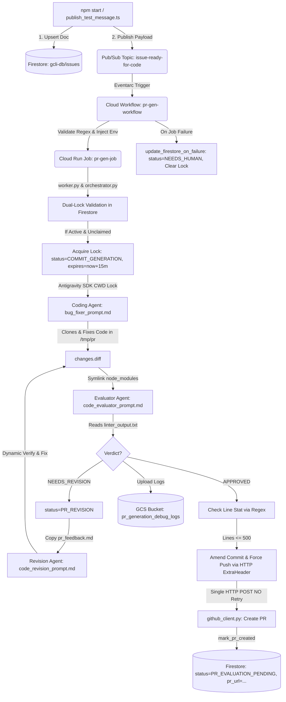

# Project Context & Developer Reference Manual

This document serves as the complete, authoritative reference guide for the
**Gemini CLI Issue-to-PR Code Generation Pipeline**
(`gcli-intern-project-2026`). It contains all architectural details, operational
workflows, Firestore database integration specifications, GCS debug logging
specs, evaluation framework commands, full file breakdowns, database enums, AI
agent prompt rules, test suite mechanics, and golden issue dataset schemas
required for an agent or developer working in this repository.

---

## 🚨 Critical Rules & Assertions for AI Agents

1. **STRICT WORKSPACE BOUNDARY**:
   - **NEVER edit files outside of the `cloudrun/pr-generator/` directory.**
   - All orchestrator logic, prompt templates, evaluation scripts, build
     configurations, deployment scripts, and unit tests reside within
     `cloudrun/pr-generator/`.
2. **GCLOUD CLI PROJECT SCOPE**:
   - The local development terminal defaults to `cloudtop-prod-us-east` if
     `--project` is omitted.
   - **Always append `--project=gcli-intern-project-2026` to all `gcloud`
     commands.**
3. **DO NOT MODIFY PERMISSION ROLES ON 403 ERRORS**:
   - If a `403 Permission Denied` error occurs (e.g.
     `aiplatform.endpoints.predict`, `storage.objects.get`,
     `datastore.databases.get`, or `workflows.invoker`), **DO NOT attempt to
     elevate roles (e.g. DO NOT upgrade `objectViewer` to `Admin`)**.
   - Run `./setup_permissions.sh gcli-intern-project-2026` to restore stripped
     IAM roles.

---

## 💀 The 403 Errors & The Reaper

### What is the Reaper?

The GCP project `gcli-intern-project-2026` runs in an intern sandbox environment
governed by an automated background **Reaper process**. The Reaper enforces a
periodic security compliance sweep that automatically strips custom or newly
granted IAM role bindings from service accounts during idle times or
long-running test cycles.

### The Solution

When a 403 error happens, **do not change code or alter role definitions**.
Simply re-run the permissions provisioning script to restore all IAM role
bindings:

```bash
cd cloudrun/pr-generator
./setup_permissions.sh gcli-intern-project-2026
```

---

## 🏗️ High-Level System Architecture & State Machine

The project implements an autonomous, event-driven AI agent pipeline that
receives triaged GitHub issue specifications, synchronizes them to Firestore
(`gcli-db/issues`), enforces transactional concurrency locks, generates code
patches using headless Gemini agents in a sandbox, evaluates changes against
linters/tests, iteratively revises code upon rejection, uploads trajectory logs
to GCS (`gs://pr_generation_debug_logs`), and creates Pull Requests on GitHub.

### End-to-End Workflow Diagram



### Key Architectural & Operational Behaviors

1. **Deterministic Preflight Regression Tests with Dynamic Package Scoping & OOM Disambiguation**:
   - The orchestrator defines `_run_regression_checks()`
     ([orchestrator.py:L741-L809](file:///usr/local/google/home/joneba/ssr-prototype/gcli-intern-project/tools/caretaker-agent/cloudrun/pr-generator/workflow/orchestrator.py#L741-L809)),
     which executes full-repository verification: `npm run clean`, `NODE_OPTIONS="--max-old-space-size=4096" npm ci --no-audit --no-fund`, `npm run format`, `npm run build`, `npm run lint:ci`, and `npm run typecheck`.
   - **Infrastructure OOM Crash Disambiguation**: If an infrastructure memory crash occurs during CI verification (`JavaScript heap out of memory`, `Allocation failed`, or exit code `137`/`255`), the orchestrator immediately raises `OrchestrationError` instead of polluting `pr_feedback.md` and prompting the coding agent to hallucinate configuration fixes.
   - For unit tests, it dynamically resolves modified files (`_get_modified_files()`) and determines the minimal set of affected workspace packages (including downstream dependents via `_resolve_affected_workspaces()`), executing `npm test -w <workspace> -- --no-coverage` only on impacted packages. If no code/test packages are touched (e.g. docs), unit tests are skipped to minimize turnaround time.
   - If any CI step fails on valid code issues, detailed execution logs (command, exit code, stdout, stderr) are written to `pr_feedback.md` and synced back to the coding workspace via `_save_feedback_to_coding_workspace()` to guide iterative repair turns.
   - Privilege-bypass allowed list rules are enforced via `PreflightFilter.should_ignore_preflight_failure()` to prevent non-critical sandbox test anomalies from stalling progress.
2. **Performance Optimization via `node_modules` Symlinking**:
   - In `_run_evaluation()`, before falling back to `npm ci`, the orchestrator
     checks if `/tmp/pr/<repo_name>/node_modules` exists and symlinks it to
     `/tmp/eval/<repo_name>/node_modules` (`os.symlink`), avoiding redundant
     package installations during iterative evaluation loops.
3. **Headless Sandbox Tool Allowlist & Policy Hook**:
   - [agent_runner.py](file:///usr/local/google/home/joneba/ssr-prototype/gcli-intern-project/tools/caretaker-agent/cloudrun/pr-generator/workflow/agent_runner.py)
     enforces a strict 7-tool allowlist (`ALLOWED_SANDBOX_TOOLS`): `view_file`,
     `read_file`, `replace_file_content`, `multi_replace_file_content`,
     `write_file`, `write_to_file`, and `run_command`. It registers an
     Antigravity SDK policy hook (`@hooks.pre_tool_call_decide` via
     `auto_approve_all_tools`) that automatically returns `"PROCEED"` for
     allowlisted tools and `"REJECT"` for any other tool calls. Enforces a 30-minute
     async turn budget via `asyncio.wait_for(..., timeout=1800.0)`.
4. **Git Push Authentication via In-Memory Environment ExtraHeader**:
   - In `_submit_pull_request()`, rather than modifying global git credential
     stores, push authentication is achieved by injecting in-memory HTTP extra
     headers into the subprocess environment:
     ```python
     auth_bytes = f"x-access-token:{self.config.git_token}".encode("utf-8")
     auth_b64 = base64.b64encode(auth_bytes).decode("utf-8")
     git_env["GIT_CONFIG_COUNT"] = "1"
     git_env["GIT_CONFIG_KEY_0"] = "http.extraHeader"
     git_env["GIT_CONFIG_VALUE_0"] = f"AUTHORIZATION: basic {auth_b64}"
     ```
5. **Commit Amending & Force-Pushing during PR Creation**:
   - If the Evaluator Agent creates `pr_details.md`, the orchestrator extracts
     the recommended commit message using regex
     (`r"##\s*Commit\s*Message\r?\n\s*(.+?)(?=\r?\n##|$)"`) and amends the
     staged commit with `git commit --amend -m <msg> --no-verify`. When pushing
     to remote origin, it executes a force push
     (`git push -f origin HEAD:refs/heads/<branch_name>`) to override any prior
     retries.
6. **Network Retries with Exponential Backoff in GitHub Client**:
   - [github_client.py](file:///usr/local/google/home/joneba/ssr-prototype/gcli-intern-project/tools/caretaker-agent/cloudrun/pr-generator/workflow/github_client.py)
     implements a 3-attempt exponential backoff retry loop with jitter. It handles
     rate-limiting and server-side errors (HTTP 429, 500, 502, 503, 504), respects
     the `Retry-After` header when present, and safely propagates irrecoverable errors
     via `GitHubClientError`.

---

### 3.5 Complete Environment Variables Reference

The table below documents every environment variable used across production
execution (`workflow/`) and local evaluation (`eval/`):

| Environment Variable                    | Category          | Required / Optional         | Default Value                                       | Description & Purpose                                                                                                                      |
| :-------------------------------------- | :---------------- | :-------------------------- | :-------------------------------------------------- | :----------------------------------------------------------------------------------------------------------------------------------------- |
| **`GOOGLE_CLOUD_PROJECT`**              | GCP / Auth        | Required (Prod)             | Auto-resolved from ADC / GCP                        | Target Google Cloud Project ID for Vertex AI models and Firestore database (`gcli-intern-project-2026`).                                   |
| **`GOOGLE_CLOUD_LOCATION`**             | GCP / Auth        | Optional                    | `"global"`                                          | Google Cloud region/location for Vertex AI model endpoints (e.g. `global` or `us-central1`).                                               |
| **`MODEL_NAME`**                        | Model / Agent     | Optional                    | `"gemini-3.5-flash"`                                | Gemini model used by `AgentRunner` for agent execution across state machine turns.                                                         |
| **`MAX_ATTEMPTS`**                      | Workflow / State  | Optional                    | `"5"`                                               | Maximum repair loop iterations for patch generation before setting status to `NEEDS_HUMAN` (enforces `max(int(...), 1)`).                  |
| **`GIT_TOKEN`**                         | Auth / Secrets    | Required (Prod PR creation) | `None`                                              | GitHub Personal Access Token used for authenticated git operations and Pull Request creation. Popped from `os.environ` on `Config` init.   |
| **`REPO_URL`**                          | Workflow / Git    | Optional                    | `"https://github.com/google-gemini/gemini-cli.git"` | Target GitHub repository URL to clone into isolated workspaces.                                                                            |
| **`FIRESTORE_DATABASE`**                | Database          | Optional                    | `"gcli-db"`                                         | Specific Firestore database instance name.                                                                                                 |
| **`FIRESTORE_COLLECTION`**              | Database          | Optional                    | `"issues"`                                          | Target Firestore collection name storing issue specifications and transactional locks.                                                     |
| **`FIRESTORE_DOC`**                     | State / Ingestion | Required (Cloud Run)        | `None`                                              | Raw JSON string representing the complete Firestore issue specification document.                                                          |
| **`FIRESTORE_ID`** / **`firestore_id`** | Database / Lock   | Required (Cloud Run)        | `None`                                              | Firestore document ID used for transactional concurrency locks and status tracking.                                                        |
| **`EXECUTION_ID`**                      | Observability     | Optional                    | `"local-eval-execution"` (Eval)                     | Unique Cloud Run Job or Cloud Workflow execution identifier.                                                                               |
| **`PR_GEN_DEBUG_LOGS_BUCKET`**          | Storage / Logs    | Optional                    | `"pr_generation_debug_logs"`                        | GCS bucket name for uploading production trajectory debug logs and artifacts.                                                              |
| **`PR_GEN_EVAL_RESULTS_BUCKET`**        | Storage / Eval    | Optional                    | `"pr-generation-eval-results"`                      | GCS bucket name for storing evaluation run outputs when `--gcs` is enabled.                                                                |
| **`DISABLE_GCS_LOGGING`**               | Storage / Eval    | Optional                    | `"false"`                                           | Toggles GCS log uploads. Set to `"true"` or `"1"` in local evaluation mode to bypass remote GCS calls unless `--gcs` is explicitly passed. |
| **`EVAL_GCS_RUN_NAME`**                 | Eval Harness      | Auto-set in `--gcs` eval    | `None`                                              | Evaluation run identifier set by `eval_suite.py` when `--gcs` is passed to direct GCS blobs to `runs/<run_name>_<timestamp>/`.             |
| **`EVAL_GCS_RUN_TIMESTAMP`**            | Eval Harness      | Auto-set in `--gcs` eval    | `None`                                              | UTC timestamp string set by `eval_suite.py` when `--gcs` is passed.                                                                        |
| **`LOCAL_TRACE_DIR`**                   | Eval Harness      | Auto-set in eval            | `evals/pr-generation/run_outputs/<run_name>/json`   | Directory path where local agent trajectory JSON logs are saved per turn.                                                                  |
| **`GEMINI_CLI_WORKSPACE_TRUSTED`**      | System / CLI      | Auto-set by Config          | `"true"`                                            | Set automatically by `Config` initialization to bypass workspace trust prompts when running `gemini-cli` commands.                         |
| **`USE_ADC`**                           | GCP / Auth        | Optional                    | `"true"`                                            | Directs Vertex AI / Google Auth SDK to use Application Default Credentials.                                                                |

---

### 3.6 Triage Agent Spec Generation Integration

In addition to running static datasets, candidate issue specifications can be
generated dynamically using the Triage Agent via
`python3 -m evals.triage.runner --issues <IDs> --no-judge --run-name <run_name>`.
In `--no-judge` mode, the triage runner serializes issue specifications adhering
strictly to the production Firestore schema (`status: "TRIAGED"`,
`workable_spec`, `github_metadata`, `lock`) and writes JSON files to
`evals/triage/dataset/<run_name>/`. These files are ingested directly by
`evals/pr-generation/eval_suite.py` via
`--input-path evals/triage/dataset/<run_name>`.

---

## 4. Complete File Breakdown & Directory Map

### 4.1 Root Infrastructure, Configuration & Deployment Scripts

| File                                                                                                                                                                                                                                                                        | Description & Key Parameters                                                                                                                                                                                                                                                                                                                                                                                          |
| :-------------------------------------------------------------------------------------------------------------------------------------------------------------------------------------------------------------------------------------------------------------------------- | :-------------------------------------------------------------------------------------------------------------------------------------------------------------------------------------------------------------------------------------------------------------------------------------------------------------------------------------------------------------------------------------------------------------------- |
| **[.env](file:///usr/local/google/home/joneba/ssr-prototype/gcli-intern-project/cloudrun/code_generator/.env)**                                                                                                                                                             | Stores root environment variable `GOOGLE_CLOUD_PROJECT=gcli-intern-project-2026`.                                                                                                                                                                                                                                                                                                                                     |
| **[.gitignore](file:///usr/local/google/home/joneba/ssr-prototype/gcli-intern-project/cloudrun/code_generator/.gitignore)**                                                                                                                                                 | Configures Git to ignore `pr_gen_evals/` (local evaluation output directory).                                                                                                                                                                                                                                                                                                                                         |
| **[Dockerfile](file:///usr/local/google/home/joneba/ssr-prototype/gcli-intern-project/cloudrun/code_generator/Dockerfile)**                                                                                                                                                 | Built from `python:3.11-slim`. Installs `git`, `curl`, `file`, `procps`, `shellcheck`, `xz-utils`, `ca-certificates`, and pre-installs `actionlint` into `/usr/local/bin`. Copies Node.js 20 from `node:20-slim`, creates unprivileged user `appuser` (UID 1000) with `WORKDIR /app`, installs `requirements.txt`, copies `workflow/` and `agent_prompts/`, and sets `ENTRYPOINT ["python", "/app/workflow/worker.py"]`. |
| **[job.yaml](file:///usr/local/google/home/joneba/ssr-prototype/gcli-intern-project/tools/caretaker-agent/cloudrun/pr-generator/job.yaml)**                                                                                                                                                     | Cloud Run Job specification (`pr-gen-job`) in `us-central1`. Uses execution environment `gen2`, 4 CPU, 16Gi memory, `timeoutSeconds: '5400'`, `maxRetries: 2`, and service account `code-gen-job-execution-sa@...`. Sets env vars (`FIRESTORE_DATABASE=gcli-db`, `FIRESTORE_COLLECTION=issues`, `PR_GEN_DEBUG_LOGS_BUCKET=pr_generation_debug_logs`) and mounts secret `GIT_TOKEN` from `PR_GEN_GITHUB_PUSH_KEY`.      |
| **[workflow.yaml](file:///usr/local/google/home/joneba/ssr-prototype/gcli-intern-project/tools/caretaker-agent/cloudrun/pr-generator/workflow.yaml)**                                                                                                                                           | Cloud Workflow definition (`pr-gen-workflow`). Enforces regex `^[a-zA-Z0-9_.-]+$` on `doc_id` in `validate_doc_id`. Invokes `pr-gen-job` with a 7200s connector timeout. If the job fails, step `update_firestore_on_failure` traps the error, sets status to `NEEDS_HUMAN`, records the exception, and clears transactional locks to `NULL_VALUE`.                                                                   |
| **[package.json](file:///usr/local/google/home/joneba/ssr-prototype/gcli-intern-project/tools/caretaker-agent/cloudrun/pr-generator/package.json)** & **[package-lock.json](file:///usr/local/google/home/joneba/ssr-prototype/gcli-intern-project/tools/caretaker-agent/cloudrun/pr-generator/package-lock.json)** | Node.js project manifest (`gcli-intern-project`). Defines script `"start": "node -r dotenv/config -r ts-node/register publish_test_message.ts"`. Dependencies: `@google-cloud/firestore` (^8.6.0), `@google-cloud/pubsub` (^4.7.0), `dotenv` (^17.4.2).                                                                                                                                                               |
| **[tsconfig.json](file:///usr/local/google/home/joneba/ssr-prototype/gcli-intern-project/tools/caretaker-agent/cloudrun/pr-generator/tsconfig.json)**                                                                                                                                           | TypeScript configuration targeting `es2022` with `commonjs` module generation, strict type-checking, `esModuleInterop: true`, and `skipLibCheck: true`.                                                                                                                                                                                                                                                               |
| **[requirements.txt](file:///usr/local/google/home/joneba/ssr-prototype/gcli-intern-project/tools/caretaker-agent/cloudrun/pr-generator/requirements.txt)**                                                                                                                                     | Python dependencies: `google-antigravity>=0.1.0`, `protobuf>=7.35.0`, `pydantic`, `google-cloud-firestore>=2.15.0, <3.0.0`, `google-cloud-storage>=2.14.0`, `google-genai>=2.0.0`, and `yamllint>=1.35.1`.                                                                                                                                                                                                          |
| **[pytest.ini](file:///usr/local/google/home/joneba/ssr-prototype/gcli-intern-project/tools/caretaker-agent/cloudrun/pr-generator/pytest.ini)**                                                                                                                                                 | Pytest configuration with `pythonpath = . workflow`, `testpaths = tests`, `asyncio_mode = auto`, and line coverage reporting for `workflow`.                                                                                                                                                                                                                      |
| **[setup_permissions.sh](file:///usr/local/google/home/joneba/ssr-prototype/gcli-intern-project/tools/caretaker-agent/cloudrun/pr-generator/setup_permissions.sh)**                                                                                                                             | Provisions IAM roles for three service accounts: Workflow SA (`triaged-issue-ingestion@...`), Execution SA (`code-gen-job-execution-sa@...` with `aiplatform.user`, `storage.objectAdmin`, `datastore.user`, and `secretAccessor`), and Compute SA (`${PROJECT_NUMBER}-compute@...` with `artifactregistry.writer`). Grants Workflow SA `iam.serviceAccountUser` on Execution SA. Noticeably grants NO Pub/Sub roles. |
| **[update_deployment.sh](file:///usr/local/google/home/joneba/ssr-prototype/gcli-intern-project/tools/caretaker-agent/cloudrun/pr-generator/update_deployment.sh)**                                                                                                              | **DEPRECATED**: Legacy deployment wrapper that delegates execution directly to unified script `scripts/deploy.sh --target pr-gen "$@"`.                                                                                                                                                                                                                                                                                |
| **[scripts/deploy.sh](file:///usr/local/google/home/joneba/ssr-prototype/gcli-intern-project/tools/caretaker-agent/scripts/deploy.sh)**                                                                                                                                   | Production GCP deployment entrypoint script supporting targets (`ingestion`, `triage`, `egress`, `evals`, `pr-gen`, `all`) and flags (`--project-id`, `--region`, `--tag`, `--dry-run`, `--skip-build`). Provisions Cloud Run Job with `--memory=16Gi --cpu=4 --task-timeout=5400.                                                                                                                                     |
| **[publish_test_message.ts](file:///usr/local/google/home/joneba/ssr-prototype/gcli-intern-project/tools/caretaker-agent/cloudrun/pr-generator/publish_test_message.ts)**                                                                                                                       | TypeScript synchronizer and publisher (`npm start`). Reads issue JSONs from `inputPath`, resolves document ID (`github_<owner>_<repo>_<issue_number>`), converts ISO date strings to Firestore `Timestamp` objects, upserts docs to `gcli-db/issues`, and publishes payload to Pub/Sub topic `issue-ready-for-code`.                                                                                                  |
| **[example_firestore.json](file:///usr/local/google/home/joneba/ssr-prototype/gcli-intern-project/tools/caretaker-agent/cloudrun/pr-generator/example_firestore.json)**                                                                                                                         | Sample JSON document adhering to current triaged ingestion schema (`status: "TRIAGED"`, `triage_attempts: 0`, `generation_attempts: 0`, `lock`, timestamps, `workable_spec`, `github_metadata`, `error: ""`).                                                                                                                                                                                                         |
| **[example_spec.json](file:///usr/local/google/home/joneba/ssr-prototype/gcli-intern-project/tools/caretaker-agent/cloudrun/pr-generator/example_spec.json)**                                                                                                                                   | Sample standalone `workable_spec` JSON without Firestore document wrapper metadata.                                                                                                                                                                                                                                                                                                                                   |

---

### 4.2 AI Agent System Prompts (`agent_prompts/`)

| File                                                                                                                                                                  | Agent Role & Strict Execution Rules                                                                                                                                                                                                                                                                                                                                                                                                                                                                                                                                                                                                                                                                                                                                                                                                        |
| :-------------------------------------------------------------------------------------------------------------------------------------------------------------------- | :----------------------------------------------------------------------------------------------------------------------------------------------------------------------------------------------------------------------------------------------------------------------------------------------------------------------------------------------------------------------------------------------------------------------------------------------------------------------------------------------------------------------------------------------------------------------------------------------------------------------------------------------------------------------------------------------------------------------------------------------------------------------------------------------------------------------------------------- |
| **[bug_fixer_prompt.md](file:///usr/local/google/home/joneba/ssr-prototype/gcli-intern-project/tools/caretaker-agent/cloudrun/pr-generator/agent_prompts/bug_fixer_prompt.md)**           | **Coding Agent**: Ingests `firestore_doc.json`. Enforces mandatory file edits using allowlisted tools on files in `files_to_modify` and `test_file`. **Strictly forbidden from running `npm run preflight` or full package test suites**, `git commit`, or `git push`. Must execute targeted tests via `run_command` with `WaitMsBeforeAsync: 10000` (e.g., `npx vitest run <test_file>`) and avoid non-tool waiting text.                                                                                                                                                                                                                                                                                                                                                                                  |
| **[code_evaluator_prompt.md](file:///usr/local/google/home/joneba/ssr-prototype/gcli-intern-project/tools/caretaker-agent/cloudrun/pr-generator/agent_prompts/code_evaluator_prompt.md)** | **Evaluator Agent**: Static quality and security reviewer. Ingests `changes.diff`. Phase 1 encourages deep multi-turn static exploration via `view_file` (reading `changes.diff`, `firestore_doc.json`, `linter_output.txt`, full modified files, unit tests, and imported type definitions). **Strictly forbidden from running test runners or package managers** (`npm run lint`, `npm test`, `npx vitest`, `npm ci`, `npm install`, `node`, `tsx`, `tsc`). If `NEEDS_REVISION`, creates `pr_feedback.md` grouped by category with line numbers and writes `verdict.json`. If `APPROVED`, creates `pr_details.md` with commit message ($\le 10$ words) and PR description (must include `fixes #<issue_number>`). |
| **[code_revision_prompt.md](file:///usr/local/google/home/joneba/ssr-prototype/gcli-intern-project/tools/caretaker-agent/cloudrun/pr-generator/agent_prompts/code_revision_prompt.md)**   | **Revision Agent**: Invoked during `PR_REVISION` state upon evaluation rejection or when previous session produced no modifications. Ingests `pr_feedback.md`. Operates within a strict **maximum 3-turn budget**. Executes targeted test commands via `run_command` with `WaitMsBeforeAsync: 10000` (`npx vitest run <test_file>`), avoiding full package test suites and non-tool waiting text. Prohibits exploratory git commands (`git status`, `git log`).                                                                                                                                                                                                                                                                                                                                                                            |

---

### 4.3 Workflow Core Modules (`workflow/`)

| File                                                                                                                                                            | Description & Implemented Classes/Functions                                                                                                                                                                                                                                                                                                                                                                                                                                                                                                                                                                                                                                                                                                        |
| :-------------------------------------------------------------------------------------------------------------------------------------------------------------- | :------------------------------------------------------------------------------------------------------------------------------------------------------------------------------------------------------------------------------------------------------------------------------------------------------------------------------------------------------------------------------------------------------------------------------------------------------------------------------------------------------------------------------------------------------------------------------------------------------------------------------------------------------------------------------------------------------------------------------------------------- |
| **[workflow/__init__.py](file:///usr/local/google/home/joneba/ssr-prototype/gcli-intern-project/tools/caretaker-agent/cloudrun/pr-generator/workflow/__init__.py)**                 | Package initializer for the orchestrator namespace.                                                                                                                                                                                                                                                                                                                                                                                                                                                                                                                                                                                                                                                                                                |
| **[workflow/config.py](file:///usr/local/google/home/joneba/ssr-prototype/gcli-intern-project/tools/caretaker-agent/cloudrun/pr-generator/workflow/config.py)**                     | Defines `ConfigurationError` and `Config`. Reads env vars (`REPO_URL`, `GIT_TOKEN`, `FIRESTORE_DOC`, `FIRESTORE_ID` / lowercase `firestore_id`, `EXECUTION_ID`, `GOOGLE_CLOUD_PROJECT`, `GOOGLE_CLOUD_LOCATION` defaulting to `"global"`, `MODEL_NAME`, `MAX_ATTEMPTS` defaulting to 5). Sets `os.environ["GEMINI_CLI_WORKSPACE_TRUSTED"] = "true"` and pops secret tokens `GIT_TOKEN`, `GITHUB_TOKEN`, and `GH_TOKEN` from process environment. Enforces lower bound `max(int(...), 1)` on `MAX_ATTEMPTS`. Implements schema validation in `load_and_validate_firestore_doc()`.                                                                                                                                             |
| **[workflow/worker.py](file:///usr/local/google/home/joneba/ssr-prototype/gcli-intern-project/tools/caretaker-agent/cloudrun/pr-generator/workflow/worker.py)**                     | Container entrypoint. Configures process-wide root logger with `IgnoreRawWsMsgFilter` to suppress SDK websocket transport chatter (`RAW WS MSG`) and sets up dedicated `Orchestrator` logger at `INFO` level with `StreamHandler(sys.stdout)`. Sets up dual-tier crash handlers around `asyncio.run(main())`, mapping exceptions to exit codes (`exit 1` for `OrchestrationError`, `exit 4` for unexpected runtime errors).                                                                                                                                                                                                                                                                                                                                                     |
| **[workflow/orchestrator.py](file:///usr/local/google/home/joneba/ssr-prototype/gcli-intern-project/tools/caretaker-agent/cloudrun/pr-generator/workflow/orchestrator.py)**         | Main state machine (`Orchestrator` and `OrchestrationError`). Uses `logger = logging.getLogger("Orchestrator")`. Initializes dynamic `self.base_ref` (defaulting to `"origin/main"`, overridden in evaluation to target commit SHA). Coordinates git sync, `_run_code_generation()`, `_run_evaluation()`, deterministic E2E regression checks in `_run_regression_checks()` (`npm run clean`, `npm ci`, `npm run format`, `npm run build`, `npm run lint:ci`, `npm run typecheck`, dynamically scoped `npm test -w <workspace>`), infrastructure OOM crash detection, ESLint static checks (`_run_eslint_static_check` on modified TS/JS files via `git diff {self.base_ref} --name-only`), symlink optimization, commit amending, force pushing, and GCS debug logging.                                     |
| **[workflow/command_executor.py](file:///usr/local/google/home/joneba/ssr-prototype/gcli-intern-project/tools/caretaker-agent/cloudrun/pr-generator/workflow/command_executor.py)** | Subprocess utility (`CommandExecutor` and `CommandExecutionError`). Uses `logger = logging.getLogger("Orchestrator")`. Implements `sanitize_relative_path` (blocking traversal `..` and null bytes) and `sanitize_identifier` (stripping injection symbols and leading dashes/dots). Parses inline env prefixes (`KEY=VAL`), tokenizes commands via `shlex.split`, and runs with a default `3600.0s` timeout.                                                                                                                                                                                                                                                                                                                                            |
| **[workflow/github_client.py](file:///usr/local/google/home/joneba/ssr-prototype/gcli-intern-project/tools/caretaker-agent/cloudrun/pr-generator/workflow/github_client.py)**       | GitHub REST API v3 client (`GitHubClient` and `GitHubClientError`) built purely with standard library `urllib`. Uses `logger = logging.getLogger("Orchestrator")`. Submits PRs to `https://api.github.com/repos/{owner}/{repo}/pulls` targeting base branch `"main"` with a 60s timeout. Includes a 3-attempt exponential backoff retry loop with jitter and `Retry-After` header handling.                                                                                                                                                                                                                                                                                                                                                                                                                 |
| **[workflow/preflight_filter.py](file:///usr/local/google/home/joneba/ssr-prototype/gcli-intern-project/tools/caretaker-agent/cloudrun/pr-generator/workflow/preflight_filter.py)** | Strips ANSI escape sequences (`strip_ansi`) and evaluates test failures (`PreflightFilter` and `is_preflight_failure_allowed`). Enforces allowlist `ALLOWED_SANDBOX_FAILURES` containing 4 exact exception strings: `"src/utils/sessionCleanup.test.ts"`, `"src/config/extension-manager-permissions.test.ts"`, `"root-privilege-check"`, and `"container-permission-test"`. Returns `True` only if all failing lines match an allowed exception.                                                                                                                                                                                                                                                                                                  |
| **[workflow/agent_runner.py](file:///usr/local/google/home/joneba/ssr-prototype/gcli-intern-project/tools/caretaker-agent/cloudrun/pr-generator/workflow/agent_runner.py)**         | Headless Antigravity SDK runner (`AgentRunner` and `AgentRunnerError`). Uses `logger = logging.getLogger("Orchestrator")` to log `[Thought]`, `[Tool Call]`, and `[Response]` entries cleanly into `.log` files. Implements process-wide CWD async lock (`_cwd_lock`), 7-tool sandbox allowlist, automatic policy hook (`auto_approve_all_tools`), 30-minute async turn timeout, and `os.path.commonpath` boundary validation in `_load_prompt_file()`. Returns `(full_output_text, resolved_chunks)`.                                                                                                                                                                                                                                                                                          |
| **[workflow/gcs_logger.py](file:///usr/local/google/home/joneba/ssr-prototype/gcli-intern-project/tools/caretaker-agent/cloudrun/pr-generator/workflow/gcs_logger.py)**             | GCS storage logger (`PR_GEN_DEBUG_LOGS_BUCKET`). Uses `logger = logging.getLogger("Orchestrator")`. Implements streaming delta consolidation in `serialize_chunks()` (merging consecutive `Text` deltas per step into single `Text` objects). Implements `_get_gcs_blob_prefix()` to route GCS uploads to `pr-generation-eval-results/runs/<run_name>_<timestamp>/` when in evaluation mode (`EVAL_GCS_RUN_NAME`), falling back to `<owner>_<repo>/` in production mode. In local mode (`LOCAL_TRACE_DIR`), saves structured arrays with unique timestamps to `json/coding_agent/issue_<num>_<timestamp>_traces.json` and `json/eval_agent/issue_<num>_<timestamp>_traces.json`. Fails silently without throwing exceptions if GCS is unavailable. |
| **[workflow/db/__init__.py](file:///usr/local/google/home/joneba/ssr-prototype/gcli-intern-project/tools/caretaker-agent/cloudrun/pr-generator/workflow/db/__init__.py)**           | Database package initializer cleanly re-exporting 13 core symbols from `.db_interface`.                                                                                                                                                                                                                                                                                                                                                                                                                                                                                                                                                                                                                                                            |
| **[workflow/db/db_interface.py](file:///usr/local/google/home/joneba/ssr-prototype/gcli-intern-project/tools/caretaker-agent/cloudrun/pr-generator/workflow/db/db_interface.py)**   | Firestore database access layer. Defines enums `IssueStatus`, `ClaimAction`, and `ReleaseAction`. Resolves doc IDs via `get_firestore_id()`. Implements transactional locking in `acquire_lock()` (900s duration, permitting jobs to start from `TRIAGED`, `COMMIT_GENERATION`, or defensively `PR_REVISION` in `allowed_start_states`, and automatically escalating to `NEEDS_HUMAN` when `generation_attempts >= 2`) and `release_lock()` (which defensively resets `generation_attempts` to 0 when `success=True` for future multi-stage PR revision runs).                                                                                                                                                                                     |

---

### 4.4 Local Evaluation Framework (`evals/pr-generation/`)

| File                                                                                                                                                                                                                          | Description & Implemented Classes/Functions                                                                                                                                                                                                                                                                                                                                                                                                                                                                                                                                                                                                                                                                                                                                                                                                                                                                                                                |
| :---------------------------------------------------------------------------------------------------------------------------------------------------------------------------------------------------------------------------- | :--------------------------------------------------------------------------------------------------------------------------------------------------------------------------------------------------------------------------------------------------------------------------------------------------------------------------------------------------------------------------------------------------------------------------------------------------------------------------------------------------------------------------------------------------------------------------------------------------------------------------------------------------------------------------------------------------------------------------------------------------------------------------------------------------------------------------------------------------------------------------------------------------------------------------------------------------------- |
| **[evals/pr-generation/**init**.py](file:///usr/local/google/home/joneba/ssr-prototype/gcli-intern-project/tools/caretaker-agent/evals/pr-generation/__init__.py)**                                                           | Evaluation package initializer for local benchmarking.                                                                                                                                                                                                                                                                                                                                                                                                                                                                                                                                                                                                                                                                                                                                                                                                                                                                                                     |
| **[evals/pr-generation/helpers/eval_config.py](file:///usr/local/google/home/joneba/ssr-prototype/gcli-intern-project/tools/caretaker-agent/evals/pr-generation/helpers/eval_config.py)**                                     | `EvalConfig(Config)` subclass and `@dataclass(frozen=True) class TriageBatchConfig`. Dynamically resolves target repo URL and name by inspecting `github_metadata` in `firestore_doc_dict` with defensive structural checks preventing `AttributeError` on null specs. Normalizes `workspace_root` via `os.path.abspath`. Sets isolated paths: `tmp_dir = <workspace_root>/tmp`, `pr_dir = <tmp_dir>/pr`, `eval_dir = <tmp_dir>/eval`. Disables remote GCS logging by setting `DISABLE_GCS_LOGGING = "true"`. Implements `load_and_validate_firestore_doc()` to bypass real DB calls by returning in-memory dictionaries.                                                                                                                                                                                                                                                                                                                                  |
| **[evals/pr-generation/eval_diff_judge.py](file:///usr/local/google/home/joneba/ssr-prototype/gcli-intern-project/tools/caretaker-agent/evals/pr-generation/eval_diff_judge.py)**                                             | Offline LLM-as-a-Judge benchmark (`--run-name`, `--input-path` required, `--model`). Evaluates candidate patches across **2 core metrics**: (1) **Functional Correctness (`functional_score`, 0–3 scale)** evaluating core logic parity and edge cases, and (2) **Code & Patch Quality (`quality_score`, 0–3 scale)** evaluating code structure, readability, security (preventing command injection and ReDoS), and unit test coverage. Calculates `overall_score = functional_score + quality_score` (clamped between `0` and `6`). Outputs markdown score report (`Score: X.XX / 6.00`) to `evals/pr-generation/run_outputs/<run_name>/<run_name>_eval_score.md`.                                                                                                                                                                                                                                                                                       |
| **[evals/pr-generation/helpers/eval_orchestrator.py](file:///usr/local/google/home/joneba/ssr-prototype/gcli-intern-project/tools/caretaker-agent/evals/pr-generation/helpers/eval_orchestrator.py)**                         | `EvalOrchestrator(Orchestrator)` subclass using package-qualified imports (`from workflow.orchestrator import Orchestrator`). Uses `logger = logging.getLogger("Orchestrator")`. Extracts `owner` and `repo` from `github_metadata` (defaulting to `google-gemini/gemini-cli`). In `_sync_or_clone_repository()`, runs `git fetch origin` and checks out `eval-agent-issue-<num>` targeting `github_metadata.target_version` SHA (falling back to `origin/main` if missing/failed). Bypasses Firestore locking, writes out `firestore_doc.json` in repo root, configures `.git/info/exclude` in the PR repo workspace so temp files never leak into git diffs, automatically runs `npm ci --maxsockets 3` if needed, tracks repair loop iteration turns (`attempts` and `max_attempts`), and enforces the `< 500 lines` limit by computing `git diff --stat` directly against `target_version` (or `HEAD~1`), returning `EXCEEDED_LINE_LIMIT` if breached. |
| **[evals/pr-generation/eval_suite.py](file:///usr/local/google/home/joneba/ssr-prototype/gcli-intern-project/tools/caretaker-agent/evals/pr-generation/eval_suite.py)**                                                       | Master parallel test harness (`--input-path`, `--run-name`, `--max-workers`, `--max-attempts` defaulting to 5, `--keep-env`, `--judge`, `--gcs` disabled by default). Directs application logging through `logger = logging.getLogger("Orchestrator")` with `FileHandler` and `StreamHandler(sys.stdout)` with `TestProgressFilter` and `RootWarningFilter`. Restricts terminal `StreamHandler` logs to high-level test status and progress milestones while preserving full un-truncated logs in file handlers (`logs/issue_<issue_number>_<timestamp>_logs.log`). Saves git diffs to `outputs/diffs/` and PR details to `outputs/pr_details/`. When `--gcs` is supplied, sets `EVAL_GCS_RUN_NAME` and `EVAL_GCS_RUN_TIMESTAMP` and invokes `upload_eval_run_artifacts()`. If `--judge` is set, automatically invokes `run_diff_judge_eval(run_name, input_path)` programmatically.                                                                       |
| **[evals/pr-generation/helpers/generate_golden_issue.py](file:///usr/local/google/home/joneba/ssr-prototype/gcli-intern-project/tools/caretaker-agent/evals/pr-generation/helpers/generate_golden_issue.py)**                 | Dual golden issue generator CLI (`--issue`, `--pr`, `--owner`, `--repo`, `--mode`). Generates golden issue JSON files using (1) Ground-Truth method (backwards PR diff synthesis in `evals/pr-generation/datasets/ground_truth_specs/`) and (2) Triage Agent method (forward prediction in `evals/pr-generation/datasets/triage_agent_specs/`).                                                                                                                                                                                                                                                                                                                                                                                                                                                                                                                                                                                                            |
| **[evals/pr-generation/judge_prompt.md](file:///usr/local/google/home/joneba/ssr-prototype/gcli-intern-project/tools/caretaker-agent/evals/pr-generation/judge_prompt.md)**                                                   | LLM judge markdown rubric. Injects placeholders: `{{OWNER}}`, `{{REPO}}`, `{{ISSUE_ID}}`, `{{ISSUE_TITLE}}`, `{{ISSUE_SUMMARY}}`, `{{TRUE_DIFF}}`, `{{PROPOSED_DIFF}}`. Directs judge to evaluate **Functional Correctness** (0–3 scale) and **Code Quality** (0–3 scale). Requires strict raw JSON output schema: `{"functional_score": <0-3>, "quality_score": <0-3>, "functional_critique": "...", "quality_critique": "...", "verdict_description": "..."}`.                                                                                                                                                                                                                                                                                                                                                                                                                                                                                           |
| **[evals/pr-generation/generate_diff_viewer.py](file:///usr/local/google/home/joneba/ssr-prototype/gcli-intern-project/tools/caretaker-agent/evals/pr-generation/generate_diff_viewer.py)**                                   | Interactive GitHub-Style HTML Diff Viewer Generator (`--run-name`, `--input-path`, `--output-html`). Generates interactive standalone GitHub-style HTML diff report comparing Ground-Truth PR diffs, Agent Proposed diffs, and original source file contents with dynamic file `<select>` dropdown UI and Unicode script tag XSS mitigation (`\u003c`/`\u003e`). Supports score report file discovery fallbacks. Outputs to `evals/pr-generation/run_outputs/<run_name>/<run_name_diff_viewer.html`.                                                                                                                                                                                                                                                                                                                                                                                                                                                      |
| **[evals/pr-generation/helpers/publish_datasets_to_firestore.py](file:///usr/local/google/home/joneba/ssr-prototype/gcli-intern-project/tools/caretaker-agent/evals/pr-generation/helpers/publish_datasets_to_firestore.py)** | Firestore Dataset Publisher (`--project`, `--database`, `--triage-collection`, `--golden-collection`, `--dry-run`). Recursively scans local JSON issue specifications from `evals/pr-generation/datasets/triage_agent_specs/` and `evals/pr-generation/datasets/ground_truth_specs/`, normalizes payload metadata, resolves deterministic document IDs (`github_<owner>_<repo>_<issue_number>`), and publishes documents to Firestore collections in `gcli-db` using batch writes.                                                                                                                                                                                                                                                                                                                                                                                                                                                                         |
| **[evals/pr-generation/tools/create_pr_from_diff.py](file:///usr/local/google/home/joneba/ssr-prototype/gcli-intern-project/tools/caretaker-agent/evals/pr-generation/tools/create_pr_from_diff.py)**                         | Standalone Git & GitHub API / CLI Pull Request Submitter for evaluation diffs (`--run-name`, `--issues`, `--fork-owner`, `--author-name`, `--author-email`, `--draft`, `--dry-run`, `--force`). Automatically heals malformed hunk line counts via `heal_unified_diff()`, formats modified files with Prettier (`format_modified_files()`), selectively stages only modified files (`git add -- <files>`), and creates/updates Pull Requests via GitHub REST API or `gh` CLI.                                                                                                                                                                                                                                                                                                                                                                                                                                                                      |
| **[evals/pr-generation/tools/submit_prs_from_run.ts](file:///usr/local/google/home/joneba/ssr-prototype/gcli-intern-project/tools/caretaker-agent/evals/pr-generation/tools/submit_prs_from_run.ts)**                         | Octokit GitHub App Pull Request Submitter (`--run-name`, `--issues`, `--owner`, `--repo`, `--draft`, `--dry-run`, `--force`). Authenticates as a GitHub App using `@octokit/auth-app` and `@octokit/rest` with auto-installation discovery, heals hunk headers, selectively stages modified files, and opens PRs via the Octokit REST API.                                                                                                                                                                                                                                                                                                                                                                                                                                                                                    |
| **[evals/pr-generation/tools/submit_prs_from_run.py](file:///usr/local/google/home/joneba/ssr-prototype/gcli-intern-project/tools/caretaker-agent/evals/pr-generation/tools/submit_prs_from_run.py)**                         | Python CLI wrapper executing `npx tsx submit_prs_from_run.ts` from the project root.                                                                                                                                                                                                                                                                                                                                                                                                                                                                                                                                                                                                                                                                                                                                       |

---

### 4.5 Dataset & Test Suite Infrastructure

| Folder / File                                          | Architecture & Comprehensive Specifications                                                                                                                                                                                                                                  |
| :----------------------------------------------------- | :--------------------------------------------------------------------------------------------------------------------------------------------------------------------------------------------------------------------------------------------------------------------------- |
| **`evals/pr-generation/datasets/ground_truth_specs/`** | Dataset of ground-truth benchmark JSON specifications synthesized backwards from accepted GitHub PR diffs (`small_golden_issues/`, `medium_golden_issues/`, `large_golden_issues/`). Evaluates fixes against real-world `google-gemini/gemini-cli`.                          |
| **`evals/pr-generation/datasets/triage_agent_specs/`** | Dataset of forward-predicted specifications generated by the Triage Agent (`onboarded_issues/`, `small_triaged_issues/`, `medium_triaged_issues/`, `large_triaged_issues/`).                                                                                                 |
| **`evals/pr-generation/tests/`**                       | Hermetic unit test suite executing offline without GCP or GitHub API calls (`test_eval_diff_judge.py`, `test_eval_orchestrator.py`, `test_eval_suite_logging.py`, `test_generate_diff_viewer.py`, `test_generate_golden_issue.py`, `test_publish_datasets_to_firestore.py`). |
| **`evals/pr-generation/run_outputs/`**                 | Local evaluation output directory containing per-run subdirectories (`<run_name>/`) with `agent_environments/`, `logs/`, `json/`, `outputs/diffs/`, `outputs/pr_details/`, `Results.txt`, and score reports (`*_eval_score.md`).                                             |

---

## 5. 🔬 Detailed Technical Schemas & Database Enums

### 5.1 Firestore Ingestion Schema (`workable_spec` & `github_metadata`)

All ingested issue documents in Firestore collection `gcli-db/issues` conform to
the following schema:

```json
{
  "status": "TRIAGED",
  "triage_attempts": 0,
  "generation_attempts": 0,
  "lock": { "holder": null, "expires_at": null },
  "error": "",
  "created_at": "<ISO_TIMESTAMP_OR_FIRESTORE_TIMESTAMP>",
  "updated_at": "<ISO_TIMESTAMP_OR_FIRESTORE_TIMESTAMP>",
  "workable_spec": {
    "issue_id": "google-gemini/gemini-cli#19868",
    "summary": {
      "problem": "EISDIR crash when typing @ for file completion on ignored directories.",
      "root_cause": "Synchronous fs.existsSync and file reading without stat check.",
      "context": "Occurs when node_modules or temp dirs are added to customIgnoreFilePaths."
    },
    "implementation_plan": {
      "files_to_modify": ["packages/cli/src/services/fileDiscoveryService.ts"],
      "steps": [
        "Replace fs.existsSync with fs.statSync(path, { throwIfNoEntry: false })?.isFile()"
      ]
    },
    "testing_strategy": {
      "test_file": "packages/cli/src/services/fileDiscoveryService.test.ts",
      "expected_behavior": "Directory completion ignores folders without crashing.",
      "verification_steps": [
        "npm test -w @google/gemini-cli -- fileDiscoveryService.test.ts"
      ],
      "framework": "Vitest"
    }
  },
  "github_metadata": {
    "owner": "google-gemini",
    "repo": "gemini-cli",
    "issue_number": 19868,
    "title": "EISDIR crash on @ completion",
    "target_version": "a38e2f00488a08797f4da2f7bcf2e90bfce03a03",
    "pr_number": 19898
  }
}
```

### 5.2 Firestore State Machine Enums ([db_interface.py](file:///usr/local/google/home/joneba/ssr-prototype/gcli-intern-project/cloudrun/code_generator/workflow/db/db_interface.py))

- **`IssueStatus` (10 Distinct States)**:
  - `UNTRIAGED`: Newly ingested issue awaiting triage analysis.
  - `TRIAGING`: Actively being analyzed by the Triage Agent.
  - `NEEDS_INFO`: Issue specification is unclear; requires human clarification.
  - `TRIAGED`: Ready for code generation; `workable_spec` is populated.
  - `COMMIT_GENERATION`: Coding Agent is actively modifying code under an
    acquired lock.
  - `PR_VALIDATION_PENDING`: Code generated; awaiting static linter/test
    validation.
  - `PR_EVALUATION_PENDING`: PR created on GitHub; awaiting external reviewer
    evaluation.
  - `PR_REVISION`: Evaluator rejected diff (`NEEDS_REVISION`); Code Revision
    Agent actively refining patch.
  - `NEEDS_HUMAN`: Escalated to human developers due to repeated failures
    (`generation_attempts >= 2` or job crash).
  - `AUTO_CLOSE`: Automatically closed due to obsolescence or resolution.
- **`ClaimAction`**: `PROCEED` (lock acquired), `SKIP` (locked by another
  worker), `NEEDS_HUMAN` (escalated).
- **`ReleaseAction`**: `COMPLETE` (exit code 0; success or escalated), `RETRY`
  (exit code 1; retryable failure under attempt limit).

### 5.3 Benchmark Dataset Taxonomy (`evals/pr-generation/datasets/ground_truth_specs/`)

The 28 golden issues evaluate fixes against `google-gemini/gemini-cli` across 5
distinct problem domains:

1. **Filesystem, Path Resolution & OS Crashes (6 issues)**: Fixing `EISDIR`
   directory read crashes (#19868, #21527), multi-session temp tracker
   collisions (#22198), Windows PowerShell quote stripping regressions (#25859),
   and `.gitignore`/`.geminiignore` scanning rules (#27205, #27674).
2. **LLM Model Configs, Token Accounting & API Handling (7 issues)**: Plan mode
   model switching bugs (#23230), Computer-Use vision tool schemas (#24501),
   numeric GCP Project ID rejection (#24695), Gemini 3.1 preview model aliases
   (#27000), MCP server array compliance (#27725), ACP token spend accounting
   (#27985), and hook usage metadata schema docs (#28048).
3. **CLI Interactive UI, Auth & Performance (7 issues)**: Free-tier `/privacy`
   notices (#2407), slash command listener memory leaks (#24337), dynamic CLI
   version reporting (#24413), custom plan directory startup crashes (#25566),
   Windows quote stripping in session IDs (#26861), sign-in URL sanitization
   (#28052), and lazy editor probing eliminating 50s+ Windows startup freezes
   (#28106).
4. **CI/CD Pipelines & Workflows (3 issues)**: "Argument list too long" in
   automated triage workflows via disk reading (#26602), expression fallbacks in
   release nightly builds (#28001), and `--ignore-scripts` in release
   verification (#28115).
5. **Documentation, Parsing & Extension Resolution (5 issues)**: Lowercase
   `system.md` standardization (#23410), YAML frontmatter multiline parsing
   (#25693), SSH git extension URLs (`ssh://`) (#26273), ripgrep PATH resolution
   with RCE prevention (#26777), and NixOS `/nix/store` grep trust paths
   (#28251).

### 5.4 Unit Test Suite Architecture (`tests/`)

- **Hermetic Execution**: The 60 tests execute offline without GCP or GitHub API
  calls.
- **Shared Environment Setup
  ([conftest.py](file:///usr/local/google/home/joneba/ssr-prototype/gcli-intern-project/tools/caretaker-agent/cloudrun/pr-generator/tests/conftest.py))**:
  Implements autouse fixture `reset_env` to inject standardized environment
  variables across all test modules: `GOOGLE_CLOUD_PROJECT="test-project-2026"`,
  `GOOGLE_CLOUD_LOCATION="us-central1"`, `MODEL_NAME="gemini-3.5-flash"`,
  `MAX_ATTEMPTS="5"`, `REPO_URL="..."`, and `GIT_TOKEN="..."`.

---

## 6. 🛠️ How to Run & Test Everything

All commands must be executed using the virtual environment python
(`.venv/bin/python3` or `.venv/bin/pytest`).

### 0. Virtual Environment & Package Installation

To set up or re-create the local Python virtual environment and bypass Corp
Airlock 401 authentication issues when installing dependencies:

```bash
python3 -m venv .venv
.venv/bin/pip install --index-url https://pypi.org/simple -r requirements.txt
```

### 1. Running the Unit Test Suite

Runs all 60 hermetic unit tests with line coverage analysis across workflow and
eval modules:

```bash
.venv/bin/pytest tests/
```

### 2. Running Local Pub/Sub Message Publishing

Reads `example_firestore.json`, upserts to Firestore database `gcli-db`, and
publishes to Pub/Sub:

```bash
npm start gcli-intern-project-2026
```

### 3. Reformatting Golden Issues Dataset

Reformats JSON files into standard ingestion schema:

```bash
.venv/bin/python3 evals/pr-generation/helpers/reformat_golden_issues.py
```

### 4. Running the Local Evaluation Suite

Executes the code generation agent on test issues in
`evals/pr-generation/datasets/ground_truth_specs/small_golden_issues` with
configurable parallel workers, repair attempts (defaulting to a max_attempts
turn limit of 5), environment preservation, and automatic LLM judge scoring:

```bash
.venv/bin/python3 evals/pr-generation/eval_suite.py --input-path evals/pr-generation/datasets/ground_truth_specs/small_golden_issues --run-name run_1 --max-workers 2 --max-attempts 5 --keep-env --judge
```

### 5. Running the LLM-as-a-Judge Diff Evaluator Standalone

Evaluates generated diffs in `evals/pr-generation/run_outputs/<run_name>/`
against ground-truth GitHub diffs:

```bash
.venv/bin/python3 evals/pr-generation/eval_diff_judge.py --run-name run_1 --input-path evals/pr-generation/datasets/ground_truth_specs/small_golden_issues --model gemini-3.5-flash
```

Outputs score report (Overall Score: X.XX / 6.00 based on Functional Correctness
[0-3] and Code Quality [0-3]) to:
`evals/pr-generation/run_outputs/run_1/run_1_eval_score.md`.

### 6. Generating and Serving Interactive HTML Diff Viewer Reports

Generates interactive GitHub-style diff viewer HTML reports comparing
Ground-Truth PR diffs, Agent Proposed diffs, and original source file contents:

```bash
.venv/bin/python3 evals/pr-generation/generate_diff_viewer.py --run-name <run_name> --input-path <input_path>
python3 -m http.server 8080 --directory evals/pr-generation/run_outputs/<run_name>/
```

Outputs `<run_name>_diff_viewer.html` directly in
`evals/pr-generation/run_outputs/<run_name>/`.

### 7. Running the Batch Triage Agent Spec Generator Runner

Generates workable specs across a batch of GitHub issue numbers using the Triage
Agent in `--no-judge` mode:

```bash
.venv/bin/python3 -m evals.triage.runner --issues 19868,21527,22198 --no-judge --run-name triage_batch_1 --concurrency 3
```

Outputs generated Firestore-compliant specs to
`evals/triage/dataset/triage_batch_1/` for consumption by `eval_suite.py`.

### 7. Restoring IAM Permissions (Reaper Fix)

```bash
./setup_permissions.sh gcli-intern-project-2026
```

### 8. Redeploying the Cloud Run Pipeline & Workflow

Submits Cloud Build, deploys Cloud Run Job `pr-gen-job`, and deploys Cloud
Workflow `pr-gen-workflow`:

```bash
../../scripts/deploy.sh --target pr-gen --project-id gcli-intern-project-2026 --region us-central1
```

---

## 7. 💰 Cost & Resource Computation: GitHub Actions vs. GCP Cloud Run (Serverless / Scale-to-Zero)

This section documents the infrastructure cost economics for running the autonomous Issue-to-PR generation pipeline on **GCP Cloud Run Jobs** versus **GitHub Actions Dedicated Runners** based on production benchmark measurements (average execution runtime of **~28 minutes** / 1,680 seconds per issue).

### 7.1 Workload Compute & Resource Profile

* **Compute Profile**: 4 vCPU, 16 GiB Memory (configured in `job.yaml` and `scripts/deploy.sh`).
* **Execution Environment**: Cloud Run Second Generation (`gen2`), Region: `us-central1`.
* **Benchmark Runtime**: ~28 minutes ($1,680\text{ seconds}$) average cycle time covering repo hydration, iterative code generation, LLM evaluator judging, full regression checks (`build`, `lint:ci`, `typecheck`), and targeted Vitest unit testing.
* **Execution Model**: **On-Demand / Scale-to-Zero** (billed strictly per active execution millisecond, $0.00 idle cost).

### 7.2 Itemized Cost Breakdown (Per ~28-Minute Execution)

#### 1. GCP Cloud Run Jobs (On-Demand Compute)

| Resource Component | Allocation | GCP Pricing Rate (`us-central1`) | Active Consumption (28 min) | Total Cost |
| :--- | :--- | :--- | :--- | :--- |
| **vCPU Compute** | 4 vCPU | $0.00002400 / vCPU-second | $4 \times 1,680\text{ s} = 6,720\text{ vCPU-s}$ | **$0.1613** |
| **Memory Allocation** | 16 GiB RAM | $0.00000250 / GiB-second | $16 \times 1,680\text{ s} = 26,880\text{ GiB-s}$ | **$0.0672** |
| **Cloud Run Subtotal** | **4 vCPU / 16 GB** | — | **1,680 seconds** | **$0.2285 (~$0.23)** |

#### 2. Supporting GCP Cloud Services (Per Issue)

| Service | Usage Description | Pricing Basis | Cost per Issue |
| :--- | :--- | :--- | :--- |
| **Vertex AI (Gemini 3.5 Flash)** | ~120k input tokens + ~10k output tokens across state turns | • $0.075 / 1M Input<br>• $0.300 / 1M Output | **$0.0120** |
| **Cloud Workflows** | Workflow execution and step transitions | $0.01 / 1,000 internal steps (~15 steps) | **<$0.0002** |
| **Firestore (`gcli-db`)** | Document reads, lock leases, and status transitions | $0.06 / 100,000 operations (~6 ops) | **<$0.0001** |
| **Cloud Storage (GCS)** | Trajectory trace logs and debug artifacts upload | $0.020 / GiB-month (~5 MB) | **<$0.0001** |
| **Total Pipeline Cost (GCP)** | **Full Autonomous Execution** | **Compute + LLM + Storage + Database** | **~$0.2408 (~$0.24)** |

---

### 7.3 Comparison: GitHub Actions Runners vs. GCP Cloud Run

| Compute Platform | Runner / Instance Size | Billing Rate | 28-Minute Run Cost | Net Savings with Cloud Run | Cost Reduction (%) |
| :--- | :--- | :--- | :--- | :--- | :--- |
| **GitHub Actions (16-core)** | 16 vCPU, 64 GB RAM | $0.0640 / minute | **$1.7920 ($1.79)** | **-$1.5635** | **87.2% Savings** |
| **GitHub Actions (4-core)** | 4 vCPU, 16 GB RAM | $0.0160 / minute | **$0.4480 ($0.45)** | **-$0.2195** | **48.9% Savings** |
| **GCP Cloud Run Job (gen2)** | **4 vCPU, 16 GB RAM** | **Per-second active** | **$0.2285 ($0.23)** | **Baseline** | **Baseline** |

---

### 7.4 Scale-to-Zero vs. Always-On Dedicated VM Economics

In an asynchronous GitHub issue triage environment, incoming issues arrive intermittently. 

* **Always-On Dedicated VM (`n2-standard-4`: 4 vCPU, 16 GB RAM)**:
  * Monthly fixed cost: **~$145.00 / month** (regardless of whether 5 issues or 100 issues are processed).
* **GCP Cloud Run Serverless (Scale-to-Zero)**:
  * Zero idle cost between issues.
  * **At 50 issues/month**: $50 \times \$0.2285 = \mathbf{\$11.43 / \text{month}}$ (**92.1% savings** vs. dedicated VM).
  * **At 100 issues/month**: $100 \times \$0.2285 = \mathbf{\$22.85 / \text{month}}$ (**84.2% savings** vs. dedicated VM).

---

### 7.5 Aggregate Savings at Scale (Cloud Run vs. GitHub Actions 16-Core)

| Issue Volume | GitHub Actions (16-core) | GCP Cloud Run Compute | Total GCP Pipeline (incl. LLM) | Net Savings (Compute vs GA) |
| :--- | :--- | :--- | :--- | :--- |
| **1 Issue** | $1.79 | $0.23 | $0.24 | **$1.56** |
| **100 Issues / month** | $179.20 | $22.85 | $24.08 | **$156.35 / month** |
| **500 Issues / year** | $896.00 | $114.25 | $120.40 | **$781.75 / year** |
| **2,000 Issues / year** | $3,584.00 | $457.00 | $481.60 | **$3,127.00 / year** |

