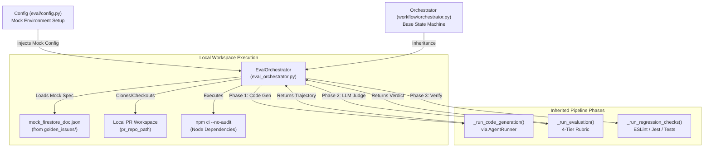
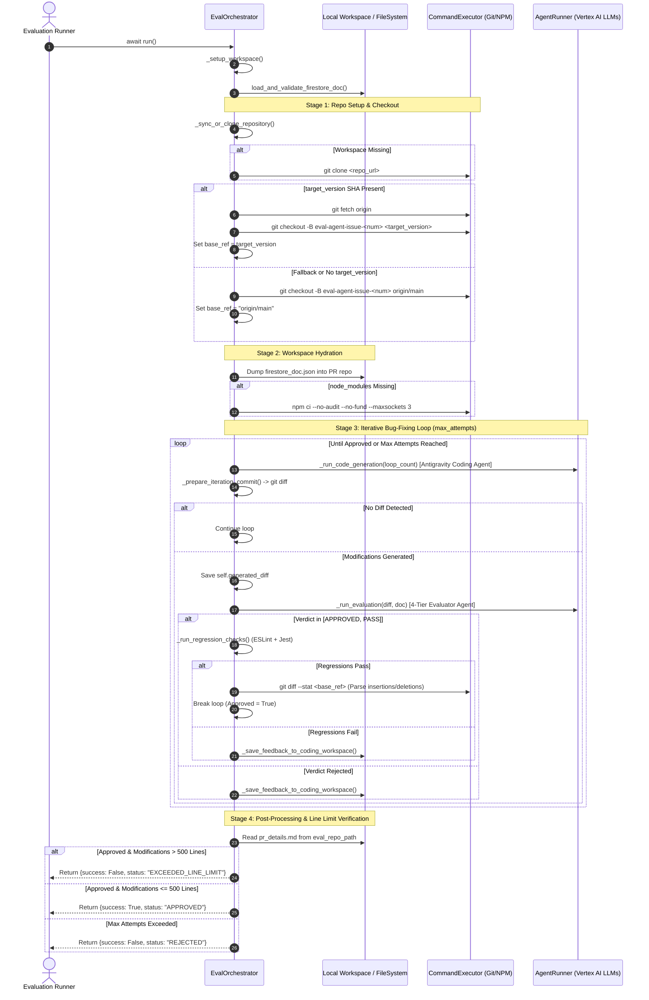

# SSR Code Generator: Offline Evaluation Pipeline Design Document

This design document provides an exhaustive architectural, functional, and
operational reference for the offline evaluation pipeline
(`evals/pr-generation/`) of the SSR Code Generator project.

The evaluation pipeline is designed to benchmark and validate autonomous AI
coding agents against golden historical bug-fix datasets without mutating live
external infrastructure (such as Google Cloud Firestore, Google Cloud Storage,
or live GitHub repositories). It adapts production state machines for
deterministic, repeatable, and parallelized offline execution while employing an
automated LLM-as-a-Judge grading framework to score agent patches against
historical ground truth diffs.

---

## Table of Contents

1. [Chapter 1: Master Parallel Test Harness (`eval_suite.py`)](#chapter-1-master-parallel-test-harness-eval_suitepy)
2. [Chapter 2: Offline State Machine Adaptation (`evals/pr-generation/helpers/eval_orchestrator.py`)](#chapter-2-offline-state-machine-adaptation-eval_orchestratorpy)
3. [Chapter 3: Configuration & Workspace Hydration (`evals/pr-generation/helpers/eval_config.py`)](#chapter-3-configuration--workspace-hydration-eval_configpy)
4. [Chapter 4: LLM-as-a-Judge Diff Evaluation Engine (`eval_diff_judge.py`)](#chapter-4-llm-as-a-judge-diff-evaluation-engine-eval_diff_judgepy)
5. [Chapter 5: Evaluation Rubric & Prompt Contract (`judge_prompt.md`)](#chapter-5-evaluation-rubric--prompt-contract-judge_promptmd)
6. [Chapter 6: Dataset Migration & Standardization (`evals/pr-generation/helpers/reformat_golden_issues.py`)](#chapter-6-dataset-migration--standardization-reformat_golden_issuespy)
7. [Chapter 7: Dual Golden Issue Generator & Trace Logging (`evals/pr-generation/helpers/generate_golden_issue.py`)](#chapter-7-dual-golden-issue-generator--trace-logging-generate_golden_issuepy)
8. [Chapter 8: Multi-Instance Task Array Cloud Evaluation Pipeline (`cloud_eval_runner.py`)](#chapter-8-multi-instance-task-array-cloud-evaluation-pipeline-cloud_eval_runnerpy)
9. [Chapter 9: Batch Triage Agent Spec Generator Architecture (`evals/pr-generation/helpers/triage_agent_runner.py`)](#chapter-9-batch-triage-agent-spec-generator-architecture-triage_agent_runnerpy)

---

## Chapter 1: Master Parallel Test Harness (eval_suite.py)

Created At: 2026-07-28T14:57:16Z Completed At: 2026-07-28T14:57:17Z File Path:
`file:///usr/local/google/home/joneba/ssr-prototype/gcli-intern-project/evals/pr-generation/judge_prompt.md`
Total Lines: 62 Total Bytes: 2145 Showing lines 1 to 62 The following code has
been modified to include a line number before every line, in the format:
<line_number>: <original_line>. Please note that any changes targeting the
original code should remove the line number, colon, and leading space. 1: You
are an expert Principal Software Engineer and Code Reviewer evaluating an AI
coding agent's proposed patch against the ground-truth diff that solved a real
GitHub issue. 2: 3: ### Evaluation Objective 4: Compare the PROPOSED DIFF
generated by the coding agent against the GROUND TRUTH DIFF. Analyze
functionality, correctness, code quality, edge case handling, security
implications, and test coverage. 5: 6: --- 7: 8: ### Ground Truth Context 9: -
**Repository:** {{OWNER}}/{{REPO}} 10: - **Issue ID:** {{ISSUE_ID}} 11: -
**Issue Title:** {{ISSUE_TITLE}} 12: 13: ### Issue Summary & Specification 14:
{{ISSUE_SUMMARY}} 15: 16: --- 17: 18: ### GROUND TRUTH DIFF (The Accepted Fix)
19: `diff 20: {{TRUE_DIFF}} 21: ` 22: 23: --- 24: 25: ### PROPOSED DIFF (Agent
Patch to Evaluate) 26: `diff 27: {{PROPOSED_DIFF}} 28: ` 29: 30: --- 31: 32: ###
Scoring Rubric & Grading Standard 33: 34: Assign an integer score strictly from
**0 to 3** based on the following rubric: 35: 36: _ **Score 3 (Full Parity /
Equivalent Quality):** 37: - Implements identical core functionality and logic
as the ground-truth patch. 38: - Solves the underlying issue without regressions
or incomplete logic. 39: - Includes adequate unit test coverage matching or
exceeding the true patch. 40: 41: _ **Score 2 (Similar Functionality / Lacking
Detail):** 42: - On the right path and fixes the primary bug path, but missing
secondary edge case handling, refactoring details, or unit tests included in the
ground-truth patch. 43: - Functional, but incomplete compared to the
production-grade fix. 44: 45: _ **Score 1 (Minimal / On the Right Track):**
46: - Modifies relevant files or functions, but the fix is incomplete,
syntactically flawed, or fails to resolve key issue requirements. 47: 48: _
**Score 0 (Severe Defect / Security Concern / Completely Incorrect):** 49: -
Introduces a high-tier security vulnerability (e.g. command injection,
un-sanitized path traversal, secret exposure), causes major code breaking
changes, or is completely unrelated/incorrect. 50: 51: --- 52: 53: ### Output
JSON Format 54: Output ONLY a raw JSON object with no surrounding markdown
formatting or explanation outside the JSON: 55: 56:
`json 57: { 58:   "score": <INTEGER_0_TO_3>, 59:   "verdict_description": "<CONCISE_2_TO_3_SENTENCE_EXPLANATION_OF_VERDICT>" 60: } 61: `
62: The above content shows the entire, complete file contents of the requested
file.

---

## Chapter 2: Offline State Machine Adaptation (eval_orchestrator.py)

This document provides an in-depth architectural, functional, and operational
analysis of
[`eval_orchestrator.py`](file:///usr/local/google/home/joneba/ssr-prototype/gcli-intern-project/evals/pr-generation/eval_orchestrator.py),
a critical component within the SSR Code Generator offline evaluation pipeline
(`eval/`).

---

### 1. Purpose & Architectural Role

#### 1.1 Core Responsibilities in the Offline Evaluation Pipeline

The
[`EvalOrchestrator`](file:///usr/local/google/home/joneba/ssr-prototype/gcli-intern-project/evals/pr-generation/eval_orchestrator.py#L35)
class serves as the localized execution engine for benchmarking and validating
autonomous code generation capabilities without mutating live external
infrastructure. In production, the bug-fixing workflow relies on distributed
coordination (Google Cloud Firestore dual-phase locks, Google Cloud Storage
trajectory logging, and live GitHub API pull request creation). In contrast,
`EvalOrchestrator` adapts this production state machine for deterministic,
offline, and repeatable evaluation runs against benchmarks (such as golden
bug-fix test suites stored in `golden_issues/`).

Specifically,
[`EvalOrchestrator`](file:///usr/local/google/home/joneba/ssr-prototype/gcli-intern-project/evals/pr-generation/eval_orchestrator.py#L35):

1. **Bypasses Distributed Locking**: Eliminates Firestore lock acquisition
   (`acquire_lock`/`release_lock`) and state transition writes
   (`mark_pr_created`, `mark_needs_human`), operating entirely against in-memory
   or locally loaded mock Firestore document specifications.
2. **Neutralizes External Side-Effects**: Prevents external API calls to GitHub
   (`GitHubClient.create_pull_request`), preventing unwanted branch pushes, PR
   creations, or comment flooding on remote repositories.
3. **Enforces Benchmarking Guardrails**: Implements rigorous constraints—such as
   dynamic git revision baselining and a hard 500-line modification threshold—to
   ensure generated patches are concise, targeted, and evaluated against precise
   historical commits.

#### 1.2 Interfacing with Ecosystem Components



- **[`Orchestrator`](file:///usr/local/google/home/joneba/ssr-prototype/gcli-intern-project/cloudrun/pr-generator/workflow/orchestrator.py#L62)
  (Superclass)**: Inherits core iterative bug-fixing phase execution, including
  [`_run_code_generation`](file:///usr/local/google/home/joneba/ssr-prototype/gcli-intern-project/cloudrun/pr-generator/workflow/orchestrator.py#L355),
  [`_prepare_iteration_commit`](file:///usr/local/google/home/joneba/ssr-prototype/gcli-intern-project/cloudrun/pr-generator/workflow/orchestrator.py#L404),
  [`_run_evaluation`](file:///usr/local/google/home/joneba/ssr-prototype/gcli-intern-project/cloudrun/pr-generator/workflow/orchestrator.py#L447),
  [`_run_regression_checks`](file:///usr/local/google/home/joneba/ssr-prototype/gcli-intern-project/cloudrun/pr-generator/workflow/orchestrator.py#L610),
  and
  [`_save_feedback_to_coding_workspace`](file:///usr/local/google/home/joneba/ssr-prototype/gcli-intern-project/cloudrun/pr-generator/workflow/orchestrator.py#L656).
- **`Config` / Mock Firestore Docs**: Interfaces with the configuration object
  to invoke `load_and_validate_firestore_doc()`, which reads local JSON test
  cases (e.g., from `golden_issues/`) instead of querying GCP Firestore.
- **[`AgentRunner`](file:///usr/local/google/home/joneba/ssr-prototype/gcli-intern-project/cloudrun/pr-generator/workflow/agent_runner.py)**:
  Manages interactions with Google Vertex AI (Gemini models) via the prompt
  scripts in `agent_prompts/`, executing the Antigravity Coding Agent and
  Evaluator Agent.
- **[`CommandExecutor`](file:///usr/local/google/home/joneba/ssr-prototype/gcli-intern-project/cloudrun/pr-generator/workflow/command_executor.py#L34)**:
  Executes shell subprocesses for git operations, package installations
  (`npm ci`), and diff statistics analysis.
- **Local File Logging**: Redirects outputs that would normally be streamed to
  GCS (`upload_agent_trajectory_log`, `upload_git_diff`, `upload_pr_details`) or
  GitHub PR bodies into local artifacts (`pr_details.md`, `generated_diff`)
  stored directly within the evaluation workspace.

---

### 2. Class & Function Architecture

#### 2.1 Class: [`EvalOrchestrator`](file:///usr/local/google/home/joneba/ssr-prototype/gcli-intern-project/evals/pr-generation/eval_orchestrator.py#L35)

- **Inheritance**: Subclasses
  [`Orchestrator`](file:///usr/local/google/home/joneba/ssr-prototype/gcli-intern-project/cloudrun/pr-generator/workflow/orchestrator.py#L62)
  from `workflow.orchestrator`.
- **Module Path Manipulation**: Dynamically injects `WORKFLOW_DIR` (i.e.,
  `../workflow`) into `sys.path`
  ([L27-L29](file:///usr/local/google/home/joneba/ssr-prototype/gcli-intern-project/evals/pr-generation/eval_orchestrator.py#L27-L29))
  to ensure seamless resolution of production modules without package
  installation overhead.

##### Internal State (Instance Attributes)

| Attribute            | Type          | Initial Value                                                                                                                       | Description                                                                                       |
| :------------------- | :------------ | :---------------------------------------------------------------------------------------------------------------------------------- | :------------------------------------------------------------------------------------------------ |
| `config`             | `Config`      | Passed via `__init__`                                                                                                               | Configuration instance defining paths, API parameters, and environment overrides.                 |
| `base_ref`           | `str`         | `"origin/main"` (inherited)                                                                                                         | The target git revision SHA or branch against which code modifications and diffs are computed.    |
| `agent_runner`       | `AgentRunner` | Initialized in superclass                                                                                                           | Client instance responsible for dispatching prompts to Vertex AI language models.                 |
| `generated_diff`     | `str \| None` | `None` ([L40](file:///usr/local/google/home/joneba/ssr-prototype/gcli-intern-project/evals/pr-generation/eval_orchestrator.py#L40)) | Captures the final `git diff` generated by the agent during a successful or terminated iteration. |
| `pr_details_content` | `str \| None` | `None` ([L41](file:///usr/local/google/home/joneba/ssr-prototype/gcli-intern-project/evals/pr-generation/eval_orchestrator.py#L41)) | Captures the markdown contents of `pr_details.md` produced by the LLM Evaluator agent.            |

---

#### 2.2 Method Breakdown

##### [`__init__(self, config) -> None`](file:///usr/local/google/home/joneba/ssr-prototype/gcli-intern-project/evals/pr-generation/eval_orchestrator.py#L38-L41)

- **Parameters**:
  - `config` (`Any` / `Config`): The evaluation configuration object.
- **Return Type**: `None`
- **Behavior**: Invokes `super().__init__(config)` to initialize the superclass
  state (including `self.agent_runner` and default `self.base_ref`), and
  initializes `self.generated_diff` and `self.pr_details_content` to `None`.

---

##### [`_sync_or_clone_repository(self) -> None`](file:///usr/local/google/home/joneba/ssr-prototype/gcli-intern-project/evals/pr-generation/eval_orchestrator.py#L43-L68)

- **Parameters**: None (implicit `self`).
- **Return Type**: `None`
- **Behavior**: Overrides the superclass implementation to support historical
  commit benchmarking:
  1. Loads the mock Firestore document via
     `self.config.load_and_validate_firestore_doc()`.
  2. Extracts `target_version` (commit SHA) and `issue_number` from
     `github_metadata`.
  3. Constructs an evaluation branch name: `eval-agent-issue-{issue_num}`.
  4. Checks if `self.config.pr_repo_path` exists; if missing, clones
     `self.config.repo_url` via
     [`CommandExecutor.run`](file:///usr/local/google/home/joneba/ssr-prototype/gcli-intern-project/cloudrun/pr-generator/workflow/command_executor.py#L34).
  5. Performs git checkout based on `target_version` availability (see Section
     3.2 for fallback logic).
  6. Dynamically sets `self.base_ref` to the checked-out revision
     (`target_version` or `"origin/main"`).

---

##### [`async run(self) -> dict`](file:///usr/local/google/home/joneba/ssr-prototype/gcli-intern-project/evals/pr-generation/eval_orchestrator.py#L70-L185)

- **Parameters**: None (implicit `self`).
- **Return Type**: `dict` (Structured evaluation result summary).
- **Behavior**: Asynchronous execution entrypoint that drives the offline
  evaluation loop.
- **Return Structure Specification**:
  ```json
  {
    "success": true,
    "status": "APPROVED | REJECTED | EXCEEDED_LINE_LIMIT",
    "diff": "diff --git a/... b/...",
    "pr_details": "# Pull Request Details\n...",
    "error": "Error message string or null"
  }
  ```
  - `success` (`bool`): `True` if and only if the evaluator approved the patch,
    regression checks passed, and the commit line count is $\le 500$.
  - `status` (`str`): Explicit terminal status code (`APPROVED`, `REJECTED`, or
    `EXCEEDED_LINE_LIMIT`).
  - `diff` (`str | None`): The raw git patch string generated by the agent.
  - `pr_details` (`str | None`): The markdown narrative generated by the
    evaluator agent.
  - `error` (`str | None`): Diagnostic explanation of failure if `success` is
    `False`.

---

### 3. Step-by-Step Logical Flow

The execution flow of an evaluation run via `await eval_orchestrator.run()`
proceeds through five distinct stages:



#### 3.1 Workspace Setup and Specification Loading

1. **Workspace Initialization**: Calls `self._setup_workspace()` (inherited from
   superclass) to create `tmp_dir`, `pr_dir`, and `eval_dir` if they do not
   exist.
2. **Specification Extraction**: Calls
   `self.config.load_and_validate_firestore_doc()` to parse the problem
   specification (e.g., golden issue definition). It extracts `issue_id` and
   `issue_number` from the document's metadata.

#### 3.2 Dynamic Repository Synchronization & `target_version` Checkout

When `_sync_or_clone_repository()` is invoked, it ensures the target codebase is
checked out at the exact historical point where the reported bug exists:

1. **Repository Cloning**: Checks for the existence of
   `self.config.pr_repo_path`. If absent, executes a fresh git clone of
   `self.config.repo_url`.
2. **Dynamic Revision Checkout & Fallback Strategy**:
   - **Case A (`target_version` is specified in `github_metadata`)**:
     - Executes `git fetch origin` within `pr_repo_path` to guarantee the local
       repository is aware of all remote commits and branches.
     - Executes `git checkout -B eval-agent-issue-{issue_num} {target_version}`.
     - If checkout succeeds, dynamically updates
       `self.base_ref = target_version`.
     - **Fallback Mechanism**: If the checkout fails (e.g., due to a rebased
       SHA, garbage collected commit, or network fetch failure), the exception
       is caught and logged as a warning
       ([L61-L64](file:///usr/local/google/home/joneba/ssr-prototype/gcli-intern-project/evals/pr-generation/eval_orchestrator.py#L61-L64)).
       It safely falls back to executing
       `git checkout -B eval-agent-issue-{issue_num} origin/main` and sets
       `self.base_ref = "origin/main"`.
   - **Case B (`target_version` is absent or `None`)**:
     - Executes `git checkout -B eval-agent-issue-{issue_num} origin/main`.
     - Sets `self.base_ref = "origin/main"`.

#### 3.3 Workspace Hydration (Mock Firestore Dump & Node Dependencies)

1. **Mock Firestore Document Dumping**: To allow offline agents (which read
   local workspace specifications) to understand the issue without querying GCP
   Firestore, `EvalOrchestrator` serializes the dictionary returned by
   `load_and_validate_firestore_doc()` and dumps it directly to
   `{pr_repo_path}/firestore_doc.json`
   ([L89-L94](file:///usr/local/google/home/joneba/ssr-prototype/gcli-intern-project/evals/pr-generation/eval_orchestrator.py#L89-L94)).
   Any filesystem `IOError` raises an `OrchestrationError`.
2. **Deterministic NPM Package Installation**:
   - Checks if `{pr_repo_path}/node_modules` exists.
   - If missing, executes `npm ci` via `CommandExecutor.run`:
     ```bash
     NODE_OPTIONS="--max-old-space-size=4096" npm ci --no-audit --no-fund --maxsockets 3
     ```
   - **Why `npm ci` over symlinking?** In production environments, package
     directories might be symlinked across workspaces to save disk space and
     network bandwidth. However, during evaluation against historical
     `target_version` commits, package dependency trees (`package-lock.json`)
     vary across time. Using `npm ci` guarantees a clean, immutable installation
     matching the exact dependency tree of that specific historical commit while
     using memory-safe heap limits (`4096 MB`) and throttling network socket
     concurrency (`--maxsockets 3`) to prevent resource exhaustion or race
     conditions in parallel evaluation workers.

#### 3.4 Iterative Code Generation and Evaluation Loop

The orchestrator enters a bounded loop
(`while loop_count < self.config.max_attempts and not approved:`):

1. **Phase 1: Code Generation**: Awaits `self._run_code_generation(loop_count)`.
   The Antigravity Coding Agent analyzes the bug report, inspects codebase
   files, and applies file modifications directly inside `pr_repo_path`.
2. **Diff Preparation**: Invokes
   `self._prepare_iteration_commit(issue_num, loop_count)`.
   - Stages changes and generates a diff against `self.base_ref`.
   - If no modifications are detected (`not diff_content`), it logs a notice and
     immediately advances to the next iteration loop
     ([L120-L122](file:///usr/local/google/home/joneba/ssr-prototype/gcli-intern-project/evals/pr-generation/eval_orchestrator.py#L120-L122)).
   - Otherwise, records `self.generated_diff = diff_content`.
3. **Phase 2: LLM Evaluation**: Awaits
   `self._run_evaluation(diff_content, firestore_doc)`.
   - The Evaluator Agent reviews the patch against the issue description and
     emits a qualitative verdict using a 4-tier rubric (e.g., `APPROVED`,
     `PASS`, `NEEDS_REVISION`, `REJECT`).
4. **Phase 3: Regression Preflight Verification**:
   - If `verdict in ["APPROVED", "PASS"]`, it executes
     `await self._run_regression_checks()`. This triggers ESLint static analysis
     and Jest automated test suites within the workspace.
   - If regression checks pass (`approved == True`), the loop terminates.
   - If regression checks fail (`approved == False`) or the Evaluator rejected
     the patch, `self._save_feedback_to_coding_workspace()` writes diagnostic
     feedback (lint errors, test failures, or reviewer notes) into
     `pr_feedback.md` inside the workspace so the Coding Agent can ingest it on
     the next iteration.

#### 3.5 Post-Processing, Line Count Validation, and Exit

Upon exiting the loop:

1. **Artifact Extraction**: Attempts to read `{eval_repo_path}/pr_details.md`
   (which contains the Evaluator's summary report) and stores it in
   `self.pr_details_content`.
2. **Dynamic Line Count Limit Verification**:
   - During the approval phase
     ([L134-L146](file:///usr/local/google/home/joneba/ssr-prototype/gcli-intern-project/evals/pr-generation/eval_orchestrator.py#L134-L146)),
     the orchestrator runs `git diff --stat {self.base_ref}` to calculate the
     total line modifications (summing regex-parsed `insertions` and
     `deletions`).
   - If `approved == True` but `commit_line_count > 500`, the orchestrator
     **overrides the approval**, logs an error, and returns a failure status:
     ```json
     {
       "success": false,
       "status": "EXCEEDED_LINE_LIMIT",
       "diff": "...",
       "pr_details": "...",
       "error": "Commit modifications (542 lines) exceed 500 lines limit."
     }
     ```
3. **Terminal Returns**:
   - If `approved == True` and `commit_line_count <= 500`: Returns
     `{success: True, status: "APPROVED", ...}`.
   - If `approved == False` (max attempts exhausted): Returns
     `{success: False, status: "REJECTED", error: "Failed to reach approval after N iterations.", ...}`.

---

### 4. Design Decisions & Edge Cases

#### 4.1 Key Architectural Design Choices

##### 1. Dynamic `base_ref` Tracking

In standard continuous integration, pull requests are evaluated against
`origin/main`. In offline historical benchmarking, evaluating a bug fix against
modern `main` would cause catastrophic merge conflicts and false-positive test
failures due to codebase drift. By dynamically setting
`self.base_ref = target_version`, `EvalOrchestrator` ensures that all subsequent
operations—specifically `git diff` generation, evaluator context framing, and
line modification counting—are measured strictly relative to the exact
historical commit where the bug was introduced.

##### 2. Hard 500-Line Modification Threshold (`EXCEEDED_LINE_LIMIT`)

Autonomous coding agents can occasionally suffer from "solution drift" or
refactoring hallucinations, rewriting entire modules or formatting files
unnecessarily instead of applying a surgical bug fix. The 500-line modification
limit
([L160-L168](file:///usr/local/google/home/joneba/ssr-prototype/gcli-intern-project/evals/pr-generation/eval_orchestrator.py#L160-L168))
acts as a crucial programmatic guardrail. Even if the LLM Evaluator approves a
patch and all unit tests pass, an oversized diff is rejected as an invalid
bug-fix candidate. This forces benchmarking metrics to reward conciseness and
precision over brute-force refactoring.

##### 3. In-Memory / Workspace File Serialization vs. Live Database

By persisting `firestore_doc.json` into the root of `pr_repo_path`
([L89](file:///usr/local/google/home/joneba/ssr-prototype/gcli-intern-project/evals/pr-generation/eval_orchestrator.py#L89)),
the evaluation orchestrator reuses the exact same agent prompts and workspace
exploration tools used in production. The coding agents do not need special code
paths to distinguish whether they are running in production cloud environments
or offline local evaluations; they simply read the local JSON spec file.

##### 4. 4-Tier Evaluator Rubric Integration

The evaluation condition check `if verdict in ["APPROVED", "PASS"]:`
([L128](file:///usr/local/google/home/joneba/ssr-prototype/gcli-intern-project/evals/pr-generation/eval_orchestrator.py#L128))
demonstrates adaptation to a nuanced LLM judging rubric. Rather than a binary
pass/fail, the evaluator agent can emit nuanced verdicts where both explicit
approval (`APPROVED`) and acceptable functional equivalence (`PASS`) trigger
preflight regression testing.

---

#### 4.2 Edge Case Handling and Mitigation Strategies

| Edge Case / Failure Mode                   | Root Cause                                                                                                                | Mitigation Strategy in `EvalOrchestrator`                                                                                                                                                                                                                                                                                                                      |
| :----------------------------------------- | :------------------------------------------------------------------------------------------------------------------------ | :------------------------------------------------------------------------------------------------------------------------------------------------------------------------------------------------------------------------------------------------------------------------------------------------------------------------------------------------------------- |
| **Missing or Pruned `target_version` SHA** | Historical SHA specified in test case was force-rebased, garbage-collected on remote, or typographical error in metadata. | Try/except block on `git checkout` ([L57-L64](file:///usr/local/google/home/joneba/ssr-prototype/gcli-intern-project/evals/pr-generation/eval_orchestrator.py#L57-L64)). Logs warning and automatically falls back to checking out `origin/main` and resetting `self.base_ref = "origin/main"`, preventing pipeline crash.                                     |
| **Workspace Missing `node_modules`**       | Fresh git clone or workspace clean wiped local node dependency binaries required for running tests/linters.               | Auto-detects missing `node_modules` directory and triggers `npm ci` with strict flags (`--no-audit --no-fund`) and socket limits ([L97-L104](file:///usr/local/google/home/joneba/ssr-prototype/gcli-intern-project/evals/pr-generation/eval_orchestrator.py#L97-L104)).                                                                                       |
| **NPM Memory Heap Exhaustion**             | Heavy Node dependency builds out-of-memory (OOM) during CI installation on constrained evaluation VMs.                    | Explicitly prepends `NODE_OPTIONS="--max-old-space-size=4096"` to the installation command ([L101](file:///usr/local/google/home/joneba/ssr-prototype/gcli-intern-project/evals/pr-generation/eval_orchestrator.py#L101)), guaranteeing 4GB of heap allocation.                                                                                                |
| **Agent Generates Zero Modifications**     | Coding agent fails to locate the bug or generates an empty patch during an iteration loop.                                | Verifies `if not diff_content:` ([L120](file:///usr/local/google/home/joneba/ssr-prototype/gcli-intern-project/evals/pr-generation/eval_orchestrator.py#L120)). Logs notice and short-circuits evaluation/regression checks, advancing immediately to the next retry attempt without wasting LLM evaluator tokens.                                             |
| **Diff Stat Parsing Failure**              | Malformed git diff output or unexpected formatting when executing `git diff --stat`.                                      | Wraps line count regex parsing (`r"(\d+)\s+insertion"`) in a try/except block ([L133-L146](file:///usr/local/google/home/joneba/ssr-prototype/gcli-intern-project/evals/pr-generation/eval_orchestrator.py#L133-L146)). If parsing fails, logs a warning without crashing the pipeline, defaulting line counts to safe fallbacks.                              |
| **Missing `pr_details.md` Artifact**       | Evaluator agent crashes or fails to write its markdown summary report to `eval_repo_path`.                                | Checks filesystem existence `if os.path.exists(pr_details_path):` and wraps read in try/except `IOError` ([L151-L157](file:///usr/local/google/home/joneba/ssr-prototype/gcli-intern-project/evals/pr-generation/eval_orchestrator.py#L151-L157)), gracefully returning `pr_details: None` in the output dictionary instead of raising an unhandled exception. |

---

### 5. Summary of Differences: `Orchestrator` vs. `EvalOrchestrator`

To conclude the architectural analysis, the table below highlights the
operational differences between the production superclass and the offline
evaluation subclass:

| Capability / Feature        | Production `Orchestrator` (`workflow/`)                                                  | Offline `EvalOrchestrator` (`eval/`)                                                                     |
| :-------------------------- | :--------------------------------------------------------------------------------------- | :------------------------------------------------------------------------------------------------------- |
| **Firestore State Locking** | Enforces distributed concurrency locks via `acquire_lock` / `release_lock`.              | **Disabled**. Bypasses DB locks; operates on local mock JSON specifications.                             |
| **PR & Comment Submission** | Pushes branches to remote origin and opens live GitHub Pull Requests via `GitHubClient`. | **Disabled**. Generates local `generated_diff` and `pr_details.md` file artifacts.                       |
| **Git Revision Baselining** | Hardcoded to evaluate against remote `origin/main`.                                      | **Dynamic**. Checks out historical `target_version` SHA with fallback to `origin/main`.                  |
| **Dependency Management**   | Assumes pre-configured environment or relies on external setup.                          | **Self-Healing**. Auto-detects missing `node_modules` and executes optimized `npm ci`.                   |
| **Line Modification Limit** | No hard failure limit on patch line counts (relies on human/LLM review).                 | **Strict Guardrail**. Enforces a hard $\le 500$ line modification limit; overrides approval if exceeded. |
| **Return Value / Output**   | Async execution returning `None` (side-effects written to GCP/GitHub).                   | Returns a structured dictionary containing `success`, `status`, `diff`, `pr_details`, and `error`.       |

---

## Chapter 3: Configuration & Workspace Hydration (eval_config.py)

### Environment Variables Specification

The evaluation pipeline and underlying workflow engine rely on the following
environment variables. The table below lists all variables, default values, and
operational scope:

| Environment Variable                    | Scope             | Required / Optional         | Default Value                                       | Description & Function                                                                                                                     |
| :-------------------------------------- | :---------------- | :-------------------------- | :-------------------------------------------------- | :----------------------------------------------------------------------------------------------------------------------------------------- |
| **`GOOGLE_CLOUD_PROJECT`**              | GCP / Auth        | Required (Prod)             | Auto-resolved from ADC / GCP                        | Target Google Cloud Project ID (`gcli-intern-project-2026`).                                                                               |
| **`GOOGLE_CLOUD_LOCATION`**             | GCP / Auth        | Optional                    | `"global"`                                          | Google Cloud region/location for Vertex AI model endpoints.                                                                                |
| **`MODEL_NAME`**                        | Model / Agent     | Optional                    | `"gemini-3.5-flash"`                                | Gemini model used by `AgentRunner` for agent execution across state machine turns.                                                         |
| **`MAX_ATTEMPTS`**                      | State Machine     | Optional                    | `"5"`                                               | Maximum repair loop iterations for patch generation before setting status to `NEEDS_HUMAN` (enforces `max(int(...), 1)`).                  |
| **`GIT_TOKEN`**                         | Auth / Secrets    | Required (Prod PR creation) | `None`                                              | GitHub Personal Access Token used for authenticated git operations and Pull Request creation. Popped from `os.environ` on `Config` init.   |
| **`REPO_URL`**                          | Git Workspace     | Optional                    | `"https://github.com/google-gemini/gemini-cli.git"` | Target GitHub repository URL to clone into isolated workspaces.                                                                            |
| **`FIRESTORE_DATABASE`**                | Database          | Optional                    | `"gcli-db"`                                         | Specific Firestore database instance name.                                                                                                 |
| **`FIRESTORE_COLLECTION`**              | Database          | Optional                    | `"issues"`                                          | Target Firestore collection name storing issue specifications and transactional locks.                                                     |
| **`FIRESTORE_DOC`**                     | State / Ingestion | Required (Cloud Run)        | `None`                                              | Raw JSON string representing the complete Firestore issue specification document.                                                          |
| **`FIRESTORE_ID`** / **`firestore_id`** | Database / Lock   | Required (Cloud Run)        | `None`                                              | Firestore document ID used for transactional concurrency locks and status tracking.                                                        |
| **`EXECUTION_ID`**                      | Observability     | Optional                    | `"local-eval-execution"` (Eval)                     | Unique Cloud Run Job or Cloud Workflow execution identifier.                                                                               |
| **`PR_GEN_DEBUG_LOGS_BUCKET`**          | Storage / Logs    | Optional                    | `"pr_generation_debug_logs"`                        | GCS bucket name for uploading production trajectory debug logs and artifacts.                                                              |
| **`PR_GEN_EVAL_RESULTS_BUCKET`**        | Storage / Eval    | Optional                    | `"pr-generation-eval-results"`                      | GCS bucket name for storing evaluation run outputs when `--gcs` is enabled.                                                                |
| **`DISABLE_GCS_LOGGING`**               | Storage / Eval    | Optional                    | `"false"`                                           | Toggles GCS log uploads. Set to `"true"` or `"1"` in local evaluation mode to bypass remote GCS calls unless `--gcs` is explicitly passed. |
| **`EVAL_GCS_RUN_NAME`**                 | Eval Harness      | Auto-set in `--gcs` eval    | `None`                                              | Evaluation run identifier set by `eval_suite.py` when `--gcs` is passed to direct GCS blobs to `runs/<run_name>_<timestamp>/`.             |
| **`EVAL_GCS_RUN_TIMESTAMP`**            | Eval Harness      | Auto-set in `--gcs` eval    | `None`                                              | UTC timestamp string set by `eval_suite.py` when `--gcs` is passed.                                                                        |
| **`LOCAL_TRACE_DIR`**                   | Eval Harness      | Auto-set in eval            | `eval/run_outputs/<run_name>/json`                  | Directory path where local agent trajectory JSON logs are saved per turn.                                                                  |
| **`GEMINI_CLI_WORKSPACE_TRUSTED`**      | System / CLI      | Auto-set by Config          | `"true"`                                            | Set automatically by `Config` initialization to bypass workspace trust prompts when running `gemini-cli` commands.                         |
| **`USE_ADC`**                           | GCP / Auth        | Optional                    | `"true"`                                            | Directs Vertex AI / Google Auth SDK to use Application Default Credentials.                                                                |

Created At: 2026-07-28T14:58:02Z Completed At: 2026-07-28T14:58:04Z File Path:
`file:///usr/local/google/home/joneba/ssr-prototype/gcli-intern-project/evals/pr-generation/eval_orchestrator.py`
Total Lines: 186 Total Bytes: 8468 Showing lines 101 to 186 The following code
has been modified to include a line number before every line, in the format:
<line_number>: <original_line>. Please note that any changes targeting the
original code should remove the line number, colon, and leading space. 101:
npm_install_cmd = 'NODE_OPTIONS="--max-old-space-size=4096" npm ci --no-audit
--no-fund --maxsockets 3' 102: CommandExecutor.run(npm_install_cmd,
self.config.pr_repo_path) 103: except Exception as e: 104: raise
OrchestrationError(f"Failed to install NPM dependencies in PR workspace: {e}")
from e 105: 106: approved = False 107: loop_count = 0 108: verdict =
"NEEDS_REVISION" 109: commit_line_count = 0 110: 111: while loop_count <
self.config.max_attempts and not approved: 112: loop_count += 1 113:
logging.info("=== [LOCAL EVAL] Starting Iteration %s/%s ===", loop_count,
self.config.max_attempts) 114: 115: # Phase 1: Code Generation 116: await
self.\_run_code_generation(loop_count) 117: 118: # Stage edits and generate diff
119: diff_content = self.\_prepare_iteration_commit(issue_num, loop_count) 120:
if not diff_content: 121: logging.info("[LOCAL EVAL] No code modifications
detected in iteration %s.", loop_count) 122: continue 123: self.generated_diff =
diff_content 124: 125: # Phase 2: Evaluation 126: verdict = await
self.\_run_evaluation(diff_content, firestore_doc) 127: 128: if verdict in
["APPROVED", "PASS"]: 129: logging.info("[LOCAL EVAL] Patch approved by
Evaluator. Running regression checks...") 130: approved = await
self.\_run_regression_checks() 131: 132: if approved: 133: try: 134: diff_stat =
CommandExecutor.run(f"git diff --stat {self.base_ref}",
self.config.pr_repo_path) 135: logging.info("Diff Stat summary:\n%s", diff_stat)
136: lines = diff_stat.split("\n") 137: last_line = lines[-1] if lines else ""
138: insertions = re.search(r"(\d+)\s+insertion", last_line) 139: deletions =
re.search(r"(\d+)\s+deletion", last_line) 140: if insertions: 141:
commit_line_count += int(insertions.group(1)) 142: if deletions: 143:
commit_line_count += int(deletions.group(1)) 144: except Exception as e: 145:
logging.warning("Failed to parse modifications line count: %s", e) 146: 147: if
not approved: 148: self.\_save_feedback_to_coding_workspace() 149: 150: #
Extract pr_details.md if generated 151: pr_details_path =
os.path.join(self.config.eval_repo_path, "pr_details.md") 152: if
os.path.exists(pr_details_path): 153: try: 154: with open(pr_details_path, "r",
encoding="utf-8") as f: 155: self.pr_details_content = f.read() 156: except
IOError: 157: pass 158: 159: if approved: 160: if commit_line_count > 500: 161:
logging.error("[LOCAL EVAL] Approved but modifications (%s lines) exceed 500
limit.", commit_line_count) 162: return { 163: "success": False, 164: "status":
"EXCEEDED_LINE_LIMIT", 165: "diff": self.generated_diff, 166: "pr_details":
self.pr_details_content, 167: "error": f"Commit modifications
({commit_line_count} lines) exceed 500 lines limit.", 168: } 169:
logging.info("=== [LOCAL EVAL] SUCCESS: Patch Approved and Verified ===") 170:
return { 171: "success": True, 172: "status": "APPROVED", 173: "diff":
self.generated_diff, 174: "pr_details": self.pr_details_content, 175: "error":
None, 176: } 177: else: 178: logging.error("=== [LOCAL EVAL] FAILED: Exceeded
Max Attempts without Approval ===") 179: return { 180: "success": False, 181:
"status": "REJECTED", 182: "diff": self.generated_diff, 183: "pr_details": None,
184: "error": f"Failed to reach approval after {self.config.max_attempts}
iterations.", 185: } 186: The above content does NOT show the entire file
contents. If you need to view any lines of the file which were not shown to
complete your task, call this tool again to view those lines.

---

## Chapter 4: LLM-as-a-Judge Diff Evaluation Engine (eval_diff_judge.py)

This report provides a rigorous, comprehensive architectural and functional
analysis of
[`eval/eval_diff_judge.py`](file:///usr/local/google/home/joneba/ssr-prototype/gcli-intern-project/evals/pr-generation/eval_diff_judge.py),
the automated LLM-as-a-Judge evaluation component of the SSR Code Generator
evaluation pipeline.

---

### 1. Purpose & Architectural Role

#### 1.1 Core Responsibility

[`eval_diff_judge.py`](file:///usr/local/google/home/joneba/ssr-prototype/gcli-intern-project/evals/pr-generation/eval_diff_judge.py)
serves as the **automated qualitative evaluation engine** for offline evaluation
runs. While
[`eval_suite.py`](file:///usr/local/google/home/joneba/ssr-prototype/gcli-intern-project/evals/pr-generation/eval_suite.py)
orchestrates the execution of the SSR Code Generator agent across test cases to
produce candidate patches (saved as `.diff` files), `eval_diff_judge.py` is
responsible for systematically grading those generated candidate patches against
the historical ground-truth patches accepted into production repositories.

#### 1.2 Pipeline Integration & Component Interfacing

The evaluator acts as the post-processing phase of the evaluation pipeline,
interfacing with several local and remote systems:

```mermaid
graph TD
    subgraph Offline Evaluation Suite
        ES[eval_suite.py] -->|Outputs candidate diffs| ODIR[eval/run_outputs/run_name/outputs/diffs/*.diff]
    end

    subgraph LLM-as-a-Judge Pipeline [eval_diff_judge.py]
        CLI[CLI Parser] --> MAIN[main()]
        MAIN -->|Reads candidate diff| ODIR
        MAIN -->|Matches test_id| GIDIR[golden_issues/*.json]
        MAIN -->|Queries Ground Truth| GH[GitHub REST API<br/>pull/PR_NUMBER.diff]
        MAIN -->|Loads Rubric| JP[judge_prompt.md]
        MAIN -->|Injects Context| PROMPT[Rendered Prompt]

        PROMPT --> AR[AgentRunner.run_agent]
        AR -->|Vertex AI API Call| LLM[Gemini Model<br/>gemini-3.5-flash]
        LLM -->|Raw LLM Response| PARSER[Regex JSON Parser & Score Clamper]
        PARSER -->|Aggregates Verdicts| REP[Score Report Writer]
    end

    REP -->|Writes Final Report| OUTFILE[eval/run_outputs/run_name/run_name_eval_score.md]
```

1. **Candidate Diff Artifacts (`eval/run_outputs/<run_name>/outputs/diffs/`)**:
   - The script scans the run's output directory for candidate patches generated
     by
     [`EvalOrchestrator`](file:///usr/local/google/home/joneba/ssr-prototype/gcli-intern-project/evals/pr-generation/eval_orchestrator.py).
     These files follow the naming convention
     `issue_<issue_number>_<timestamp>_diff.diff` (or `<test_id>_diff.diff`).
2. **Golden Specifications (`golden_issues/`)**:
   - For every candidate diff, the evaluator queries the local `golden_issues/`
     directory containing standardized JSON specifications (e.g.,
     [`gemini_cli_25693.json`](file:///usr/local/google/home/joneba/ssr-prototype/gcli-intern-project/evals/pr-generation/datasets/golden_issues/gemini_cli_25693.json)).
     These files provide essential metadata: repository owner, repository name,
     PR number, issue title, and structured issue summaries.
3. **Ground-Truth Diff Retrieval (GitHub REST API)**:
   - Using the metadata extracted from the golden issue JSON, the module makes
     unauthenticated HTTP GET requests to GitHub's public REST endpoints
     (`https://github.com/<owner>/<repo>/pull/<pr_number>.diff`) to dynamically
     fetch the accepted historical fix.
4. **Vertex AI Execution via `AgentRunner` & `Config`**:
   - To execute the LLM evaluation, the script dynamically adds the `workflow/`
     directory to `sys.path` and instantiates the pipeline's core
     [`Config`](file:///usr/local/google/home/joneba/ssr-prototype/gcli-intern-project/cloudrun/pr-generator/workflow/config.py)
     and
     [`AgentRunner`](file:///usr/local/google/home/joneba/ssr-prototype/gcli-intern-project/cloudrun/pr-generator/workflow/agent_runner.py)
     classes. It initializes `AgentRunner` with Google Cloud project credentials
     (`project_id`, `location`) and the user-specified evaluation model
     (`gemini-3.5-flash`), reusing the standard production SDK wrapper.
5. **Score Summary Reporting**:
   - The evaluator outputs a human- and machine-readable Markdown summary report
     (`<run_name>_eval_score.md`) within the root run directory, documenting
     test case scores, attempt counts per test case, verdict descriptions,
     aggregate average score, and average runtime, with `#<issue_number>` labels
     in the Issue column.

---

### 2. Class & Function Architecture

The script is implemented in a functional, procedural style with asynchronous
support for LLM interactions. Below is an exhaustive structural breakdown:

#### 2.1 Module-Level Constants and Configuration

| Constant            | Type  | Value / Definition                              | Purpose                                                                                          |
| :------------------ | :---- | :---------------------------------------------- | :----------------------------------------------------------------------------------------------- |
| `BASE_DIR`          | `str` | `os.path.abspath(os.path.join(..., ".."))`      | Root directory of the `cloudrun/pr-generator` project.                                           |
| `WORKFLOW_DIR`      | `str` | `os.path.join(BASE_DIR, "workflow")`            | Path to production workflow modules (`agent_runner.py`, `config.py`). Inserted at `sys.path[0]`. |
| `RUNS_BASE_DIR`     | `str` | `os.path.join(BASE_DIR, "eval", "run_outputs")` | Root directory containing local evaluation run outputs.                                          |
| `JUDGE_PROMPT_PATH` | `str` | `os.path.join(..., "judge_prompt.md")`          | Absolute path to the Markdown rubric template used for LLM instructions.                         |

---

#### 2.2 Function Definitions

##### 1. `parse_args() -> argparse.Namespace`

- **Purpose**: Parses command-line arguments to configure the evaluation run.
- **Parameters**: None (reads from `sys.argv`).
- **Return Type**: `argparse.Namespace` containing:
  - `run_name` (`str`, required): Identifier of the evaluation run directory
    (e.g., `'run_1'`).
  - `input_path` (`str`, required, aliases: `--input-dir`): Path to input
    directory or JSON spec file containing golden issue specifications.
  - `model` (`str`, optional, default: `'gemini-3.5-flash'`): Vertex AI model
    identifier used to perform the LLM-as-a-Judge evaluation.
- **Internal Logic**: Configures an `ArgumentParser` with description
  `"LLM-as-a-Judge Diff Evaluator"` and returns the parsed argument namespace.

##### 2. `load_judge_prompt_template() -> str`

- **Purpose**: Loads the raw Markdown rubric template from
  [`eval/judge_prompt.md`](file:///usr/local/google/home/joneba/ssr-prototype/gcli-intern-project/evals/pr-generation/judge_prompt.md).
- **Parameters**: None.
- **Return Type**: `str` representing the prompt template with `{{PLACEHOLDER}}`
  tokens.
- **Exceptions**: Raises `FileNotFoundError` if `JUDGE_PROMPT_PATH` does not
  exist on the filesystem.

##### 3. `fetch_true_diff(owner: str, repo: str, pr_number: int) -> str`

- **Purpose**: Dynamically fetches the ground-truth patch from GitHub over HTTP.
- **Parameters**:
  - `owner` (`str`): GitHub organization or user (e.g., `'google-gemini'`).
  - `repo` (`str`): Repository name (e.g., `'gemini-cli'`).
  - `pr_number` (`int`): Pull request number corresponding to the accepted fix.
- **Return Type**: `str` containing the raw unified diff, or an empty string
  `""` if retrieval fails.
- **Internal Logic**:
  - Validates inputs; returns `""` if any parameter is falsy (`0`, `""`,
    `None`).
  - Constructs URL: `https://github.com/{owner}/{repo}/pull/{pr_number}.diff`.
  - Instantiates `urllib.request.Request` with header
    `'User-Agent': 'SSR-Eval-Judge'`.
  - Executes `urllib.request.urlopen(req, timeout=30)` inside a `with` context.
  - Decodes response bytes as `utf-8`.
  - Catches all `Exception` instances, logs a warning via `logging.warning`, and
    gracefully falls back to `""`.

##### 4. `find_golden_spec_for_test(test_id: str, input_path: str) -> dict | None`

- **Purpose**: Locates and deserializes the golden issue specification JSON
  matching the test identifier directly from `input_path`.
- **Parameters**:
  - `test_id` (`str`): Identifier extracted from the candidate diff filename
    (e.g., `'gemini_cli_25693'`).
  - `input_path` (`str`): Path to input directory or JSON spec file provided via
    `--input-path`.
- **Return Type**: `dict` containing the parsed JSON schema, or `None` if no
  match is found.
- **Internal Logic**:
  - Checks if `input_path` exists; returns `None` if invalid.
  - If `input_path` is a single JSON file, verifies if base filename matches
    `test_id` and loads it directly.
  - If `input_path` is a directory, executes
    `glob.glob(os.path.join(input_path, "*.json"))`.
  - Iterates through file paths, extracting the filename stem
    (`os.path.splitext(os.path.basename(filepath))[0]`).
  - Performs string matching: checks if `base in test_id` or
    `test_id.startswith(base)`.
  - If matched, opens and parses the JSON file using `json.load()`. Ignores JSON
    decoding or I/O errors and continues searching.

##### 5. `async evaluate_single_diff(...) -> dict[str, Any]`

- **Purpose**: Orchestrates the preparation, LLM execution, and result parsing
  for a single test case.
- **Parameters**:
  - `test_id` (`str`): Test case identifier.
  - `proposed_diff` (`str`): Candidate patch content generated by the coding
    agent.
  - `doc_dict` (`dict`): Deserialized golden issue JSON specification.
  - `prompt_template` (`str`): Raw template string from `judge_prompt.md`.
  - `model_name` (`str`): Target Vertex AI model name.
- **Return Type**: `dict[str, Any]` with structured evaluation keys:
  ```python
  {
      "test_id": str,
      "score": int,              # Clamped integer in range [0, 3]
      "verdict_description": str, # Concise text explaining the score
      "success": bool             # True if LLM invocation succeeded, False on exception
  }
  ```

##### 6. `main() -> None`

- **Purpose**: Synchronous entrypoint that manages file discovery, execution
  loops, aggregation, and report generation.
- **Parameters**: None.
- **Return Type**: `None`.
- **Internal Logic**:
  - Validates directories and discovers candidate diffs.
  - Loops over diff files in sorted order, calling
    `asyncio.run(evaluate_single_diff(...))` sequentially.
  - Computes average score across all test cases.
  - Formats and writes the detailed text report to disk and outputs summaries to
    stdout.

---

### 3. Step-by-Step Logical Flow

The execution workflow from entrypoint (`if __name__ == "__main__":`) to
completion follows a deterministic sequence:

```mermaid
sequenceDiagram
    autonumber
    actor User as CLI User / Script
    participant Main as main()
    participant Spec as Golden Spec (JSON)
    participant GH as GitHub REST API
    participant AR as AgentRunner
    participant LLM as Vertex AI (Gemini)
    participant FS as Local Filesystem

    User->>Main: python3 eval/eval_diff_judge.py --run-name run_1
    Main->>FS: Check existence of eval/run_outputs/run_1/outputs/diffs/
    FS-->>Main: Return list of *_diff.diff files
    Main->>FS: Load eval/judge_prompt.md template

    loop For each sorted diff file (e.g., gemini_cli_25693_diff.diff)
        Main->>FS: Read proposed candidate diff
        Main->>Spec: find_golden_spec_for_test("gemini_cli_25693")
        Spec-->>Main: Return doc_dict (github_metadata, workable_spec)

        Main->>Main: Invoke asyncio.run(evaluate_single_diff(...))

        Main->>GH: GET https://github.com/owner/repo/pull/pr_number.diff (30s timeout)
        alt Fetch Successful
            GH-->>Main: Return raw true_diff
        else Network Error / Timeout / Not Found
            GH-->>Main: Fail (Exception caught); use fallback comment string
        end

        Main->>Main: Perform placeholder replacements ({{OWNER}}, {{REPO}}, etc.)
        Main->>AR: Initialize AgentRunner(project_id, location, model_name)
        Main->>AR: await run_agent(role="LLM Diff Judge", prompt=..., repo_path=tmp_dir)
        AR->>LLM: Generate content via Vertex AI SDK
        LLM-->>AR: Return raw_output string
        AR-->>Main: Return (raw_output, metadata)

        Main->>Main: Extract JSON using re.search(r"\{.*\}", raw_output, re.DOTALL)
        alt Valid JSON Matched
            Main->>Main: Parse score = int(parsed["score"]), verdict = str(parsed["verdict_description"])
        else Regex Match Failed / JSON Decode Error
            Main->>Main: Fallback text analysis ("Score: 1" in text -> 1 else 0)
        end

        Main->>Main: Clamp score: max(0, min(3, score))
    end

    Main->>Main: Calculate avg_score = sum(scores) / len(results)
    Main->>FS: Write summary report to eval/run_outputs/run_1/run_1_eval_score.md
    Main->>User: Print console summary (Average score, file path)
```

#### 3.1 Initialization and File Discovery

1. **Argument Parsing**: `parse_args()` extracts `--run-name` and `--model`.
2. **Directory Validation**: Constructs `run_dir`
   (`eval/run_outputs/<run_name>`) and `diffs_dir` (`<run_dir>/outputs/diffs`).
   If `run_dir` does not exist, it prints an error and terminates with
   `sys.exit(1)`.
3. **Diff Scanning**: Uses `glob.glob(os.path.join(diffs_dir, "*_diff.diff"))`
   to discover candidate patches. If no diff files are found, it exits with
   `sys.exit(1)`.
4. **Template Loading**: Reads `judge_prompt.md` into memory once before
   entering the evaluation loop.

#### 3.2 Test Case Processing Loop

The script iterates over `sorted(diff_files)`. For each file:

1. **Test ID Extraction**: Strips the trailing `_diff.diff` from the filename to
   derive `test_id` (e.g., `gemini_cli_25693_diff.diff` -> `gemini_cli_25693`).
2. **Read Candidate Diff**: Loads the entire candidate diff string from disk
   into `proposed_diff`.
3. **Specification Lookup**: Calls `find_golden_spec_for_test(test_id)`. If no
   matching JSON file is found in `golden_issues/`, an empty dictionary `{}` is
   used as a fallback.
4. **Event Loop Invocation**: Calls `asyncio.run(evaluate_single_diff(...))`.
   - _Note on Concurrency_: Unlike `eval_suite.py`, which uses a
     `ProcessPoolExecutor` for multiprocessing across test cases,
     `eval_diff_judge.py` processes each candidate diff **sequentially in a
     synchronous loop**, spawning and tearing down a new asyncio event loop for
     each individual test case.

#### 3.3 Prompt Construction and Placeholder Injection

Inside `evaluate_single_diff`:

1. **Metadata Extraction**: Extracts `owner`, `repo`, `pr_number`, `issue_id`,
   `title`, and `summary` from `doc_dict`. Default fallbacks are applied
   (`owner="google-gemini"`, `repo="gemini-cli"`, `pr_number=0`).
2. **Ground-Truth Retrieval**: Calls `fetch_true_diff(owner, repo, pr_number)`.
   If network retrieval fails or returns empty, `true_diff` is assigned a
   fallback comment:
   ```diff
   # (Ground truth diff unavailable from GitHub REST API)
   ```
3. **Candidate Diff Normalization**: If `proposed_diff.strip()` is empty
   (indicating the coding agent failed to produce code changes), it is replaced
   with:
   ```diff
   # No changes generated.
   ```
4. **Template Rendering**: Performs literal string replacements on the prompt
   template:
   - `{{OWNER}}` $\rightarrow$ Owner string.
   - `{{REPO}}` $\rightarrow$ Repository name.
   - `{{ISSUE_ID}}` $\rightarrow$ String representation of
     `workable_spec["issue_id"]` or fallback format `owner/repo#issue_number`.
   - `{{ISSUE_TITLE}}` $\rightarrow$ Issue title string.
   - `{{ISSUE_SUMMARY}}` $\rightarrow$ Formatted JSON string
     (`json.dumps(..., indent=2)`) of the issue summary specification.
   - `{{TRUE_DIFF}}` $\rightarrow$ Ground-truth diff string.
   - `{{PROPOSED_DIFF}}` $\rightarrow$ Normalized candidate diff string.

#### 3.4 LLM Invocation via `AgentRunner`

1. **Config Instantiation**: Instantiates `Config()` to retrieve system defaults
   (`project_id`, `location`, `tmp_dir`). Overrides
   `config.model_name = model_name`.
2. **Runner Initialization**: Instantiates `AgentRunner` using keyword
   arguments:
   ```python
   agent_runner = AgentRunner(
       project_id=config.project_id,
       location=config.location,
       model_name=model_name,
   )
   ```
3. **Execution**: Awaits `agent_runner.run_agent(...)` with role
   `"LLM Diff Judge"`, passing the fully rendered evaluation prompt and setting
   `repo_path=config.tmp_dir`.

#### 3.5 Regex JSON Parsing, Fallbacks, and Score Clamping

Once `raw_output` is returned by the LLM:

1. **Primary Regex Extraction**: Executes regex search to isolate JSON payloads
   from conversational chatter or markdown fences:
   ```python
   json_match = re.search(r"\{.*\}", raw_output, re.DOTALL)
   ```
2. **JSON Deserialization**:
   - If matched, attempts `json.loads(json_match.group(0))`.
   - Extracts `score = int(parsed.get("score", 0))` and
     `verdict = str(parsed.get("verdict_description", raw_output))`.
3. **Secondary Fallback Parsing**:
   - If regex matching fails or deserialization throws an error, the script
     falls back to raw substring matching:
     ```python
     score = 1 if "Score: 1" in raw_output or "2" in raw_output else 0
     verdict = raw_output.strip()
     ```
4. **Score Clamping**: To guarantee mathematical integrity for downstream
   reporting and prevent LLM hallucinations from introducing out-of-bounds
   integers, the score is strictly clamped to the rubric interval $[0, 3]$:
   ```python
   score = max(0, min(3, score))
   ```
5. **Exception Handling**: If an unhandled exception occurs anywhere during
   `run_agent` or parsing, it is caught, logged via `logging.error`, and a
   failure dictionary is returned with `score: 0` and `success: False`.

#### 3.6 Aggregation and Summary Report Generation

1. **Average Calculation**: Computes the arithmetic mean across all evaluated
   test cases:
   ```python
   avg_score = total_score / len(results) if results else 0.0
   ```
2. **Report Formatting**: Opens `<run_dir>/<run_name>_eval_score.md` in write
   mode (`"w"`, UTF-8) and outputs a structured report:
   - **Header Block**: Documents run name, average score formatted to two
     decimal places (`{avg_score:.2f} / 3.00`), `Average Turns` directly under
     Average Score, total evaluated test cases, and `Max Attempts`.
   - **Detailed Breakdown Table**: Iterates through `results`, printing each
     test case with status icon, issue number (`#<issue_number>`), turn count,
     runtime, assigned numerical score, and the LLM's concise verdict
     description.
3. **Console Output**: Prints summary statistics and the absolute report file
   path to stdout.

---

### 4. Design Decisions & Edge Case Mitigations

#### 4.1 Key Architectural Design Choices

##### 1. 4-Tier LLM Judging Rubric ([0, 3] Scale)

The evaluation prompt (`judge_prompt.md`) enforces a strict 4-tier rubric rather
than binary pass/fail or continuous scoring:

- **Score 3 (Full Parity)**: Identical core logic, no regressions, adequate unit
  tests matching ground-truth.
- **Score 2 (Similar Functionality)**: Fixes primary bug path, but lacking
  secondary edge cases or tests.
- **Score 1 (Minimal / Right Track)**: Modifies relevant files/functions, but
  incomplete or syntactically flawed.
- **Score 0 (Severe Defect / Incorrect)**: Introduces security vulnerabilities,
  major breaking changes, or completely unrelated. _Rationale_: Code generation
  for complex repository issues is nuanced. A 4-tier rubric allows evaluators to
  distinguish between near-miss candidate patches (Score 2) and complete
  hallucinations (Score 0), providing high-granularity signal for prompt
  engineering and model capability tracking.

##### 2. Unauthenticated GitHub REST Fetching via `urllib`

The script uses standard library `urllib.request` to fetch `.diff` endpoints
directly from `https://github.com/<owner>/<repo>/pull/<pr_number>.diff` without
authentication tokens or external dependencies (such as `requests` or
`PyGithub`). _Rationale_: Keeps the evaluation tool lightweight and
self-contained without requiring GitHub API tokens or OAuth setup in offline
evaluation environments. Adding a custom `User-Agent: SSR-Eval-Judge` header
complies with GitHub API guidelines for anonymous web requests.

##### 3. Substring Matching in Golden Issue Resolution

In `find_golden_spec_for_test()`, file matching against `golden_issues/*.json`
relies on substring checks:

```python
if base in test_id or test_id.startswith(base):
```

_Rationale_: Candidate diff files generated by different evaluation runs or
orchestration workflows may append suffixes, timestamps, or attempt index
identifiers to the core test case name (e.g.,
`gemini_cli_25693_attempt1_diff.diff`). Using substring inclusion and prefix
matching ensures robust resolution of the underlying golden specification
without strict filename coupling.

##### 4. Reusing `AgentRunner` with Temporary Repository Paths

When invoking `agent_runner.run_agent(...)`, the script passes
`repo_path=config.tmp_dir`. _Rationale_: `AgentRunner` is designed to execute
tool loops inside a workspace directory. While the judge evaluation is a pure
text-to-text prompt task that does not require git manipulation or tool
execution, passing `config.tmp_dir` fulfills the SDK's initialization
requirements without mutating candidate test workspaces or evaluation
directories.

---

#### 4.2 Edge Case Handling and Mitigations

| Edge Case / Failure Mode                               | Root Cause                                                                                                           | Mitigation / Handling Strategy in Code                                                                                                                                                                                                                                                     |
| :----------------------------------------------------- | :------------------------------------------------------------------------------------------------------------------- | :----------------------------------------------------------------------------------------------------------------------------------------------------------------------------------------------------------------------------------------------------------------------------------------- |
| **GitHub API Rate Limiting / Network Timeout**         | Anonymous HTTP requests to GitHub exceeding rate limits, or network connectivity dropouts during `fetch_true_diff`.  | Explicit **30-second timeout** on `urlopen`. Wrapped in a try/except block that catches all exceptions, logs a warning, and returns an empty string `""`.                                                                                                                                  |
| **Missing Ground-Truth Diff**                          | `fetch_true_diff` returns `""` due to network failure, missing PR metadata (`pr_number=0`), or private repositories. | Candidate evaluation does not abort. `true_diff` is replaced with an explicit markdown comment: `# (Ground truth diff unavailable from GitHub REST API)`. The LLM judge evaluates the candidate patch against the structured issue summary alone.                                          |
| **Empty or Missing Candidate Patch**                   | Coding agent failed to generate a diff or produced an empty `.diff` file during `eval_suite.py` execution.           | Checked via `if proposed_diff.strip() else`. Injects `# No changes generated.` into `{{PROPOSED_DIFF}}`. The LLM judge evaluates this as an omission, typically assigning a score of `0`.                                                                                                  |
| **LLM Output Formatting Non-Compliance**               | LLM includes markdown conversational preamble, trailing commentary, or forgets to wrap output in ```json fences.     | Robust **Regex Parsing**: `re.search(r"\{.*\}", raw_output, re.DOTALL)` scans across line breaks (`re.DOTALL`) to extract the outermost JSON object, bypassing surrounding markdown text.                                                                                                  |
| **JSON Deserialization Failure / Hallucinated Syntax** | Regex matches a broken JSON string, or LLM output completely lacks a JSON structure.                                 | **Secondary Fallback Parser**: If JSON decoding fails, line-oriented text inspection is executed (`score = 1 if "Score: 1" in raw_output or "2" in raw_output else 0`). Ensures the pipeline still extracts an integer rather than crashing.                                               |
| **Out-of-Bounds Score Hallucination**                  | LLM outputs a numeric score outside the [0, 3] rubric (e.g., `5` or `-1`).                                           | **Mathematical Clamping**: Enforces boundary integrity via `score = max(0, min(3, score))`, preventing anomalous values from distorting the run's average score.                                                                                                                           |
| **Total Evaluation Execution Failure**                 | Unhandled exception during Vertex AI network call, authentication failure, or unexpected context limit exceeded.     | Wrapped in `try...except Exception as e` in `evaluate_single_diff`. Logs an error and returns a fallback result dictionary with `score: 0`, `success: False`, and the exception message in `verdict_description`. Guarantees batch evaluation completes even if individual API calls fail. |

---

## Chapter 5: Evaluation Rubric & Prompt Contract (judge_prompt.md)

Created At: 2026-07-28T14:56:28Z Completed At: 2026-07-28T14:56:30Z File Path:
`file:///usr/local/google/home/joneba/ssr-prototype/gcli-intern-project/evals/pr-generation/eval_suite.py`
Total Lines: 282 Total Bytes: 10759 Showing lines 1 to 282 The following code
has been modified to include a line number before every line, in the format:
<line*number>: <original_line>. Please note that any changes targeting the
original code should remove the line number, colon, and leading space. 1:
#!/usr/bin/env python3 2: # Copyright 2026 Google LLC 3: # 4: # Licensed under
the Apache License, Version 2.0 (the "License"); 5: # you may not use this file
except in compliance with the License. 6: # You may obtain a copy of the License
at 7: # 8: # http://www.apache.org/licenses/LICENSE-2.0 9: # 10: # Unless
required by applicable law or agreed to in writing, software 11: # distributed
under the License is distributed on an "AS IS" BASIS, 12: # WITHOUT WARRANTIES
OR CONDITIONS OF ANY KIND, either express or implied. 13: # See the License for
the specific language governing permissions and 14: # limitations under the
License. 15: 16: """Local Evaluation Suite Runner for SSR Code Generator Agent.
17: 18: Usage: 19: python3 eval/eval_suite.py --input-path <dir_or_file>
--run-name <name> [--max-workers <N>] 20: """ 21: 22: import argparse 23: import
asyncio 24: import json 25: import logging 26: import os 27: import shutil 28:
import sys 29: import time 30: from concurrent.futures import
ProcessPoolExecutor 31: from typing import Any 32: 33: # Ensure workflow and
eval directories are in sys.path 34: BASE_DIR =
os.path.abspath(os.path.join(os.path.dirname(**file**), "..")) 35: WORKFLOW_DIR
= os.path.join(BASE_DIR, "workflow") 36: EVAL_DIR = os.path.dirname(**file**)
37: 38: if WORKFLOW_DIR not in sys.path: 39: sys.path.append(WORKFLOW_DIR) 40:
if EVAL_DIR not in sys.path: 41: sys.path.append(EVAL_DIR) 42: 43: from
eval_config import EvalConfig 44: from eval_orchestrator import EvalOrchestrator
45: 46: 47: import datetime 48: 49: 50: class
JsonlLoggingHandler(logging.Handler): 51: """Logging handler that formats and
writes records as JSON Lines.""" 52: 53: def **init**(self, filepath: str) ->
None: 54: super().**init**() 55: self.filepath = filepath 56: self.file =
open(filepath, "a", encoding="utf-8") 57: 58: def emit(self, record:
logging.LogRecord) -> None: 59: try: 60: log_entry = { 61: "timestamp":
datetime.datetime.fromtimestamp(record.created).isoformat(), 62: "level":
record.levelname, 63: "logger": record.name, 64: "message": record.getMessage(),
65: } 66: self.file.write(json.dumps(log_entry) + "\n") 67: self.file.flush()
68: except Exception: 69: self.handleError(record) 70: 71: def close(self) ->
None: 72: if hasattr(self, "file") and not self.file.closed: 73:
self.file.close() 74: super().close() 75: 76: 77: def parse_args(): 78: parser =
argparse.ArgumentParser(description="SSR Code Generator Local Evaluation Suite")
79: parser.add_argument("--input-path", required=True, help="Path to JSON test
file or directory of JSON files") 80: parser.add_argument("--run-name",
required=True, help="Run identifier (e.g. 'run_1')") 81:
parser.add_argument("--max-workers", type=int, default=1, help="Max parallel
test execution processes") 82: parser.add_argument("--max-attempts", type=int,
default=5, help="Max repair iterations per test case") 83:
parser.add_argument("--keep-env", action="store_true", help="Keep
agent_environments directory after run") 84: parser.add_argument("--judge",
action="store_true", help="Automatically run LLM-as-a-Judge evaluation after
completion") 85: return parser.parse_args() 86: 87: 88: def
load_test_files(input_path: str) -> list[tuple[str, dict]]: 89: """Loads all
valid test message JSON files from a file or directory.""" 90: files = [] 91:
abs_path = os.path.abspath(input_path) 92: if os.path.isfile(abs_path): 93:
paths = [abs_path] 94: elif os.path.isdir(abs_path): 95: paths = [ 96:
os.path.join(abs_path, f) 97: for f in sorted(os.listdir(abs_path)) 98: if
f.endswith(".json") and not f.startswith(".") 99: ] 100: else: 101: raise
ValueError(f"Input path does not exist: {input_path}") 102: 103: for p in paths:
104: try: 105: with open(p, "r", encoding="utf-8") as f: 106: data =
json.load(f) 107: if isinstance(data, dict) and "workable_spec" in data: 108:
files.append((p, data)) 109: except Exception as e: 110: print(f"Warning:
Skipping invalid test JSON {p}: {e}") 111: 112: return files 113: 114: 115: def
run_single_test(args_tuple: tuple) -> dict[str, Any]: 116: """Worker process
function executing a single evaluation test case.""" 117: file_path, doc_dict,
run_dir, max_attempts, keep_env = args_tuple 118: 119: file_base =
os.path.splitext(os.path.basename(file_path))[0] 120: github_meta =
doc_dict.get("github_metadata", {}) 121: issue_num =
github_meta.get("issue_number", "0") 122: test_id = f"{file_base}*{issue_num}"
123: 124: # Setup distinct directories for this run under
eval/run_outputs/{run_name}/ 125: env_dir = os.path.join(run_dir,
"agent_environments", test_id) 126: logs_dir = os.path.join(run_dir, "logs")
127: jsonl_dir = os.path.join(run_dir, "jsonl") 128: diffs_dir =
os.path.join(run_dir, "outputs", "diffs") 129: pr_details_dir =
os.path.join(run_dir, "outputs", "pr_details") 130: 131: os.makedirs(env_dir,
exist_ok=True) 132: os.makedirs(logs_dir, exist_ok=True) 133:
os.makedirs(jsonl_dir, exist_ok=True) 134: os.makedirs(diffs_dir, exist_ok=True)
135: os.makedirs(pr_details_dir, exist_ok=True) 136: 137: log_file_txt =
os.path.join(logs_dir, f"{test_id}\_logs.log") 138: log_file_jsonl =
os.path.join(jsonl_dir, f"{test_id}\_logs.jsonl") 139: 140: # Configure
per-process file logging 141: logger = logging.getLogger() 142:
logger.setLevel(logging.INFO) 143: for h in logger.handlers[:]: 144:
logger.removeHandler(h) 145: 146: fh = logging.FileHandler(log_file_txt,
mode="w", encoding="utf-8") 147: fh.setFormatter(logging.Formatter("%(asctime)s
[%(levelname)s] %(name)s: %(message)s")) 148: logger.addHandler(fh) 149: 150: jh
= JsonlLoggingHandler(log_file_jsonl) 151: logger.addHandler(jh) 152: 153:
logging.info("Starting local evaluation for test case: %s", test_id) 154: 155: #
Instantiate config (dynamically resolving repo from github_metadata) &
orchestrator 156: config = EvalConfig(workspace_root=env_dir,
firestore_doc_dict=doc_dict) 157: config.max_attempts = max_attempts 158:
orchestrator = EvalOrchestrator(config) 159: 160: # Execute async pipeline 161:
try: 162: result = asyncio.run(orchestrator.run()) 163: result["test_id"] =
test_id 164: result["file_base"] = file_base 165: result["issue_num"] =
issue_num 166: 167: # Save output artifacts on success 168: if
result.get("success"): 169: if result.get("diff"): 170: diff_path =
os.path.join(diffs_dir, f"{test_id}\_diff.diff") 171: with open(diff_path, "w",
encoding="utf-8") as f: 172: f.write(result["diff"]) 173: if
result.get("pr_details"): 174: pr_path = os.path.join(pr_details_dir,
f"{test_id}\_pr_details.md") 175: with open(pr_path, "w", encoding="utf-8") as
f: 176: f.write(result["pr_details"]) 177: 178: except Exception as e: 179:
logging.exception("Unhandled exception during test execution: %s", e) 180:
result = { 181: "test_id": test_id, 182: "file_base": file_base, 183:
"issue_num": issue_num, 184: "success": False, 185: "status": "CRASHED", 186:
"error": str(e), 187: } 188: finally: 189: # Close logging handlers 190:
jh.close() 191: fh.close() 192: 193: # Cleanup temporary environment folder
unless keep_env is specified 194: if not keep_env and os.path.exists(env_dir):
195: try: 196: shutil.rmtree(env_dir) 197: except OSError as err: 198:
logging.warning("Failed to clean up env dir %s: %s", env_dir, err) 199: 200:
return result 201: 202: 203: def main(): 204: args = parse_args() 205: 206: #
Create root run output directory under eval/run_outputs/{run_name}/ 207:
runs_base_dir = os.path.abspath(os.path.join(BASE_DIR, "eval", "run_outputs"))
208: run_dir = os.path.join(runs_base_dir, args.run_name) 209:
os.makedirs(run_dir, exist_ok=True) 210: 211: test_files =
load_test_files(args.input_path) 212: if not test_files: 213: print(f"Error: No
valid test message JSON files found at '{args.input_path}'.") 214: sys.exit(1)
215: 216: print("==========================================================")
217: print(f" Starting Local Evaluation Suite Run: {args.run_name}") 218:
print(f" Input Target: {args.input_path}") 219: print(f" Test Cases:
{len(test_files)}") 220: print(f" Max Workers: {args.max_workers}") 221:
print(f" Output Folder: {run_dir}") 222:
print("==========================================================\n") 223: 224:
start_time = time.time() 225: results = [] 226: 227: tasks = [ 228: (file_path,
doc_dict, run_dir, args.max_attempts, args.keep_env) 229: for file_path,
doc_dict in test_files 230: ] 231: 232: if args.max_workers > 1: 233: with
ProcessPoolExecutor(max_workers=args.max_workers) as executor: 234: results =
list(executor.map(run_single_test, tasks)) 235: else: 236: results =
[run_single_test(t) for t in tasks] 237: 238: elapsed = time.time() - start_time
239: passed_count = sum(1 for r in results if r.get("success")) 240:
failed_count = len(results) - passed_count 241: 242: # Generate Results.txt
summary 243: results_txt_path = os.path.join(run_dir, "Results.txt") 244: with
open(results_txt_path, "w", encoding="utf-8") as f: 245:
f.write("==========================================================\n") 246:
f.write(f" EVALUATION SUITE RESULTS: {args.run_name}\n") 247:
f.write("==========================================================\n") 248:
f.write(f"Total Test Cases: {len(results)}\n") 249: f.write(f"Passed:
{passed_count}\n") 250: f.write(f"Failed: {failed_count}\n") 251:
f.write(f"Execution Time: {elapsed:.2f} seconds\n") 252: f.write(f"Max Attempts:
{args.max_attempts}\n\n") 253: 254:
f.write("----------------------------------------------------------\n") 255:
f.write(" DETAILED TEST BREAKDOWN\n") 256:
f.write("----------------------------------------------------------\n") 257: for
r in results: 258: status_symbol = "✅ PASS" if r.get("success") else "❌ FAIL"
259: attempts = r.get("attempts", "?") 260: f.write(f"[{status_symbol}]
{r['test_id']} (Turns: {attempts})\n") 261: if not r.get("success"): 262:
f.write(f" Error: {r.get('error', 'Unknown failure')}\n") 263: f.write("\n")
262: 263: print("\n==========================================================")
264: print(f" Evaluation Suite Complete ({elapsed:.2f}s)") 265: print(f"
Results: {passed_count}/{len(results)} Passed ({failed_count} Failed)") 266:
print(f" Summary: {results_txt_path}") 267:
print("==========================================================") 268: 269: if
args.judge: 270: print("\n[--judge] Auto-triggering LLM-as-a-Judge diff
evaluation...") 271: from unittest.mock import patch 272: try: 273: from
eval_diff_judge import main as run_judge 274: with patch("sys.argv",
["eval_diff_judge.py", "--run-name", args.run_name]): 275: run_judge() 276:
except Exception as e: 277: logging.error("Failed to execute LLM diff judge
evaluation: %s", e) 278: 279: 280: if **name** == "**main**": 281: main() 282:
The above content shows the entire, complete file contents of the requested
file.

---

## Chapter 6: Dataset Migration & Standardization (reformat_golden_issues.py)

Created At: 2026-07-28T14:57:26Z Completed At: 2026-07-28T14:57:27Z File Path:
`file:///usr/local/google/home/joneba/ssr-prototype/gcli-intern-project/evals/pr-generation/eval_diff_judge.py`
Total Lines: 216 Total Bytes: 8069 Showing lines 1 to 50 The following code has
been modified to include a line number before every line, in the format:
<line_number>: <original_line>. Please note that any changes targeting the
original code should remove the line number, colon, and leading space. 1:
#!/usr/bin/env python3 2: # Copyright 2026 Google LLC 3: # Apache-2.0 License 4:
5: """LLM-as-a-Judge Diff Evaluator for SSR Code Generator Evaluation Runs. 6:
7: Usage: 8: python3 eval/eval_diff_judge.py --run-name run_1 [--model
gemini-3.5-flash] 9: """ 10: 11: import argparse 12: import glob 13: import json
14: import logging 15: import os 16: import re 17: import sys 18: import
urllib.request 19: from typing import Any 20: 21: # Ensure workflow directory is
in sys.path 22: BASE_DIR =
os.path.abspath(os.path.join(os.path.dirname(**file**), "..")) 23: WORKFLOW_DIR
= os.path.join(BASE_DIR, "workflow") 24: if WORKFLOW_DIR not in sys.path: 25:
sys.path.insert(0, WORKFLOW_DIR) 26: 27: from agent_runner import AgentRunner
28: from config import Config 29: 30: 31: RUNS_BASE_DIR = os.path.join(BASE_DIR,
"eval", "run_outputs") 32: GOLDEN_ISSUES_DIR = os.path.join(BASE_DIR,
"golden_issues") 33: JUDGE_PROMPT_PATH = os.path.join(os.path.dirname(**file**),
"judge_prompt.md") 34: 35: 36: def parse_args(): 37: parser =
argparse.ArgumentParser(description="LLM-as-a-Judge Diff Evaluator") 38:
parser.add_argument("--run-name", required=True, help="Run identifier (e.g.
'run_1')") 39: parser.add_argument("--model", default="gemini-3.5-flash",
help="LLM model for judge evaluation") 40: return parser.parse_args() 41: 42:
43: def load_judge_prompt_template() -> str: 44: """Loads the markdown template
for the judge prompt.""" 45: if not os.path.exists(JUDGE_PROMPT_PATH): 46: raise
FileNotFoundError(f"Judge prompt file not found: {JUDGE_PROMPT_PATH}") 47: with
open(JUDGE_PROMPT_PATH, "r", encoding="utf-8") as f: 48: return f.read() 49: 50:
The above content does NOT show the entire file contents. If you need to view
any lines of the file which were not shown to complete your task, call this tool
again to view those lines.

---

## Chapter 7: Dual Golden Issue Generator & Trace Logging (generate_golden_issue.py)

### 1. Executive Summary & Architecture

The
[`eval/generate_golden_issue.py`](file:///usr/local/google/home/joneba/ssr-prototype/gcli-intern-project/evals/pr-generation/generate_golden_issue.py)
module provides a CLI tool for synthesizing evaluation datasets using two
distinct methods:

1. **Ground-Truth Method (Backwards Synthesis)**:

   - Fetches historical issue and PR details from GitHub REST API
     (`github_api.py`).
   - Synthesizes Golden Workable Specs using `generate_golden_spec.py` with an
     AI-driven Fairness Pruning Pass to remove secondary or opportunistic
     refactorings from PR diffs.
   - Saves formatted JSON files to `eval/datasets/ground_truth_specs/`.

2. **Triage Agent Method (Forward Prediction)**:
   - Packages issue metadata into XML context tags (`<untrusted_context>`).
   - Invokes `triage_orchestrator.process_issue_triage()` to execute the
     Caretaker Agent.
   - Saves predicted Workable Specs, quality, and effort classifications to
     `eval/datasets/triage_agent_specs/`.

---

### 2. Dynamic Repository Filename Derivation

All generated JSON files dynamically derive output filenames using the target
repository name instead of hardcoded strings:

```python
def get_output_filename(repo: str, issue_number: int) -> str:
    safe_repo = repo.replace("-", "_")
    return f"{safe_repo}_{issue_number}.json"
```

For repository `gemini-cli` and issue `17733`, the generated filename is
`gemini_cli_17733.json`. For custom repositories (e.g., `custom-repo`), it
generates `custom_repo_17733.json`.

---

### 3. Unified Agent Trace Logging Standard

The evaluation suite enforces a unified trace logging standard matching the
Triage Agent (`google.cloud.triage_worker.utils.agent_logger`):

- **`.jsonl` Files (`jsonl/<test_id>_logs.jsonl`)**:
  - `JsonlLoggingHandler` filters log records so that **ONLY agent execution
    trace objects** (`Text`, `Thought`, `ToolCall` JSON objects) are emitted.
  - Standard workflow `[INFO]` logs are excluded from `.jsonl`.
- **`.log` Files (`logs/<test_id>_logs.log`)**:
  - Preserves human-readable workflow `[INFO]` logs.
  - Formats agent trace objects as pretty-printed JSON blocks
    (`json.dumps(chunk_dict, indent=2, default=str)`).

---

### 4. Markdown Score Report Standard (`eval_score.md`)

The LLM-as-a-Judge evaluation report (`eval_score.md`) written by
[`eval/eval_diff_judge.py`](file:///usr/local/google/home/joneba/ssr-prototype/gcli-intern-project/evals/pr-generation/eval_diff_judge.py)
formats output using GitHub-Flavored Markdown:

- Includes Markdown header `# 📊 Diff Evaluation Score Report: {run_name}`.
- Displays summary table with `Average Score`, `Average Turns`,
  `Average Runtime`, `Evaluated Test Cases`, and `Max Attempts`.
- Includes a detailed Markdown table with test case status, Issue number
  (`#<issue_number>`), turns, runtime, score, and verdict critiques.

---

## Chapter 8: Multi-Instance Task Array Cloud Evaluation Pipeline (`cloud_eval_runner.py`)

This chapter documents the Cloud Run Jobs & Cloud Workflows serverless
evaluation pipeline architecture (Scaling Mode B & Pattern A Pure GCS
Aggregator).

### 1. Architectural Highlights & Scaling Model

1. **Cloud Run Task Array Scaling (Scaling Mode B)**:
   - Evaluates test cases across isolated Cloud Run Job container instances
     (`taskCount: N`), provisioning dedicated 4 vCPU, 16GiB RAM, and 7200s
     (2-Hour) timeout per test case without resource contention or disk
     exhaustion.
2. **Pattern A In-Line LLM Judging & Pure GCS Aggregation**:
   - Each worker task evaluates its candidate patch in-line via
     `evaluate_single_diff()` upon test completion.
   - Aggregator step (`--aggregate`) streams `task_results/*.json` blobs
     directly into memory via `google.cloud.storage`, injecting synthetic
     failure records for OOM/timed-out task indices and generating `Results.txt`
     and `<run_name>_eval_score.md` directly into GCS with zero local disk
     downloads.
3. **Hardened Process Tree Isolation & Security**:
   - `CommandExecutor._execute_subprocess` spawns subprocesses with
     `start_new_session=True` and strips sensitive tokens (`GIT_TOKEN`,
     `PR_GEN_GITHUB_PUSH_KEY`, `GOOGLE_APPLICATION_CREDENTIALS`,
     `GCLOUD_SECRET`, `SECRET_TOKEN`).
   - Kills entire process groups using
     `os.killpg(os.getpgid(pid), signal.SIGKILL)` on timeouts to eliminate
     orphaned background runners.
4. **Resilient Dual-Source Ingestion**:
   - Caretaker Triage Worker generates triaged specifications via
     `evals/triage/generate_triaged_issue.py`, dual-writing into Firestore
     collection `triaged-issues` in database `gcli-db` AND local disk
     `eval/datasets/triaged_issues/`.
   - `eval_suite.py` queries Firestore across repositories with fast local
     dataset indexing fallback (`load_test_files_with_fallback`), skipping
     missing issues cleanly.

### 2. Pipeline File Breakdown

| File                                         | Role & Primary Responsibility                                                                                                                                         |
| :------------------------------------------- | :-------------------------------------------------------------------------------------------------------------------------------------------------------------------- |
| **`eval/cloud_eval_runner.py`**              | Container entrypoint executing single Task Array instances or the Pure GCS Aggregation step (`--aggregate`).                                                          |
| **`eval/eval_workflow.yaml`**                | Cloud Workflow definition (`pr-gen-eval-workflow`) using `googleapis.run.v2.projects.locations.jobs.run` LRO connector with 7200s timeout.                            |
| **`eval/eval_job.yaml`**                     | Cloud Run Job specification (`pr-gen-eval-job`) with 4 vCPU, 16Gi RAM, and 7200s timeout per task instance.                                                           |
| **`scripts/deploy.sh`**                      | Production GCP deployment entrypoint script supporting targets (`ingestion`, `triage`, `egress`, `evals`, `pr-gen`, `all`) and flags (`--project-id`, `--region`, `--tag`, `--dry-run`, `--skip-build`). |
| **`eval/setup_eval_permissions.sh`**         | Idempotent IAM setup script creating service accounts, auto-provisioning GCS buckets, and binding `roles/storage.objectUser` for bucket-level overwrite capabilities. |
| **`evals/triage/generate_triaged_issue.py`** | Unified Triaged Issue Generator dual-writing to Firestore `triaged-issues` and local disk.                                                                            |

---

## Chapter 9: Batch Triage Agent Spec Generator Architecture (`triage_agent_runner.py`)

This chapter documents the architecture, data structures, and operational
workflows of the Batch Triage Agent Spec Generator framework
([`eval/triage_agent_runner.py`](file:///usr/local/google/home/joneba/ssr-prototype/gcli-intern-project/evals/pr-generation/triage_agent_runner.py)
and
[`eval/cloud_triage_runner.py`](file:///usr/local/google/home/joneba/ssr-prototype/gcli-intern-project/evals/pr-generation/cloud_triage_runner.py)).

---

### 1. Architectural Role & Workflow

The Batch Triage Agent Spec Generator framework enables automated, scalable spec
generation across arbitrary GitHub issues (both open and closed) without manual
single-issue processing:

1. **Parallel Execution Engine
   ([`triage_agent_runner.py`](file:///usr/local/google/home/joneba/ssr-prototype/gcli-intern-project/evals/pr-generation/triage_agent_runner.py))**:
   Uses `ThreadPoolExecutor` (default concurrency `3`) to process tasks across
   worker slots `0..N-1`.
2. **Dynamic Target Revision Resolution**:
   - Closed issues with linked PRs resolve to `target_version` (`baseRefOid` /
     commit SHA at issue creation via `resolve_target_version`).
   - Open issues default to `"origin/main"`.
3. **Per-Task Git Worktree Lifecycle**: Each task runs in an isolated Git
   worktree (`worktrees/worker_{id}`) and cleans up immediately upon completion
   via a `finally:` block in `run_single_issue_task`.
4. **Golden Spec Schema Formatting**: Generated specs strictly follow the schema
   used by golden datasets (containing `status: "TRIAGED"`,
   `triage_attempts: 1`, `generation_attempts: 0`, `workable_spec`,
   `expected_quality`, `expected_effort`, `github_metadata`, `lock`,
   `error: ""`).
5. **Dual-Directory Output & Resilient Error Handling**:
   - Successful specs are written to
     `eval/datasets/triage_agent_specs/triage_agent_issues/{repo_name}_{issue_number}.json`.
   - Execution errors write diagnostic records to
     `eval/datasets/triage_agent_specs/logs/{repo_name}_{issue_number}_error.json`.
6. **Cloud & GCS Sync
   ([`eval/cloud_triage_runner.py`](file:///usr/local/google/home/joneba/ssr-prototype/gcli-intern-project/evals/pr-generation/cloud_triage_runner.py))**:
   Runs in Cloud Run Jobs passing CLI arguments (`--issues`, `--concurrency 3`,
   `--gcs`) and syncs output specs directly to
   `gs://pr-generation-eval-results/triage_agent_issues/`.

---

### 2. Component & Function Architecture

#### 2.1 CLI Arguments Reference (`parse_args`)

| Flag               | Type          | Default Value     | Description                                                                                       |
| :----------------- | :------------ | :---------------- | :------------------------------------------------------------------------------------------------ |
| `--issues`         | `str`         | _Required_        | Comma-separated list of GitHub issue numbers (e.g. `'19868,21527,22198'`).                        |
| `--owner`          | `str`         | `"google-gemini"` | Target GitHub repository owner.                                                                   |
| `--repo`           | `str`         | `"gemini-cli"`    | Target GitHub repository name.                                                                    |
| `--concurrency`    | `int`         | `3`               | Maximum parallel worker threads in `ThreadPoolExecutor`.                                          |
| `--gcs`            | `bool` (flag) | `False`           | Triggers GCS upload of generated specs to `gs://pr-generation-eval-results/triage_agent_issues/`. |
| `--keep-worktrees` | `bool` (flag) | `False`           | Debug flag to retain worker worktree directories after task completion.                           |

---

#### 2.2 Core Functions Breakdown

##### 1. `resolve_issue_target_version(owner, repo, issue_data, pr_number) -> Tuple[str, Optional[int]]`

- **Purpose**: Resolves the Git revision (`target_version`) at which the triage
  agent should analyze the codebase.
- **Behavior**:
  - If `issue_data['state'] == 'OPEN'` and no PR data exists, returns
    `("origin/main", pr_number)`.
  - If closed or PR number is supplied, invokes
    `resolve_target_version(owner, repo, issue_data, pr_data)` to obtain
    `baseRefOid` or historical commit SHA.

##### 2. `run_single_issue_task(issue_number, worker_id, owner, repo, pr_number, keep_worktrees) -> Dict[str, Any]`

- **Purpose**: Executes the triage agent workflow for a single issue inside an
  isolated Git worktree slot `worker_id`.
- **Worktree Lifecycle**:
  1. Calls `add_worktree(worker_id, target_version)` to create
     `worktrees/worker_{worker_id}`.
  2. Executes `process_issue_triage(payload, target_cwd=worktree_dir)`.
  3. Formats generated spec dictionary and writes to
     `eval/datasets/triage_agent_specs/triage_agent_issues/{repo}_{issue_number}.json`.
  4. In `finally:` block, calls `remove_worktree(worker_id)` to clean up local
     disk space immediately.

##### 3. `sync_triage_specs_to_gcs() -> None`

- **Purpose**: Uploads `triage_agent_issues/` and `logs/` folders to GCS bucket
  `gs://pr-generation-eval-results/triage_agent_issues/` using
  `google.cloud.storage`.

---

### 3. Output Schema Specifications

#### 3.1 Successful Triage Spec Schema (`triage_agent_issues/{repo}_{issue_number}.json`)

```json
{
  "status": "TRIAGED",
  "triage_attempts": 1,
  "generation_attempts": 0,
  "workable_spec": {
    "issue_id": "google-gemini/gemini-cli#19868",
    "summary": {
      "problem": "EISDIR crash when typing @ for file completion on ignored directories.",
      "root_cause": "Synchronous fs.existsSync and file reading without stat check.",
      "context": "Occurs when node_modules or temp dirs are added to customIgnoreFilePaths."
    },
    "implementation_plan": {
      "files_to_modify": ["packages/cli/src/services/fileDiscoveryService.ts"],
      "steps": [
        "Replace fs.existsSync with fs.statSync(path, { throwIfNoEntry: false })?.isFile()"
      ]
    },
    "testing_strategy": {
      "test_file": "packages/cli/src/services/fileDiscoveryService.test.ts",
      "expected_behavior": "Directory completion ignores folders without crashing.",
      "verification_steps": [
        "npm test -w @google/gemini-cli -- fileDiscoveryService.test.ts"
      ],
      "framework": "Vitest"
    }
  },
  "expected_quality": "OK",
  "expected_effort": "MEDIUM",
  "github_metadata": {
    "owner": "google-gemini",
    "repo": "gemini-cli",
    "issue_number": 19868,
    "title": "EISDIR crash on @ completion",
    "target_version": "a38e2f00488a08797f4da2f7bcf2e90bfce03a03",
    "pr_number": 19898
  },
  "lock": { "holder": null, "expires_at": null },
  "error": ""
}
```

#### 3.2 Error Record Schema (`logs/{repo}_{issue_number}_error.json`)

```json
{
  "issue_number": 19868,
  "status": "FAILED",
  "error": "Failed to fetch GitHub issue #19868: 403 API rate limit exceeded.",
  "timestamp": "2026-07-30T22:45:00Z"
}
```

---

### 4. Interactive HTML Diff & Source File Visualizer (`generate_diff_viewer.py`)

`evals/pr-generation/generate_diff_viewer.py` provides standalone, interactive
HTML report generation comparing Ground-Truth PR diffs, Agent Proposed diffs,
and original source file contents for evaluation runs:

1. **GitHub-Style Side-by-Side & Unified Diffs**: Embeds `diff2html` and
   `highlight.js` via CDN to render proposed agent patches and accepted PR
   patches side-by-side with line numbers and syntax highlighting.
2. **Multi-File Patch Visualization & Source Context**: Stores an
   `original_files` dictionary mapping every modified source file path to its
   content at `target_version` (retrieved via raw GitHub API or local
   repository). Renders a dynamic frontend `<select>` dropdown UI in the
   Original File tab so reviewers can inspect all affected files in multi-file
   PRs.
3. **Script-Tag XSS & Breakout Mitigation**: Sanitizes all serialized JSON
   embedded within inline HTML `<script>` blocks against XSS injection and tag
   closing by escaping dangerous characters
   (`.replace("<", "\\u003c").replace(">", "\\u003e").replace("&", "\\u0026").replace("\u2028", "\\u2028").replace("\u2029", "\\u2029")`).
4. **Score File Discovery Fallback**: If `<run_name>_eval_score.md` does not
   match the run directory name exactly, automatically falls back to discovering
   any `*_eval_score.md` score file present in the run folder.
5. **Tabbed Navigation & Judge Verdicts**: Renders test case sidebar with status
   badges (`PASS`/`FAIL`), judge rubric scores (0–3), judge critiques, and tabs
   for Agent Patch, Ground-Truth Patch, and Original File Content.
6. **Standard Output Path**: Saves standalone visualizer report directly inside
   the run directory:
   - `evals/pr-generation/run_outputs/<run_name>/<run_name>_diff_viewer.html`
7. **Execution Command & Local Web Server Hosting**:
   ```bash
   .venv/bin/python3 evals/pr-generation/generate_diff_viewer.py --run-name <run_name> --input-path <input_path>
   python3 -m http.server 8080 --directory evals/pr-generation/run_outputs/<run_name>/
   ```
8. **Automated Unit Testing**: Verified by
   `evals/pr-generation/tests/test_generate_diff_viewer.py` achieving **83% unit
   test coverage**.

---

### 5. Firestore Evaluation Dataset Publisher (`publish_datasets_to_firestore.py`)

`evals/pr-generation/helpers/publish_datasets_to_firestore.py` provides
high-performance batch publishing of local dataset JSON specifications to
Firestore database collections:

1. **Dual Dataset Discovery**: Recursively scans all subdirectories in
   `evals/pr-generation/datasets/triage_agent_specs/` (Triage Agent
   specifications) and `evals/pr-generation/datasets/ground_truth_specs/`
   (Ground-Truth Golden specifications).
2. **Deterministic Document ID Resolution**: Extracts `github_metadata` to
   construct canonical document keys (`github_<owner>_<repo>_<issue_number>`),
   falling back to file stems if metadata is absent.
3. **Schema Normalization**: Injects missing operational schema fields
   (`status: "TRIAGED"`, `lock: {holder: null, expires_at: null}`,
   `triage_attempts: 0`, `generation_attempts: 0`, and ISO 8601 UTC timestamps
   `created_at`/`updated_at`).
4. **Batch Writing Efficiency**: Utilizes Firestore `batch()` set operations
   with merge (`merge=True`), committing in chunks of 400 documents to respect
   Firestore's 500-operation limit.
5. **Execution Commands & Dry-Run Verification**:

   ```bash
   # Validate JSON discovery and document ID resolution without writing to Firestore
   .venv/bin/python3 evals/pr-generation/helpers/publish_datasets_to_firestore.py --dry-run

   # Publish local datasets to target Firestore collections in database gcli-db
   .venv/bin/python3 evals/pr-generation/helpers/publish_datasets_to_firestore.py \
     --project gcli-intern-project-2026 \
     --database gcli-db \
     --triage-collection pr-gen-triage-issues \
     --golden-collection pr-gen-golden-issues
   ```

6. **Automated Unit Testing**: Verified by
   `evals/pr-generation/tests/test_publish_datasets_to_firestore.py` achieving
   **86% unit test coverage**.

---

## Chapter 10: End-to-End Evaluation Workflow & How-To Guide

This chapter provides a complete operational guide for executing the end-to-end
evaluation pipeline: from ingesting raw GitHub issues with the Triage Agent,
generating PR code patches with the Code Generation Agent, judging candidate
patches with the LLM Diff Judge, to visualizing results in an interactive HTML
report.

### End-to-End Pipeline Architecture

```mermaid
flowchart LR
    subgraph Stage 1: Issue Triage & Spec Generation
        GH[GitHub Issues / Golden Set] -->|runner.py --no-judge| TR[Triage Agent]
        TR -->|Outputs Production Specs| DS[evals/triage/dataset/RUN_NAME/*.json]
    end

    subgraph Stage 2: Code Generation & PR Patch Benchmarking
        DS -->|eval_suite.py --input-path| ES[EvalOrchestrator]
        ES -->|Agent Repairs & Preflight| DIFF[run_outputs/RUN_NAME/outputs/diffs/*.diff]
        DIFF -->|--judge: eval_diff_judge.py| DJ[LLM Diff Judge]
        DJ -->|0-6 Score Verdicts| SCORE[run_outputs/RUN_NAME/RUN_NAME_eval_score.md]
    end

    subgraph Stage 3: Interactive Diff Visualization
        DS & DIFF & SCORE -->|generate_diff_viewer.py| HTML[RUN_NAME_diff_viewer.html]
        HTML -->|python3 -m http.server 8080| UI[Browser Diff & File Visualizer]
    end
```



---

### Step-by-Step How-To Guide

#### Prerequisites & Environment Setup

Ensure your virtual environment is activated and dependencies are installed:

```bash
python3 -m venv .venv
source .venv/bin/activate
pip install -r cloudrun/pr-generator/requirements.txt
pip install -r evals/triage/requirements.txt
```

---

#### Stage 1: Batch Triage & Spec Generation (`runner.py`)

Run the Triage Agent in **Spec Generation Mode** (`--no-judge`) over target
GitHub issue numbers or all golden issues. This creates standardized
Firestore-compliant JSON issue specifications under
`evals/triage/dataset/<run_name>/`:

```bash
# Generate workable specs for specific issues
python3 -m evals.triage.runner --issues 19868,21527,22198 --no-judge --run-name my_eval_run --concurrency 3

# Generate workable specs for all golden issues
python3 -m evals.triage.runner --issues all --no-judge --run-name my_eval_run --concurrency 5
```

- **Output Artifacts:**
  `evals/triage/dataset/my_eval_run/gemini_cli_<issue_number>.json`

---

#### Stage 2: Code Patch Generation & LLM Judge Benchmark (`eval_suite.py`)

Feed the triaged issue specifications into the master parallel test harness
(`eval_suite.py`). The harness runs `EvalOrchestrator` to generate code patches,
executes linter/test checks, enforces the 500-line diff guardrail, and
automatically triggers the LLM Diff Judge (`--judge`):

```bash
python3 evals/pr-generation/eval_suite.py \
  --input-path evals/triage/dataset/my_eval_run \
  --run-name my_eval_run \
  --max-workers 2 \
  --max-attempts 5 \
  --judge
```

- **Output Artifacts:**
  - Candidate Diffs:
    `evals/pr-generation/run_outputs/my_eval_run/outputs/diffs/`
  - PR Summaries:
    `evals/pr-generation/run_outputs/my_eval_run/outputs/pr_details/`
  - Execution Summary: `evals/pr-generation/run_outputs/my_eval_run/Results.txt`
  - Structured Metrics:
    `evals/pr-generation/run_outputs/my_eval_run/test_results.json`
  - LLM Judge Score Report:
    `evals/pr-generation/run_outputs/my_eval_run/my_eval_run_eval_score.md`

---

#### Stage 3: Visualizing Results with the Interactive Diff Viewer (`generate_diff_viewer.py`)

Generate a self-contained, interactive GitHub-style HTML diff and file viewer
comparing Proposed Diffs, Ground-Truth PR Diffs, and Original Source Files:

```bash
# Generate the standalone HTML report
python3 evals/pr-generation/generate_diff_viewer.py \
  --run-name my_eval_run \
  --input-path evals/triage/dataset/my_eval_run

# Host and view in browser
python3 -m http.server 8080 --directory evals/pr-generation/run_outputs/my_eval_run/
```

Open your browser to `http://localhost:8080/my_eval_run_diff_viewer.html`.

---

### Comprehensive Pipeline Flags Reference Matrix

| Script                                            | Flag                   | Required / Optional | Default Value        | Description & Operational Effect                                                                                             |
| :------------------------------------------------ | :--------------------- | :------------------ | :------------------- | :--------------------------------------------------------------------------------------------------------------------------- |
| **`evals/triage/runner.py`**                      | `--issues`             | Optional            | `None`               | Comma-separated issue numbers (e.g. `19868,21527`) or `"all"`. Fetches missing issues via GitHub API if absent from dataset. |
|                                                   | `--concurrency`        | Optional            | `5`                  | Maximum parallel worker threads operating inside isolated Git worktrees.                                                     |
|                                                   | `--no-judge`           | Optional            | `False`              | Disables judging; operates in **Spec Generator mode** writing specs to `evals/triage/dataset/<run_name>/`.                   |
|                                                   | `--judge`              | Optional            | `True`               | Runs LLM judge grading categorization and workable specs against golden specs.                                               |
|                                                   | `--run-name`           | Optional            | Timestamp            | Name of dataset output folder (spec mode) or results folder (judge mode).                                                    |
|                                                   | `--save` / `--no-save` | Optional            | `True`               | Persists structured evaluation results to disk under `evals/triage/results/`.                                                |
| **`evals/pr-generation/eval_suite.py`**           | `--input-path`         | **Required**        | `None`               | Path to JSON test spec file or directory of JSON test specs (e.g. `evals/triage/dataset/<run_name>`).                        |
|                                                   | `--run-name`           | **Required**        | `None`               | Unique evaluation run identifier; creates `run_outputs/<run_name>/`.                                                         |
|                                                   | `--max-workers`        | Optional            | `1`                  | Maximum parallel process workers (`ProcessPoolExecutor`).                                                                    |
|                                                   | `--max-attempts`       | Optional            | `5`                  | Maximum repair loop iterations per test case.                                                                                |
|                                                   | `--keep-env`           | Optional            | `False`              | Retains temporary test workspace directories (`agent_environments/<test_id>`).                                               |
|                                                   | `--judge`              | Optional            | `False`              | Automatically invokes `eval_diff_judge.py` upon completion.                                                                  |
|                                                   | `--gcs`                | Optional            | `False`              | Uploads evaluation run logs and output artifacts to GCS bucket `PR_GEN_EVAL_RESULTS_BUCKET`.                                 |
| **`evals/pr-generation/eval_diff_judge.py`**      | `--run-name`           | **Required**        | `None`               | Run identifier directory under `run_outputs/`.                                                                               |
|                                                   | `--input-path`         | Optional            | `None`               | Directory containing issue specifications for metadata matching.                                                             |
|                                                   | `--model`              | Optional            | `"gemini-3.5-flash"` | Gemini model used by `AgentRunner` for diff judging.                                                                         |
| **`evals/pr-generation/generate_diff_viewer.py`** | `--run-name`           | **Required**        | `None`               | Run identifier directory under `run_outputs/`.                                                                               |
|                                                   | `--input-path`         | **Required**        | `None`               | Input directory containing issue specifications.                                                                             |
|                                                   | `--output-html`        | Optional            | `None`               | Custom output path for generated HTML visualizer (defaults to `<run_dir>/<run_name>_diff_viewer.html`).                      |
