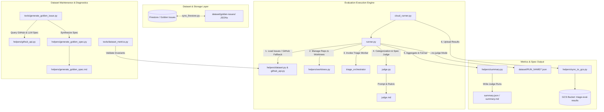

# Universal Guide to the Triage Evaluation Setup

This document serves as the comprehensive, universal technical guide and
architecture reference for the **Gemini CLI Triage Evaluation Suite** located in
[`evals/triage/`](file:///usr/local/google/home/joneba/ssr-prototype/gcli-intern-project/tools/caretaker-agent/evals/triage).

---

## 1. Executive Summary & Architecture Overview

### 1.1 Purpose

The Triage Evaluation Suite tests and evaluates the **Caretaker / Triage
Agent**, an automated system responsible for ingesting incoming GitHub issues,
classifying them by quality and effort, and generating structured, actionable
**Workable Specs** for downstream coding agents.

The evaluation setup executes curated golden test cases in isolated Git
worktrees, evaluates categorization accuracy (Quality and Effort), grades
generated Workable Specs using an LLM-as-a-Judge against Golden Workable Specs
across a 4-criterion rubric, and compiles detailed performance metrics and
summaries for dashboard reporting. It also supports **Spec Generation Mode**
(`--no-judge`) to output production Firestore-compliant issue specifications for
the PR Code Generation evaluation harness (`evals/pr-generation/eval_suite.py`).

### 1.2 System Architecture & Data Flow



---

## 2. Directory Structure

```
evals/triage/
├── __init__.py                     # Package initialization
├── TRIAGE_EVALUATION_SETUP.md      # Universal Guide (this document)
├── cloud_runner.py                 # Cloud Run Job entrypoint
├── judge.md                        # LLM Judge rubric and system instructions
├── judge.py                        # LLM-as-a-Judge grading module
├── requirements.txt                # Python dependencies
├── runner.py                       # Parallel evaluation & spec generator runner
├── dataset/
│   └── golden-issues/              # Golden issue JSON dataset by category
│       ├── FEATURE/                # Feature request test cases (8 JSONs)
│       ├── NEEDS_INFO/             # Ambiguous / missing context test cases (15 JSONs)
│       ├── OK/                     # Actionable bug test cases with Golden Specs (31 JSONs)
│       └── SPAM_EMPTY/             # Junk / empty test cases (21 JSONs)
├── helpers/
│   ├── __init__.py                 # Helpers package initialization
│   ├── dataset.py                  # Firestore streaming & untrusted context encapsulation
│   ├── generate_golden_spec.md     # System prompt for Golden Spec synthesis
│   ├── generate_golden_spec.py     # AI-driven Golden Spec generator (Antigravity SDK)
│   ├── github_api.py               # GitHub REST API client & commit SHA resolution
│   ├── summary.py                  # Metrics aggregation & Markdown/JSON report builder
│   ├── sync_to_gcs.py              # Artifact uploader to Google Cloud Storage
│   └── worktrees.py                # Git repository & isolated worktree manager
└── tools/
    ├── __init__.py                 # Tools package initialization
    ├── dataset_metrics.py          # Diagnostic CLI & dataset integrity validator
    ├── generate_golden_issue.py    # CLI to create new golden issue JSONs from GitHub
    └── sync_firestore.py           # Bidirectional local JSON <-> Firestore sync CLI
```

---

## 3. Comprehensive File-by-File Technical Guide

### 3.1 Module Initialization & Dependencies

#### 3.1.1 `evals/triage/__init__.py`

- **File Path:**
  [`evals/triage/__init__.py`](file:///usr/local/google/home/joneba/ssr-prototype/gcli-intern-project/tools/caretaker-agent/evals/triage/__init__.py)
- **Overview / Purpose:** Subpackage marker for the core triage evaluation
  module.
- **Outputs / Side Effects:** Defines subpackage docstring:
  `"Triage evaluation benchmark runner and judge suite."`.
- **Connected Files:** Contains runner, judge, helpers, tools, and dataset
  modules.

#### 3.1.2 `evals/triage/requirements.txt`

- **File Path:**
  [`evals/triage/requirements.txt`](file:///usr/local/google/home/joneba/ssr-prototype/gcli-intern-project/tools/caretaker-agent/evals/triage/requirements.txt)
- **Overview / Purpose:** Specifies Python package dependencies required to run
  the evaluation suite and its tools.
- **Dependencies Specified:**
  - `google-cloud-firestore>=2.15.0`: Google Cloud Firestore client SDK.
  - `google-antigravity>=0.1.0`: Google internal AI agent framework SDK.
  - `google-genai>=2.0.0`: Google GenAI SDK (required for `judge.py`).
  - `python-dotenv`: Environment variable loading from `.env` files.
  - `requests`: HTTP library for GitHub REST API interactions.
- **Connected Files:** Used by Dockerfiles and virtual environment setups for
  Cloud Run jobs.

---

### 3.2 Core Evaluation Execution & Judging Suite

#### 3.2.1 `evals/triage/runner.py`

- **File Path:**
  [`evals/triage/runner.py`](file:///usr/local/google/home/joneba/ssr-prototype/gcli-intern-project/tools/caretaker-agent/evals/triage/runner.py)
- **Overview / Purpose:** Core evaluation runner and spec generator. Features
  **dual operational modes**:
  1. **Benchmark Judging Mode (`--judge`, Default):** Executes parallel
     evaluation of golden GitHub issues against the `triage_worker` module using
     isolated Git worktrees per thread, evaluates categorization accuracy, calls
     the LLM judge for spec evaluation, and saves structured metrics to
     `evals/triage/results/`.
  2. **Spec Generation Mode (`--no-judge`):** Bypasses metrics and judging.
     Executes triage on target issues and writes formatted JSON issue
     specifications adhering strictly to the **production Firestore schema**
     (`status: "TRIAGED"`, `workable_spec`, `github_metadata`, `lock`) to
     `evals/triage/dataset/<run_name>/` for consumption by the PR Code
     Generation evaluation harness (`evals/pr-generation/eval_suite.py`).
- **Inputs & CLI Parameters:**
  - `--issues` (`str`, optional): Comma-separated list of issue numbers (e.g.
    `--issues 19868,21527`) or `"all"` for all golden issues. If an issue is
    missing from the local golden dataset, `runner.py` automatically falls back
    to querying the GitHub REST API (`github_api.py`) to fetch issue details and
    target commit SHAs dynamically on demand.
  - `--concurrency` (`int`, default `5`): Maximum parallel worker threads in
    `ThreadPoolExecutor`.
  - `--note` (`str`, optional): Description or annotation for the evaluation
    run.
  - `--save` / `--no-save` (`bool`, default `True`): Flag to save timestamped
    run artifacts or use temporary directory `run_temp`.
  - `--judge` / `--no-judge` (`bool`, default `True`): Toggles judging vs spec
    generation mode.
  - `--run-name` (`str`, optional): Custom name for the dataset folder (in
    `--no-judge` mode) or results directory (in `--judge` mode).
- **Detailed Functionality & Execution Flow:**
  1. Configures `sys.path` to include `CARETAKER_DIR` and `TRIAGE_WORKER_DIR`.
  2. `main()` parses arguments and invokes `run_suite()`.
  3. `run_suite()` loads test cases via `load_issues(filter_issues)` (with
     GitHub API fallback for missing issues).
  4. Calls `get_repo()` from `worktrees.py` to ensure target codebase
     (`google-gemini/gemini-cli`) is cloned and updated.
  5. Prepares output directory (`evals/triage/dataset/<run_name>/` for spec
     generation, or `evals/triage/results/runs/<run_name>/` for judging).
  6. Executes `ThreadPoolExecutor(max_workers=concurrency)` over all issues,
     calling `eval_issue(issue, worker_id)` for each issue inside an isolated
     Git worktree.
  7. In `--no-judge` mode, saves formatted `spec_doc` JSON files directly into
     `evals/triage/dataset/<run_name>/gemini_cli_<issue_number>.json`.
  8. In `--judge` mode, evaluates quality/effort match, calls
     `judge_workable_spec()`, computes aggregate metrics via `calc_summary()`,
     and generates `summary.json` and `summary.md`.
- **Outputs & Side Effects:**
  - Creates `worktrees/worker_{id}` directories temporarily during execution.
  - In `--no-judge` mode: Outputs Firestore-compliant issue JSON specs to
    `evals/triage/dataset/<run_name>/`.
  - In `--judge` mode: Generates `<run_dir>/summary.json`,
    `<run_dir>/summary.md`, and updates `latest_summary.md`.

---

#### 3.2.2 `reference_triage/triage/cloud_runner.py`

- **File Path:**
  [`reference_triage/triage/cloud_runner.py`](file:///usr/local/google/home/joneba/ssr-prototype/gcli-intern-project/cloudrun/code_generator/reference_triage/triage/cloud_runner.py)
- **Overview / Purpose:** Entry point for running the evaluation suite as a
  Google Cloud Run Job. Parses JSON configuration from environment variables,
  runs `run_suite()`, and syncs output artifacts to Google Cloud Storage.
- **Inputs:**
  - `EVAL_CONFIG` (`str`, JSON format): Environment variable containing JSON
    config (e.g.
    `{"issues": [17733], "concurrency": 5, "note": "Nightly Build"}`).
- **Detailed Functionality:**
  1. Reads `EVAL_CONFIG` from environment.
  2. Parses JSON string safely; defaults to empty dict `{}` if missing or
     invalid.
  3. Invokes
     `run_suite(filter_issues=cfg.get("issues"), concurrency=cfg.get("concurrency", 5), note=cfg.get("note"))`.
  4. Calls `sync_results_to_gcs()` to upload all generated evaluation artifacts
     to GCS.
- **Notable Functions:**
  - `main() -> None`: Reads env, executes `run_suite()`, and triggers GCS sync.
- **Outputs & Side Effects:** Triggers evaluation run and syncs `results/runs/`
  to GCS bucket `gs://triage-eval-results/`.
- **Connected Files:**
  - [`runner.py`](file:///usr/local/google/home/joneba/ssr-prototype/gcli-intern-project/cloudrun/code_generator/reference_triage/triage/runner.py)
    (`run_suite`)
  - [`helpers/sync_to_gcs.py`](file:///usr/local/google/home/joneba/ssr-prototype/gcli-intern-project/cloudrun/code_generator/reference_triage/triage/helpers/sync_to_gcs.py)
    (`sync_results_to_gcs`)

---

#### 3.2.3 `reference_triage/triage/judge.py`

- **File Path:**
  [`reference_triage/triage/judge.py`](file:///usr/local/google/home/joneba/ssr-prototype/gcli-intern-project/cloudrun/code_generator/reference_triage/triage/judge.py)
- **Overview / Purpose:** Evaluation judge module providing exact-match
  categorization checking and LLM-as-a-Judge Workable Spec grading against
  Golden Specs using the Gemini API (`google.genai`).
- **Inputs:**
  - `GEMINI_API_KEY`: API key for Google Gemini API authentication.
  - System prompt from
    [`judge.md`](file:///usr/local/google/home/joneba/ssr-prototype/gcli-intern-project/cloudrun/code_generator/reference_triage/triage/judge.md).
  - Predicted and ground-truth categorization and spec dictionaries.
- **Detailed Functionality & Architecture:**
  1. `_load_system_instruction()`: Reads prompt instructions from `judge.md`.
  2. `_get_client()`: Thread-safe lazy initialization of `genai.Client`.
  3. `evaluate_categorization(predicted, expected)`:
     - Compares `predicted_quality` vs `expected_quality`.
     - For non-OK qualities (`FEATURE`, `NEEDS_INFO`, `SPAM`, `EMPTY`),
       `effort_match` requires `predicted_effort` to be empty `""`.
     - For `OK` quality, `effort_match` requires exact match between
       `predicted_effort` and `expected_effort`.
     - Returns dictionary with booleans `quality_match`, `effort_match`, and
       extracted values.
  4. `judge_workable_spec(predicted_spec, golden_spec)`:
     - Constructs structured prompt containing Golden Spec JSON and Candidate
       Spec JSON.
     - Calls Gemini Flash model (`gemini-flash-latest` or `gemini-2.5-flash`)
       via `client.models.generate_content(...)` enforcing
       `response_mime_type="application/json"`.
     - Parses LLM evaluation JSON evaluating 4 criteria on a 0-2 scale
       (`target_files_score`, `root_cause_and_summary_score`,
       `implementation_plan_score`, `testing_strategy_score`).
     - Computes `spec_score_pct = (sum_of_scores / 8.0) * 100.0`.
     - Includes robust fallback handling for JSON parse errors or API failures.
- **Notable Functions & Classes:**
  - `evaluate_categorization(predicted: Dict[str, Any], expected: Dict[str, Any]) -> Dict[str, Any]`
    - _Parameters:_ `predicted` (dict with `quality`, `effort`), `expected`
      (dict with `quality`, `effort`).
    - _Returns:_ Dict with `quality_match` (bool), `effort_match` (bool),
      `predicted_quality`, `expected_quality`, `predicted_effort`,
      `expected_effort`.
  - `judge_workable_spec(predicted_spec: Dict[str, Any], golden_spec: Dict[str, Any]) -> Dict[str, Any]`
    - _Parameters:_ `predicted_spec` (dict), `golden_spec` (dict).
    - _Returns:_ Dict containing `target_files_score`,
      `root_cause_and_summary_score`, `implementation_plan_score`,
      `testing_strategy_score`, `spec_score_pct` (float 0..100), `total_points`
      (int 0..8), and `reasoning` (dict).
- **Outputs & Side Effects:** Outbound API requests to Gemini API; returns
  evaluation scores and critiques.
- **Connected Files:**
  - [`judge.md`](file:///usr/local/google/home/joneba/ssr-prototype/gcli-intern-project/cloudrun/code_generator/reference_triage/triage/judge.md)
    (system prompt)
  - [`runner.py`](file:///usr/local/google/home/joneba/ssr-prototype/gcli-intern-project/cloudrun/code_generator/reference_triage/triage/runner.py)
    (caller)

---

#### 3.2.4 `reference_triage/triage/judge.md`

- **File Path:**
  [`reference_triage/triage/judge.md`](file:///usr/local/google/home/joneba/ssr-prototype/gcli-intern-project/cloudrun/code_generator/reference_triage/triage/judge.md)
- **Overview / Purpose:** System prompt for the LLM-as-a-Judge. Establishes
  grading rubric, fairness guidelines, and JSON response schema for evaluating
  candidate Workable Specs.
- **Key Guidelines & Rubric Scale:**
  - **Scale Definitions:**
    - `0` (Not Met / Inaccurate / Missing): Misses key target files, hand-wavy
      solution, or completely fails to match Golden Spec.
    - `1` (Partially Met / High-Level): Correct general files/solution, but
      lacks specific steps or clarity.
    - `2` (Fully Met / Excellent Match): Accurately identifies target files,
      aligns closely with root cause and step-by-step plan.
  - **Generic Fairness Rule:** Do NOT penalize candidate specs for omitting
    extra refactoring present in human PRs that go beyond reported issue scope.
  - **Strict Ground-Truth Rule:** Evaluates candidate specs STRICTLY against the
    Golden Spec without codebase access.
  - **4 Evaluation Criteria (Score 0-2 each):**
    1. `target_files_score`: Match against primary target files or valid
       parenthetical alternatives.
    2. `root_cause_and_summary_score`: Accuracy of defect diagnostic
       independently of file paths.
    3. `implementation_plan_score`: Clear, actionable steps matching Golden Spec
       solution strategy.
    4. `testing_strategy_score`: Match against test file, expected behavior, and
       verification steps (or `N/A`).
- **Output Format:** Mandates raw JSON matching schema with scores and concise
  1-sentence explanations under `reasoning`.
- **Connected Files:** Read by `_load_system_instruction()` in
  [`judge.py`](file:///usr/local/google/home/joneba/ssr-prototype/gcli-intern-project/cloudrun/code_generator/reference_triage/triage/judge.py).

---

### 3.3 Pipeline Helpers

#### 3.3.1 `reference_triage/triage/helpers/dataset.py`

- **File Path:**
  [`reference_triage/triage/helpers/dataset.py`](file:///usr/local/google/home/joneba/ssr-prototype/gcli-intern-project/cloudrun/code_generator/reference_triage/triage/helpers/dataset.py)
- **Overview / Purpose:** Data loading and payload preparation module. Streams
  golden issue test cases from Google Cloud Firestore, validates environment
  variables, and wraps untrusted issue content in XML context tags.
- **Inputs:**
  - **Environment Variables:** `PROJECT_ID`, `FIRESTORE_DATABASE`,
    `FIRESTORE_EVAL_COLLECTION`.
  - `filter_issues` (`Optional[List[int]]`): Issue numbers filter list.
- **Detailed Functionality:**
  1. `get_env_var(name)`: Retrieves environment variable from `os.environ` or
     raises `RuntimeError`.
  2. `load_issues(filter_issues)`:
     - Instantiates `firestore.Client(project=project_id, database=db_id)`.
     - Streams all documents from `FIRESTORE_EVAL_COLLECTION`.
     - Validates `issue_number`, casts to `int`, filters by `filter_issues` if
       supplied.
     - Sorts issues sequentially by `issue_number`.
  3. `prep_payload(item)`:
     - Extracts `issue_title` and `issue_body`.
     - Escapes existing `</untrusted_context>` closing tags to prevent XML
       injection.
     - Wraps content inside `<untrusted_context>\n...\n</untrusted_context>`.
     - Constructs structured payload with `issue_number`, `title`, `body`, and
       `repository`.
- **Notable Functions:**
  - `get_env_var(name: str) -> str`
  - `load_issues(filter_issues: Optional[List[int]] = None) -> List[Dict[str, Any]]`
  - `prep_payload(item: Dict[str, Any]) -> Dict[str, Any]`
- **Outputs & Side Effects:** Connects to Firestore over GCP network; returns
  sorted issue list and formatted payloads.
- **Connected Files:**
  - Used by
    [`runner.py`](file:///usr/local/google/home/joneba/ssr-prototype/gcli-intern-project/cloudrun/code_generator/reference_triage/triage/runner.py),
    [`tools/dataset_metrics.py`](file:///usr/local/google/home/joneba/ssr-prototype/gcli-intern-project/cloudrun/code_generator/reference_triage/triage/tools/dataset_metrics.py),
    [`tools/sync_firestore.py`](file:///usr/local/google/home/joneba/ssr-prototype/gcli-intern-project/cloudrun/code_generator/reference_triage/triage/tools/sync_firestore.py).

---

#### 3.3.2 `reference_triage/triage/helpers/generate_golden_spec.py`

- **File Path:**
  [`reference_triage/triage/helpers/generate_golden_spec.py`](file:///usr/local/google/home/joneba/ssr-prototype/gcli-intern-project/cloudrun/code_generator/reference_triage/triage/helpers/generate_golden_spec.py)
- **Overview / Purpose:** AI-driven spec synthesis module using the Antigravity
  SDK (`google.antigravity`). Generates fair Golden Workable Specs from GitHub
  issue bodies and PR diffs using prompt instructions in
  `generate_golden_spec.md`.
- **Inputs:**
  - `GEMINI_API_KEY`: API key for Antigravity agent initialization.
  - System prompt from
    [`generate_golden_spec.md`](file:///usr/local/google/home/joneba/ssr-prototype/gcli-intern-project/cloudrun/code_generator/reference_triage/triage/helpers/generate_golden_spec.md).
  - Issue & PR data (`owner`, `repo`, `issue_number`, `issue_data`, `pr_data`).
- **Detailed Functionality:**
  1. Dynamically resolves `TRIAGE_WORKER_DIR` path to import validation tools
     (`utils.validator`).
  2. Prunes noise from Git diffs (removes `package-lock.json`, `yarn.lock`,
     `pnpm-lock.yaml` changes).
  3. Formats prompt combining issue context and pruned code diff.
  4. Configures `LocalAgentConfig` with strict policies `[deny("*")]` to prevent
     arbitrary tool execution.
  5. Executes `Agent(config).chat(prompt)` asynchronously via Antigravity SDK.
  6. `_parse_llm_json(raw_text)`: Strips markdown fences, parses JSON, and heals
     invalid backslash escapes with regex.
  7. Validates generated spec against `validate_triage_result()`.
  8. Returns dict containing `workable_spec` and `golden_spec_rationale`.
- **Notable Functions:**
  - `_parse_llm_json(raw_text: str) -> dict`
  - `_load_system_instruction() -> str`
  - `generate_golden_spec(owner: str, repo: str, issue_number: int, issue_data: dict, pr_data: dict) -> dict`
- **Outputs & Side Effects:** Synthesizes Golden Spec JSON objects and
  rationales.
- **Connected Files:**
  - [`generate_golden_spec.md`](file:///usr/local/google/home/joneba/ssr-prototype/gcli-intern-project/cloudrun/code_generator/reference_triage/triage/helpers/generate_golden_spec.md)
    (system prompt)
  - [`tools/generate_golden_issue.py`](file:///usr/local/google/home/joneba/ssr-prototype/gcli-intern-project/cloudrun/code_generator/reference_triage/triage/tools/generate_golden_issue.py)
    (caller)
  - `cloudrun/triage-worker/utils/validator.py` (`validate_triage_result`)

---

#### 3.3.3 `reference_triage/triage/helpers/generate_golden_spec.md`

- **File Path:**
  [`reference_triage/triage/helpers/generate_golden_spec.md`](file:///usr/local/google/home/joneba/ssr-prototype/gcli-intern-project/cloudrun/code_generator/reference_triage/triage/helpers/generate_golden_spec.md)
- **Overview / Purpose:** System prompt instructions for the Golden Spec
  Generator Agent. Enforces a 2-Phase Chain-of-Thought reasoning workflow with a
  mandatory "Fairness Pruning Pass".
- **Key Instructions & Workflow:**
  - **Phase 1:** Analyzes PR diff and modified files.
  - **Phase 2 (Fairness Pruning Pass):** Asks whether each modified file was
    strictly required to fix the user's reported symptom, or if it was an
    opportunistic refactoring / un-reported feature. Mandates pruning all
    secondary/opportunistic files from `files_to_modify`.
  - **Synthesis Rules:**
    - `golden_spec_rationale` must explicitly document what was pruned and why.
    - `files_to_modify` must ONLY contain primary target source code files
      (excludes `*.test.ts`, lockfiles, docs, version bumps).
    - `testing_strategy.test_file` must contain exact test file path if modified
      in PR, or `"N/A"`.
    - `root_cause` and `steps` must name specific functions, regexes, and
      constants rather than vague generalizations.
- **Connected Files:** Loaded by `generate_golden_spec.py`.

---

#### 3.3.4 `reference_triage/triage/helpers/worktrees.py`

- **File Path:**
  [`reference_triage/triage/helpers/worktrees.py`](file:///usr/local/google/home/joneba/ssr-prototype/gcli-intern-project/cloudrun/code_generator/reference_triage/triage/helpers/worktrees.py)
- **Overview / Purpose:** Git repository and worktree lifecycle manager. Handles
  upfront cloning/fetching of target repository (`google-gemini/gemini-cli`) and
  manages isolated worktrees for concurrent evaluation worker slots.
- **Inputs:**
  - `TARGET_REPO_DIR`: Path to base target repository
    (`reference_triage/triage/target_repo`).
  - `WORKTREES_DIR`: Path to worktrees root
    (`reference_triage/triage/worktrees`).
  - `worker_id` (`int`), `version` (`str` commit SHA or branch).
- **Detailed Functionality:**
  1. `get_repo()`: Clones `https://github.com/google-gemini/gemini-cli.git` if
     not present (120s timeout), or runs `git fetch --all --tags` if already
     present. Falls back gracefully on fetch timeouts.
  2. `add_worktree(worker_id, version)`:
     - Removes any existing stale worktree for slot `worker_id` via
       `git worktree remove --force`.
     - Executes `git worktree add -f worktrees/worker_{worker_id} <version>`.
     - If checking out `version` fails, falls back to
       `git worktree add -f worktrees/worker_{worker_id} main` and sets
       `actual_version = "main"`.
     - Returns tuple `(worktree_dir, actual_version)`.
  3. `remove_worktree(worker_id)`: Force removes `worktrees/worker_{worker_id}`.
- **Notable Functions:**
  - `get_repo() -> str`
  - `add_worktree(worker_id: int, version: str) -> Tuple[str, str]`
  - `remove_worktree(worker_id: int) -> None`
- **Outputs & Side Effects:** Manages local git repositories and worktree
  directories on disk. Spawns git sub-processes.
- **Connected Files:** Called by
  [`runner.py`](file:///usr/local/google/home/joneba/ssr-prototype/gcli-intern-project/cloudrun/code_generator/reference_triage/triage/runner.py).

---

#### 3.3.5 `reference_triage/triage/helpers/summary.py`

- **File Path:**
  [`reference_triage/triage/helpers/summary.py`](file:///usr/local/google/home/joneba/ssr-prototype/gcli-intern-project/cloudrun/code_generator/reference_triage/triage/helpers/summary.py)
- **Overview / Purpose:** Metrics aggregation, directory initialization, and
  report builder module. Computes overall suite statistics (classification
  accuracy, auto-close recall, valid issue retention, workable spec pass rates,
  execution times) and generates formatted JSON and Markdown summary reports.
- **Inputs:** Individual issue result JSONs in
  `<run_dir>/issues/gemini_cli_<issue_num>.json`.
- **Detailed Functionality:**
  1. `init_dir(save)`: Creates timestamped run folder `run_YYYYMMDD_HHMMSS` (or
     `run_temp`) under `evals/triage/results/runs/`. Creates `issues/` subfolder
     and sets `LOCAL_LOG_DIR` environment variable.
  2. `save_issue_result(issues_dir, issue_num, record)`: Writes JSON record to
     `<issues_dir>/gemini_cli_<issue_num>.json`.
  3. `calc_summary(run_dir, note, start_timestamp, end_timestamp)`:
     - Scans and parses all `gemini_cli_*.json` files.
     - Separates successful vs crashed results.
     - Computes quality match % and effort match %.
     - Computes auto-close recall rate (`SPAM`, `EMPTY`, `FEATURE` ground
       truth).
     - Computes valid kept open rate for active issues.
     - Computes average workable spec score % and average execution time in
       seconds.
     - Calls `_save_run_summary()` to write `summary.json`.
     - Calls `_write_markdown()` using `MarkdownBuilder` to render `summary.md`
       and update `latest_summary.md`.
- **Notable Functions & Classes:**
  - `MarkdownBuilder`: Helper class to format headers, tables, collapsible
    `<details>` blocks, and text.
  - `init_dir(save: bool = True) -> str`
  - `save_issue_result(issues_dir: Path, issue_num: int, record: Dict[str, Any]) -> None`
  - `calc_summary(run_dir: str, note: Optional[str], start_timestamp: str, end_timestamp: str) -> Dict[str, Any]`
- **Outputs & Side Effects:** Writes `summary.json`, `summary.md`, and updates
  `latest_summary.md`.
- **Connected Files:** Called by
  [`runner.py`](file:///usr/local/google/home/joneba/ssr-prototype/gcli-intern-project/cloudrun/code_generator/reference_triage/triage/runner.py).

---

#### 3.3.6 `reference_triage/triage/helpers/github_api.py`

- **File Path:**
  [`reference_triage/triage/helpers/github_api.py`](file:///usr/local/google/home/joneba/ssr-prototype/gcli-intern-project/cloudrun/code_generator/reference_triage/triage/helpers/github_api.py)
- **Overview / Purpose:** GitHub REST API wrapper. Fetches issue and pull
  request details, unified diffs, and resolves historical Git commit SHAs
  corresponding to issue creation timestamps.
- **Inputs:**
  - `GITHUB_TOKEN` or `GH_TOKEN`: Token for GitHub REST API authentication.
  - Arguments: `owner`, `repo`, `issue_number`, `pr_number`, `created_at`.
- **Detailed Functionality:**
  1. `_get_github_headers()`: Assembles request headers with optional Bearer
     authorization.
  2. `get_issue_details(owner, repo, issue_number)`: Queries
     `GET /repos/{owner}/{repo}/issues/{issue_number}`. Extracts `title`,
     `body`, `createdAt`, and `labels`.
  3. `get_pr_details(owner, repo, pr_number)`: Queries
     `GET /repos/{owner}/{repo}/pulls/{pr_number}` and fetches raw diff via
     `Accept: application/vnd.github.v3.diff`. Extracts `title`, `body`,
     `baseRefOid`, `diff`.
  4. `_get_commit_sha_at_timestamp(owner, repo, created_at)`: Resolves closest
     commit SHA at or prior to `created_at` timestamp via
     `GET /repos/{owner}/{repo}/commits?until={created_at}&per_page=1`.
  5. `resolve_target_version(owner, repo, issue_data, pr_data)`: 3-tier
     resolution strategy: (1) `pr_data['baseRefOid']`, (2) Timestamp commit SHA,
     (3) Fallback `"main"`.
- **Notable Functions:**
  - `get_issue_details(owner: str, repo: str, issue_number: int) -> Dict[str, Any]`
  - `get_pr_details(owner: str, repo: str, pr_number: int) -> Dict[str, Any]`
  - `resolve_target_version(owner: str, repo: str, issue_data: Dict[str, Any], pr_data: Optional[Dict[str, Any]] = None) -> str`
- **Outputs & Side Effects:** External HTTP GET requests to `api.github.com`.
- **Connected Files:** Used by
  [`tools/generate_golden_issue.py`](file:///usr/local/google/home/joneba/ssr-prototype/gcli-intern-project/cloudrun/code_generator/reference_triage/triage/tools/generate_golden_issue.py).

---

#### 3.3.7 `reference_triage/triage/helpers/sync_to_gcs.py`

- **File Path:**
  [`reference_triage/triage/helpers/sync_to_gcs.py`](file:///usr/local/google/home/joneba/ssr-prototype/gcli-intern-project/cloudrun/code_generator/reference_triage/triage/helpers/sync_to_gcs.py)
- **Overview / Purpose:** Artifact uploader module. Recursively uploads
  evaluation run results from local disk (`results/runs/`) to Google Cloud
  Storage with UTF-8 charset declarations for markdown and JSON rendering.
- **Inputs:**
  - `EVAL_RESULTS_BUCKET` (default: `"triage-eval-results"`).
  - Local files in `results/runs/`.
- **Detailed Functionality:**
  1. Validates existence of `results/runs/`.
  2. Connects to GCS via `storage.Client()`.
  3. Uses `os.walk()` to traverse all files in `results/runs/`.
  4. Sets explicit content types: `text/markdown; charset=utf-8` for `.md` and
     `application/json; charset=utf-8` for `.json`.
  5. Uploads blobs to `runs/{rel_path}` in the GCS bucket.
- **Notable Functions:**
  - `sync_results_to_gcs() -> None`
- **Outputs & Side Effects:** Uploads files to GCS bucket
  `gs://triage-eval-results/runs/`.
- **Connected Files:** Called by
  [`cloud_runner.py`](file:///usr/local/google/home/joneba/ssr-prototype/gcli-intern-project/cloudrun/code_generator/reference_triage/triage/cloud_runner.py).

---

### 3.4 Diagnostic & Dataset Management Tools

#### 3.4.1 `reference_triage/triage/tools/dataset_metrics.py`

- **File Path:**
  [`reference_triage/triage/tools/dataset_metrics.py`](file:///usr/local/google/home/joneba/ssr-prototype/gcli-intern-project/cloudrun/code_generator/reference_triage/triage/tools/dataset_metrics.py)
- **Overview / Purpose:** CLI diagnostic tool that evaluates Golden Dataset
  distribution, renders ASCII bar charts of quality and effort levels, and
  validates dataset metadata integrity.
- **Inputs:** Firestore dataset streamed via `load_issues()`.
- **Detailed Functionality:**
  1. `compute_metrics()` loads all golden issues from Firestore.
  2. Tallies `expected_quality` counts across `VALID_QUALITIES` (`OK`, `SPAM`,
     `EMPTY`, `NEEDS_INFO`, `FEATURE`).
  3. Tallies `expected_effort` counts across `VALID_EFFORTS` (`SMALL`, `MEDIUM`,
     `LARGE`) for `OK` issues.
  4. Renders ASCII horizontal bar chart (`█` \* count) with percentages to
     terminal.
  5. `_validate_spec_integrity(issues)` validates invariants:
     - Quality must be valid label.
     - `OK` issues must have non-empty `expected_workable_spec` with `summary`
       and `implementation_plan`, and valid effort label.
     - Non-OK issues must have empty spec `{}` and empty effort `""`.
  6. Returns `True` if valid, `False` if any errors found (exits with code 1 in
     `main()`).
- **Notable Functions:**
  - `compute_metrics() -> bool`
  - `_validate_spec_integrity(issues: List[Dict[str, Any]]) -> bool`
  - `main() -> None`
- **Outputs & Side Effects:** Terminal report display; process exit code 0 or 1.
- **Connected Files:** Calls
  [`helpers/dataset.py`](file:///usr/local/google/home/joneba/ssr-prototype/gcli-intern-project/cloudrun/code_generator/reference_triage/triage/helpers/dataset.py)
  (`load_issues`).

---

#### 3.4.2 `reference_triage/triage/tools/generate_golden_issue.py`

- **File Path:**
  [`reference_triage/triage/tools/generate_golden_issue.py`](file:///usr/local/google/home/joneba/ssr-prototype/gcli-intern-project/cloudrun/code_generator/reference_triage/triage/tools/generate_golden_issue.py)
- **Overview / Purpose:** Primary CLI tool for creating new Golden Issue JSON
  files. Fetches issue/PR details from GitHub API, invokes AI spec synthesis,
  resolves target commit SHAs, and saves formatted JSON to
  `dataset/golden-issues/`.
- **Inputs:**
  - CLI Arguments: `--issue` (int, required), `--pr` (int, optional), `--owner`
    (str, default `"google-gemini"`), `--repo` (str, default `"gemini-cli"`).
  - API Keys: `GITHUB_TOKEN`, `GEMINI_API_KEY`.
- **Detailed Functionality:**
  1. `generate_golden_issue(owner, repo, issue_number, pr_number)`:
     - Calls `get_issue_details()` to fetch issue title, body, labels,
       `createdAt`.
     - If `pr_number` provided, calls `get_pr_details()` for title, body,
       `baseRefOid`, diff.
     - If PR present, calls `generate_golden_spec()` to synthesize
       `workable_spec` and `golden_spec_rationale`.
     - Extracts effort label (`SMALL`, `MEDIUM`, `LARGE`) from issue labels.
     - Resolves `target_version` using `resolve_target_version()`.
     - Assembles golden issue JSON and writes to
       `dataset/golden-issues/gemini_cli_<issue_number>.json`.
- **Notable Functions:**
  - `generate_golden_issue(owner: str, repo: str, issue_number: int, pr_number: int = None) -> None`
  - `main() -> None`
- **Outputs & Side Effects:** Writes new JSON file under
  `dataset/golden-issues/`.
- **Connected Files:**
  - [`helpers/github_api.py`](file:///usr/local/google/home/joneba/ssr-prototype/gcli-intern-project/cloudrun/code_generator/reference_triage/triage/helpers/github_api.py)
    (`get_issue_details`, `get_pr_details`, `resolve_target_version`)
  - [`helpers/generate_golden_spec.py`](file:///usr/local/google/home/joneba/ssr-prototype/gcli-intern-project/cloudrun/code_generator/reference_triage/triage/helpers/generate_golden_spec.py)
    (`generate_golden_spec`)

---

#### 3.4.3 `reference_triage/triage/tools/sync_firestore.py`

- **File Path:**
  [`reference_triage/triage/tools/sync_firestore.py`](file:///usr/local/google/home/joneba/ssr-prototype/gcli-intern-project/cloudrun/code_generator/reference_triage/triage/tools/sync_firestore.py)
- **Overview / Purpose:** Bidirectional synchronization CLI tool connecting
  local JSON files under `dataset/golden-issues/` with Google Cloud Firestore.
- **Inputs:**
  - CLI Flags: `--to-firestore` (upload local JSONs to Firestore) or
    `--from-firestore` (download Firestore docs to local JSONs).
  - Environment Variables: `PROJECT_ID`, `FIRESTORE_DATABASE`,
    `FIRESTORE_EVAL_COLLECTION`.
- **Detailed Functionality:**
  1. `_get_db()`: Instantiates `firestore.Client` using environment config.
  2. `sync_to_firestore()`: Scans `dataset/golden-issues/` for JSON files,
     formats document key as `github_<owner>_<repo>_<issue_number>`, and writes
     documents via `.set(data)`.
  3. `sync_from_firestore()`: Streams all documents from Firestore collection
     and writes `gemini_cli_<issue_number>.json` files to disk.
- **Notable Functions:**
  - `_get_db() -> Tuple[firestore.Client, str]`
  - `sync_to_firestore() -> None`
  - `sync_from_firestore() -> None`
  - `main() -> None`
- **Outputs & Side Effects:** Modifies Firestore database or local JSON files
  under `dataset/golden-issues/`.
- **Connected Files:** Uses
  [`helpers/dataset.py`](file:///usr/local/google/home/joneba/ssr-prototype/gcli-intern-project/cloudrun/code_generator/reference_triage/triage/helpers/dataset.py)
  (`get_env_var`).

---

## 4. Golden Issues Dataset Architecture

### 4.1 Structure & Categories

The dataset in
[`reference_triage/triage/dataset/golden-issues/`](file:///usr/local/google/home/joneba/ssr-prototype/gcli-intern-project/cloudrun/code_generator/reference_triage/triage/dataset/golden-issues/)
is partitioned into four functional quality categories:

1. **`FEATURE/` (8 Test Cases):** Feature requests asking for new functionality
   or enhancements. `expected_quality = "FEATURE"`, `expected_effort = ""`,
   `expected_workable_spec = {}`. Tests that triage does not generate bugfix
   specs for feature requests.
2. **`NEEDS_INFO/` (15 Test Cases):** Ambiguous bug reports or issues
   referencing local/missing user files. `expected_quality = "NEEDS_INFO"`,
   `expected_effort = ""`, `expected_workable_spec = {}`. Red-team evaluation
   testing that triage asks for clarification instead of hallucinating plans.
3. **`OK/` (31 Test Cases):** Actionable bug reports with verified fixes.
   `expected_quality = "OK"`, `expected_effort` in
   `["SMALL", "MEDIUM", "LARGE"]`, `expected_workable_spec` contains full
   `summary`, `implementation_plan`, and `testing_strategy`. Core benchmark for
   Workable Spec accuracy.
4. **`SPAM_EMPTY/` (21 Test Cases):** Blank bodies, nonsensical text, or spam.
   `expected_quality` in `["EMPTY", "SPAM"]`, `expected_effort = ""`,
   `expected_workable_spec = {}`. Tests junk filtering and fast rejection.

### 4.2 Workable Spec Schema (for `OK` Quality Issues)

```json
{
  "issue_id": "google-gemini/gemini-cli#17733",
  "summary": {
    "problem": "Clear statement of reported bug",
    "root_cause": "Technical root cause analysis detailing why error occurs",
    "context": "System context and affected components"
  },
  "implementation_plan": {
    "files_to_modify": ["packages/core/src/services/configService.ts"],
    "steps": [
      "Step 1: Update method signature...",
      "Step 2: Add validation check..."
    ]
  },
  "testing_strategy": {
    "test_file": "packages/core/src/services/configService.test.ts",
    "expected_behavior": "Expected behavior after fix",
    "verification_steps": ["Run vitest on configService.test.ts to verify fix"],
    "framework": "Vitest"
  }
}
```

---

## 5. Operations & Execution Workflows

### 5.1 Running Evaluation Locally

```bash
# Run complete evaluation benchmark across all Firestore issues
python3 -m evals.triage.runner

# Run specific issues with custom concurrency and note
python3 -m evals.triage.runner --issues 17733,24695 --concurrency 4 --note "Testing new prompt"

# Run in Spec Generator Mode (--no-judge) saving specs to dataset/triage_batch_1/
python3 -m evals.triage.runner --issues 19868,21527 --no-judge --run-name triage_batch_1 --concurrency 3

# Run without saving timestamped artifacts (uses run_temp)
python3 -m evals.triage.runner --no-save
```

### 5.2 Running Diagnostic & Integrity Checks

```bash
# Display quality & effort distribution and validate dataset invariants
python3 -m evals.triage.tools.dataset_metrics
```

### 5.3 Creating a New Golden Issue

```bash
# Generate golden issue JSON with AI-synthesized spec from PR
python3 -m evals.triage.tools.generate_golden_issue --issue 17733 --pr 17750
```

### 5.4 Syncing Dataset with Firestore

```bash
# Upload local JSON files to Firestore
python3 -m evals.triage.tools.sync_firestore --to-firestore

# Download Firestore documents to local JSON files
python3 -m evals.triage.tools.sync_firestore --from-firestore
```

### 5.5 Cloud Run Job Deployment & Execution

To deploy or update the Cloud Run Jobs for Triage Evaluation and Worker:
```bash
# Deploy Triage Eval Runner Job
./scripts/deploy.sh --project-id gcli-intern-project-2026 --target evals

# Deploy Triage Worker Job
./scripts/deploy.sh --project-id gcli-intern-project-2026 --target triage
```

In Google Cloud Run Jobs, set environment variable `EVAL_CONFIG`:

```json
{
  "issues": [17733, 18374, 24695],
  "concurrency": 5,
  "note": "Automated Nightly Triage Evaluation"
}
```

The entrypoint
[`cloud_runner.py`](file:///usr/local/google/home/joneba/ssr-prototype/gcli-intern-project/tools/caretaker-agent/evals/triage/cloud_runner.py)
executes `run_suite()` and automatically syncs all output artifacts to
`gs://triage-eval-results/`.

---

## 6. Summary Matrix of All Suite Components

| Module / Component                                                                                                                                                     | Category          | Primary Responsibility                                                     | Inputs                                          | Primary Outputs / Side Effects                                  |
| :--------------------------------------------------------------------------------------------------------------------------------------------------------------------- | :---------------- | :------------------------------------------------------------------------- | :---------------------------------------------- | :-------------------------------------------------------------- |
| [`runner.py`](file:///usr/local/google/home/joneba/ssr-prototype/gcli-intern-project/tools/caretaker-agent/evals/triage/runner.py)                                     | Core Runner       | Executes parallel eval benchmark with worktree isolation & spec generation | Firestore issues, CLI args, GitHub API fallback | Per-issue JSONs, `summary.json`, `summary.md`, or dataset JSONs |
| [`cloud_runner.py`](file:///usr/local/google/home/joneba/ssr-prototype/gcli-intern-project/tools/caretaker-agent/evals/triage/cloud_runner.py)                         | Cloud Entrypoint  | Cloud Run Job wrapper with GCS sync                                        | `EVAL_CONFIG` env var                           | Runs suite & uploads results to GCS                             |
| [`judge.py`](file:///usr/local/google/home/joneba/ssr-prototype/gcli-intern-project/tools/caretaker-agent/evals/triage/judge.py)                                       | Evaluation Judge  | Categorization match & LLM-as-a-Judge grading                              | `judge.md`, Candidate & Golden specs            | Evaluation score dicts (0-2 scale per rubric)                   |
| [`judge.md`](file:///usr/local/google/home/joneba/ssr-prototype/gcli-intern-project/tools/caretaker-agent/evals/triage/judge.md)                                       | Judge Rubric      | Prompt guidelines & 4-criterion grading scale                              | Prompt text                                     | Configures LLM judge behavior & schema                          |
| [`dataset.py`](file:///usr/local/google/home/joneba/ssr-prototype/gcli-intern-project/tools/caretaker-agent/evals/triage/helpers/dataset.py)                           | Data Helper       | Firestore streaming & untrusted XML encapsulation                          | Firestore DB & `.env`                           | Sorted issues list & sanitized payloads                         |
| [`generate_golden_spec.py`](file:///usr/local/google/home/joneba/ssr-prototype/gcli-intern-project/tools/caretaker-agent/evals/triage/helpers/generate_golden_spec.py) | AI Generator      | Synthesizes fair Golden Specs via Antigravity SDK                          | Issue & PR diff data, system prompt             | Validated Golden Spec JSON & rationale                          |
| [`generate_golden_spec.md`](file:///usr/local/google/home/joneba/ssr-prototype/gcli-intern-project/tools/caretaker-agent/evals/triage/helpers/generate_golden_spec.md) | Generator Prompt  | 2-Phase CoT & Fairness Pruning Pass rules                                  | Prompt text                                     | Directs Golden Spec synthesis                                   |
| [`worktrees.py`](file:///usr/local/google/home/joneba/ssr-prototype/gcli-intern-project/tools/caretaker-agent/evals/triage/helpers/worktrees.py)                       | Git Manager       | Base repo clone/fetch & worktree creation/removal                          | Git CLI, `google-gemini/gemini-cli`             | `target_repo/` & `worktrees/worker_{id}`                        |
| [`summary.py`](file:///usr/local/google/home/joneba/ssr-prototype/gcli-intern-project/tools/caretaker-agent/evals/triage/helpers/summary.py)                           | Metrics Builder   | Calculates metrics & builds Markdown/JSON reports                          | Issue JSON records                              | `summary.json`, `summary.md`, `latest_summary.md`               |
| [`github_api.py`](file:///usr/local/google/home/joneba/ssr-prototype/gcli-intern-project/tools/caretaker-agent/evals/triage/helpers/github_api.py)                     | API Client        | Fetches GitHub issue/PR details & resolves SHAs                            | GitHub REST API, `GITHUB_TOKEN`                 | Issue/PR metadata dicts & commit SHAs                           |
| [`sync_to_gcs.py`](file:///usr/local/google/home/joneba/ssr-prototype/gcli-intern-project/tools/caretaker-agent/evals/triage/helpers/sync_to_gcs.py)                   | Cloud Storage     | Uploads run results to GCS with UTF-8 charsets                             | `results/runs/` files                           | Blobs in GCS bucket (`triage-eval-results`)                     |
| [`dataset_metrics.py`](file:///usr/local/google/home/joneba/ssr-prototype/gcli-intern-project/tools/caretaker-agent/evals/triage/tools/dataset_metrics.py)             | Diagnostics       | Validates dataset integrity & prints ASCII charts                          | Firestore dataset                               | Diagnostic terminal report & exit code                          |
| [`generate_golden_issue.py`](file:///usr/local/google/home/joneba/ssr-prototype/gcli-intern-project/tools/caretaker-agent/evals/triage/tools/generate_golden_issue.py) | Maintenance Tool  | Creates new Golden Issue JSON files from GitHub                            | `--issue`, `--pr` flags                         | `dataset/golden-issues/gemini_cli_<num>.json`                   |
| [`sync_firestore.py`](file:///usr/local/google/home/joneba/ssr-prototype/gcli-intern-project/tools/caretaker-agent/evals/triage/tools/sync_firestore.py)               | Sync Tool         | Bidirectional local JSON <-> Firestore database sync                       | `--to-firestore` / `--from-firestore`           | Firestore documents or local JSON files                         |
| [`dataset/`](file:///usr/local/google/home/joneba/ssr-prototype/gcli-intern-project/tools/caretaker-agent/evals/triage/dataset)                                        | Benchmark Dataset | Structured ground-truth test cases across 4 categories                     | `FEATURE`, `NEEDS_INFO`, `OK`, `SPAM_EMPTY`     | Golden test cases for Triage Agent evaluation                   |
